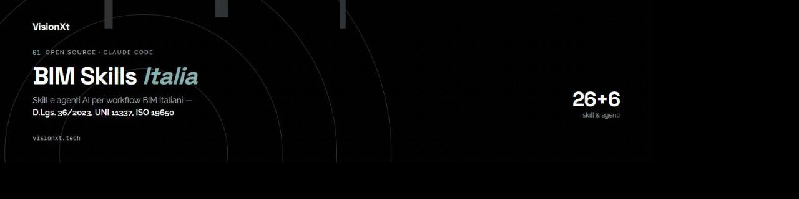

<div align="center">



<br>

[](LICENSE)
[](#catalogo-skill)
[](#agenti)
[](#quick-start)

</div>

# BIM Skills Italia

Una raccolta open-source di skill specializzate per professionisti BIM che operano nel contesto normativo italiano. Ci dedichiamo a **trasformare le procedure BIM italiane — D.Lgs. 36/2023, UNI 11337, ISO 19650 — in workflow deterministici che gli agenti AI possono eseguire**, cosi ogni skill diventa un collaboratore esperto di normative e strumenti su **Claude Code**, **Google Antigravity** e **Cursor**.

> Progetto di [VisionXt](https://visionxt.tech) — aperto a contributi della community AEC italiana.

---

## Installazione Rapida (One-Liner Guidata)

Puoi installare l'intera suite di skill e agenti BIM **con una singola riga di comando** direttamente dal terminale, senza dover clonare manualmente il repository.

### 1. Installazione Guidata Interattiva (Consigliata)

Esegui il comando: l'installer ti mostrerà un menu interattivo a video per scegliere l'ambiente desiderato:

**Windows (PowerShell):**
```powershell
irm https://raw.githubusercontent.com/VisionXt-tech/bim-skills/main/scripts/install.ps1 | iex
```

**macOS / Linux (Bash):**
```bash
curl -fsSL https://raw.githubusercontent.com/VisionXt-tech/bim-skills/main/scripts/install.sh | bash
```

---

### 2. Installazione One-Liner per Strumento Specifico

Se preferisci installare direttamente per il tuo assistente AI senza passare dal menu:

#### Claude Code
Installa le 26 skill in `~/.claude/skills/` e i 6 agenti in `~/.claude/agents/`:
- **Windows (PowerShell):**
  ```powershell
  & ([scriptblock]::Create((irm https://raw.githubusercontent.com/VisionXt-tech/bim-skills/main/scripts/install.ps1))) -Target claude
  ```
- **macOS / Linux:**
  ```bash
  curl -fsSL https://raw.githubusercontent.com/VisionXt-tech/bim-skills/main/scripts/install.sh | bash -s -- --target claude
  ```

#### Google Antigravity
Installa le 26 skill e i 6 workflow agenti in `~/.gemini/config/skills/`:
- **Windows (PowerShell):**
  ```powershell
  & ([scriptblock]::Create((irm https://raw.githubusercontent.com/VisionXt-tech/bim-skills/main/scripts/install.ps1))) -Target antigravity
  ```
- **macOS / Linux:**
  ```bash
  curl -fsSL https://raw.githubusercontent.com/VisionXt-tech/bim-skills/main/scripts/install.sh | bash -s -- --target antigravity
  ```

#### Cursor
Installa le 26 skill e i 6 agenti in `~/.cursor/skills/`:
- **Windows (PowerShell):**
  ```powershell
  & ([scriptblock]::Create((irm https://raw.githubusercontent.com/VisionXt-tech/bim-skills/main/scripts/install.ps1))) -Target cursor
  ```
- **macOS / Linux:**
  ```bash
  curl -fsSL https://raw.githubusercontent.com/VisionXt-tech/bim-skills/main/scripts/install.sh | bash -s -- --target cursor
  ```

#### Tutti gli Ambienti (All-in-One)
- **Windows (PowerShell):**
  ```powershell
  & ([scriptblock]::Create((irm https://raw.githubusercontent.com/VisionXt-tech/bim-skills/main/scripts/install.ps1))) -Target all
  ```
- **macOS / Linux:**
  ```bash
  curl -fsSL https://raw.githubusercontent.com/VisionXt-tech/bim-skills/main/scripts/install.sh | bash -s -- --target all
  ```

---

### 3. Installazione da Repository Locale (Sviluppatori)

Se hai già clonato il repository in locale:
```powershell
# Windows PowerShell (apre il menu guidato, oppure usa -Target <tool>)
.\scripts\install.ps1
```
```bash
# macOS / Linux (apre il menu guidato, oppure usa --target <tool>)
./scripts/install.sh
```

---

### 4. Verifica e Primo Utilizzo

Dopo l'installazione, apri il tuo ambiente AI e verifica la disponibilità delle skill:
- **Claude Code**: digita `/` per vedere le skill disponibili o seleziona uno degli agenti `bim-gara`, `bim-delivery-team`, `bim-quality-gate`, `bim-cde-manager`, `bim-asset-manager`, `bim-revit-dev`.
- **Google Antigravity**: digita `/` nella chat per visualizzare l'elenco delle skill BIM caricate on-demand.
- **Cursor**: usa `@` per referenziare le skill nel contesto o nei prompt di editing.

> Consulta la guida dettagliata [**docs/installazione.md**](docs/installazione.md) per ulteriori dettagli sui percorsi e risoluzione dei problemi.

---

## Catalogo Skill

### Workflow Normativi

Skill basate su D.Lgs. 36/2023, Allegato I.9, UNI 11337 e ISO 19650.

| Famiglia | Skill | Ruolo Target | Descrizione |
|----------|-------|-------------|-------------|
| **PA / Committente** | `ci-drafting` | BIM Manager (SA) | Redazione Capitolato Informativo conforme ad Allegato I.9 |
| | `ogi-evaluation` | Commissione | Valutazione Offerte di Gestione Informativa |
| | `pgi-consolidation` | BIM Manager | Trasformazione oGI in Piano di Gestione Informativa |
| **Delivery Team** | `bim-execution` | Lead Appointed Party | Redazione BEP e piani di mobilizzazione |
| | `information-delivery-planning` | BIM Manager | Costruzione MIDP/TIDP e milestone informative |
| | `information-protocol` | BIM Coordinator | Protocollo informativo ISO 19650 |
| **CDE / ACDat** | `cde-configuration` | CDE Manager | Configurazione ambiente di condivisione dati |
| | `cde-workflow` | CDE Manager | Analisi flussi e stati dei container informativi |
| | `cde-cybersecurity` | CDE Manager | Verifica sicurezza e compliance GDPR/ISO 27001 |
| **Modelli IFC** | `ifc-loin-validator` | BIM Coordinator | Validazione LOIN su modelli IFC (LoG/LoI/pset) |
| | `naming-spatial-structure` | BIM Coordinator | Verifica nomenclatura e struttura spaziale IFC |
| | `clash-detection` | BIM Coordinator | Gestione clash e issue tracking |
| | `normative-code-checking` | BIM Specialist | Controlli parametrici normativi su modelli |
| **4D/5D** | `construction-sequencing` | BIM Specialist | Collegamento modelli IFC con cronoprogrammi (4D) |
| | `quantities-cost-linking` | Cost Planner | Estrazione quantitativi e viste 5D |
| | `materials-traceability` | BIM Specialist | Tracciabilita materiali e sostenibilita |
| **Asset / Digital Twin** | `aim-construction` | Facility Manager | Costruzione Asset Information Model |
| | `maintenance-cmms` | Facility Manager | Integrazione AIM con sistemi CMMS/CAFM |
| | `digital-twin-analytics` | BIM Manager Asset | Analytics IoT e performance energetiche |

### BIM Tools (Piattaforme & Computational Design)

Skill per sviluppo software, automazione e computational design con i principali strumenti BIM.

| Skill | Piattaforma | Cosa fa |
|-------|------------|---------|
| `revit-api` | Revit API (C# .NET 8) | Sviluppo add-in Revit: transazioni, filtri, famiglie, viste, export |
| `revit-dynamo` | Dynamo for Revit | Script Dynamo: nodi Python, DesignScript, package, data flow |
| `revit-cpp-plugin` | Revit C++ | Plugin nativi C++: P/Invoke, OpenMP, performance-critical ops |
| `rhino` | Rhinoceros | Scripting RhinoCommon, comandi, geometria NURBS e SubD |
| `rhino-inside-revit` | Rhino.Inside.Revit | Interop Rhino-Revit: geometria complessa in contesto BIM |
| `grasshopper` | Grasshopper | Definizioni parametriche, componenti custom, data tree |
| `pyrevit` | pyRevit | Estensioni pyRevit: script, UI XAML, hook, engine CPython 3 |

---

## Come Funzionano

Ogni skill e un file `SKILL.md` dotato di frontmatter YAML standard che istruisce gli agenti AI (**Claude Code**, **Google Antigravity**, **Cursor**) su:

1. **Scope** — cosa fa e cosa NON fa
2. **Normativa di riferimento** — norme e articoli specifici
3. **Workflow passo-passo** — procedure deterministiche
4. **Anti-pattern** — errori comuni da evitare
5. **Output atteso** — formato e struttura dei deliverable
6. **Strumenti MCP** — integrazione con tool esterni (ifcopenshell, CDE API, Revit MCP)

Le skill NON sostituiscono il professionista. Supportano il lavoro riducendo errori, accelerando la redazione documentale e automatizzando verifiche ripetitive.

---

## Struttura del Repository

```
bim-skills/
├── skills/
│   ├── pa-appointing/          # Famiglia 1: Committente / Appointing Party
│   ├── delivery-team/          # Famiglia 2: Team di progetto / Lead Appointed Party
│   ├── cde-acdat/              # Famiglia 3: CDE Manager / ACDat
│   ├── ifc-loin-quality/       # Famiglia 4: Modelli IFC, LOIN, qualita
│   ├── 4d-5d-costs/            # Famiglia 5: 4D/5D, costi, tracciabilita
│   ├── asset-digital-twin/     # Famiglia 6: Asset Management e Digital Twin
│   └── bim-tools/              # Famiglia 7: BIM Tools (Revit, Rhino, pyRevit...)
├── agents/                     # Definizioni agenti multi-skill
├── scripts/                    # Installer multi-target (install.ps1, install.sh)
├── docs/                       # Documentazione architetturale e template
├── AGENTS.md                   # Direttive e vincoli normativi cross-platform
└── CLAUDE.md                   # Convenzioni operative per Claude Code
```

---

## Agenti

Agenti multi-skill che combinano piu competenze per workflow end-to-end. Gli script di installazione li configurano automaticamente come agenti per Claude Code e come workflow skills per Antigravity e Cursor.

| Agente | Cosa fa | Ruolo target |
|--------|---------|-------------|
| [`bim-gara`](agents/bim-gara.md) | Ciclo gara completo: CI, valutazione oGI, consolidamento pGI | BIM Manager SA, RUP |
| [`bim-delivery-team`](agents/bim-delivery-team.md) | BEP, MIDP/TIDP, protocollo informativo | Lead Appointed Party |
| [`bim-quality-gate`](agents/bim-quality-gate.md) | Verifica LOIN, nomenclatura, struttura spaziale, clash | BIM Coordinator |
| [`bim-cde-manager`](agents/bim-cde-manager.md) | Setup ACDat, governance flussi, audit sicurezza | CDE Manager |
| [`bim-asset-manager`](agents/bim-asset-manager.md) | AIM, piani manutentivi, CMMS, analytics IoT | Facility Manager |
| [`bim-revit-dev`](agents/bim-revit-dev.md) | Sviluppo Revit: sceglie tra pyRevit/C#/Dynamo/C++/Rhino.Inside | Developer |

---

## MCP Server (opzionali)

Gli agenti funzionano con i tool built-in di Claude Code. Per interazione live con Revit, validazione IFC diretta, o modellazione Rhino, installa MCP server pubblici:

| Server | Cosa fa | Link |
|--------|---------|------|
| **Autodesk Revit MCP Server** (ufficiale) | Query/report modello, editing bulk parametri, snapshot viste — solo Revit 2027, Tech Preview | [Guida ufficiale](https://help.autodesk.com/view/ADSKMCP/ENU/?guid=ADSKMCP_RevitMcp_setting_up_revit_mcp_server_html) |
| **RevitCortex** | 173 tool per Revit 2023-2027 (alternativa community) | [GitHub](https://github.com/LuDattilo/RevitCortex) |
| **ifcMCP** | Query su file IFC via ifcopenshell | [GitHub](https://github.com/smartaec/ifcmcp) |
| **IFC-MCP** | Ispezione IFC, report, BCF viewpoints | [GitHub](https://github.com/flinker-app/ifc-mcp) |
| **RhinoMCP** | Rhino + Grasshopper da Claude | [GitHub](https://github.com/jingcheng-chen/rhinomcp) |
| **Blender MCP** | Blender ufficiale MCP | [Blender Lab](https://www.blender.org/lab/mcp-server/) |
| **APS MCP** | Autodesk Platform Services cloud | [GitHub](https://github.com/autodesk-platform-services/aps-mcp-server-nodejs) |

Vedi **[docs/mcp-setup.md](docs/mcp-setup.md)** per istruzioni di installazione e configurazione dettagliate.

---

## Contribuire

Vedi [CONTRIBUTING.md](CONTRIBUTING.md) per le linee guida.

In breve:
1. Fork del repo
2. Crea la skill seguendo il template in `docs/SKILL_TEMPLATE.md`
3. Testa la skill in Claude Code
4. Apri una PR con descrizione di scope e normativa coperta

Cerchiamo contributi da: BIM Manager, BIM Coordinator, CDE Manager, sviluppatori Revit/Rhino/Dynamo, esperti di normativa italiana BIM.

---

## Accesso e Registrazione

**[Registrati su visionxt.tech/bim-skills](https://visionxt.tech/bim-skills)**

La registrazione e gratuita e ti da accesso a: notifiche su nuove skill e aggiornamenti, canale community per discussioni e supporto, accesso anticipato a skill premium e integrazioni MCP avanzate.

---

## Normativa di Riferimento

- **D.Lgs. 36/2023** — Codice dei Contratti Pubblici
- **Allegato I.9** — Metodi e strumenti di gestione informativa digitale
- **D.Lgs. 209/2024** — Correttivo, soglia 2M EUR dal 01/01/2025
- **UNI 11337** (parti 1-7) — Gestione digitale dei processi informativi
- **UNI/PdR 78:2020** — Certificazione professionisti BIM
- **ISO 19650** (parti 1-3) — Information management using BIM
- **ISO 16739-1** — Industry Foundation Classes (IFC)

---

## Licenza

MIT — vedi [LICENSE](LICENSE).

---

*Costruito da professionisti BIM, per professionisti BIM.*
