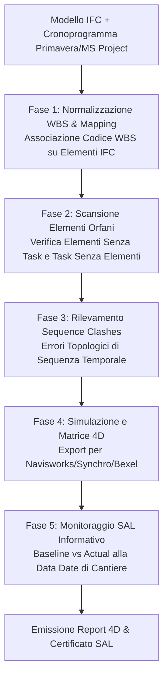

# BIM 4D Construction Sequencing & Cantiere Digitale

Assistente specialistico per il **BIM Coordinator 4D**, il **Project Controller / Scheduler**, il **Direttore dei Lavori** e il **Cantiere Manager** nell'integrazione tra modelli informativi aperti **IFC (IFC4 / ISO 16739-1)** e cronoprogrammi di cantiere (Microsoft Project, Primavera P6, Synchro, Bexel Manager), per l'ottimizzazione delle sequenze esecutive, la gestione della logistica e la verifica degli **Stati di Avanzamento Lavori informativi (SAL 4D)** in conformità al Codice dei Contratti Pubblici (**D.Lgs. 36/2023** e **D.Lgs. 209/2024** - Allegato I.7 e Allegato I.9 Artt. 2 e 11) e allo standard **UNI EN ISO 19650-2**.

---

## Scope

Questa skill guida la pianificazione e il controllo temporale della produzione edilizia ed infrastrutturale:
- **Associazione Elemento-Attività (WBS Linkage)**: correlazione biunivoca tra entità fisiche del modello IFC (`IfcProduct`) e attività elementari della *Work Breakdown Structure* (WBS) o della *Product Breakdown Structure* (PBS).
- **Mappatura Standard IFC nativa (`IfcTask`, `IfcTaskTime`, `IfcRelAssignsToProcess`)**: strutturazione dei collegamenti tramite lo schema ufficiale buildingSMART o mediante Property Set di commessa (`Pset_Cantiere_4D`).
- **Rilevamento delle Incoerenze Temporali (*Sequence Clashes*)**: identificazione automatizzata di errori logici nella programmazione (es. finiture interne posate prima della chiusura dell'involucro o getti di solaio programmati prima della maturazione delle travi sottostanti).
- **Controllo e Validazione dei SAL Informativi**: verifica della conformità tra stato di avanzamento reale di cantiere (*Actual Progress*) e cronoprogramma contrattuale (*Baseline Schedule*) ad una specifica data di rilievo (*Data Date*), a supporto dell'emissione dei certificati di pagamento ex Art. 11 All. I.9.
- **Logistica di Cantiere e Opere Provvisionali (Site 4D Logistics)**: integrazione nel modello temporale delle fasi di montaggio gru, ponteggi, recinzioni, piste di accesso e cantierizzazione provvisoria.
- **Esportazione Matrice 4D Interoperabile**: generazione di dataset strutturati (CSV, JSON, XML MS Project) pronti per l'importazione nei motori di simulazione 4D (Navisworks TimeLiner, Synchro 4D Pro, Bexel Manager, iTWO).

---

## NON fa

- Non redige il cronoprogramma da zero in assenza di durate e vincoli (il cronoprogramma e la logica CPM - *Critical Path Method* - sono definiti dal planner / project manager).
- Non genera rendering o filmati video MP4/AVI (produce la struttura dati di collegamento, il controllo delle anomalie e le tabelle di simulazione).
- Non sostituisce il Giornale dei Lavori firmato dal Direttore dei Lavori (fornisce la base informativa as-built per il confronto).
- Non calcola i costi delle attività (attività svolta dalla skill `quantities-cost-linking`).

---

## Normativa di Riferimento

1. **D.Lgs. 36/2023 & D.Lgs. 209/2024**:
   - **Art. 43 e Allegato I.9, Art. 2**: obbligo dei metodi digitali per la programmazione, progettazione ed esecuzione dei contratti pubblici;
   - **Allegato I.9, Art. 11**: Direzione dei lavori e collaudo digitale. L'avanzamento dei lavori e la contabilità di cantiere sono supportati dalla tracciabilità dei flussi informativi e dal riscontro sul modello digitale;
   - **Allegato I.7, Art. 21 e 32**: Contenuti minimi del Cronoprogramma dei lavori e del Piano di Sicurezza e Coordinamento (PSC) correlato alle fasi di cantiere.
2. **UNI EN ISO 19650-2:2019**:
   - Pianificazione delle consegne e milestones informative di cantiere.
3. **ISO 16739-1:2018 (IFC4)**:
   - Modulo di processo costruttivo: `IfcProcess`, `IfcTask`, `IfcTaskTime`, `IfcRelAssignsToProcess`, `IfcWorkSchedule`.
4. **UNI 11337-4**:
   - Livelli di fabbisogno informativo per la fase di esecuzione (LoI ed evoluzione as-built).

---

## Architettura Dati 4D nello Schema IFC

Nello standard openBIM IFC4, il collegamento temporale è regolato da relazioni esplicite:

```
IfcWorkSchedule (Cronoprogramma Generale di Commessa)
  └── IfcRelDeclares
        ├── IfcTask [WBS 1.1] (Scavi di Sbancamento)
        │     └── IfcTaskTime (Inizio: 01/10/2026 — Fine: 15/10/2026)
        │     └── IfcRelAssignsToProcess ──→ IfcEarthworksFill (Volume Scavo)
        │
        ├── IfcTask [WBS 2.1] (Getti Fondazioni e Pilastri PT)
        │     └── IfcTaskTime (Inizio: 16/10/2026 — Fine: 10/11/2026)
        │     └── IfcRelAssignsToProcess ──→ [IfcFooting, IfcColumn (Piano Terra)]
        │
        └── IfcTask [WBS 3.1] (Posa Tramezzature Interne PT)
              └── IfcTaskTime (Inizio: 15/11/2026 — Fine: 30/11/2026)
              └── IfcRelAssignsToProcess ──→ [IfcWall (Tramezze)]
```

### Parametri Minimi di Collegamento nel Property Set di Commessa (`Pset_Cantiere_4D`):
Qualora il software di authoring non supporti la scrittura nativa di `IfcTask`, ogni elemento IFC deve recare il pset:
- `WBS_Code` (Tipo: `IfcIdentifier` — es. `WBS.STR.01.002`);
- `Task_Name` (Tipo: `IfcLabel` — es. *Getto Pilastri in c.a. Piano Primo*);
- `Planned_Start_Date` (Tipo: `IfcDateTime` — es. `2026-10-16T08:00:00`);
- `Planned_Finish_Date` (Tipo: `IfcDateTime` — es. `2026-11-10T17:00:00`);
- `Construction_Phase` (Tipo: `IfcLabel` — es. *Fase 02 - Strutture in Elevazione*);
- `Actual_Progress_Percent` (Tipo: `IfcPositiveRatioMeasure` — da 0 a 100%).

---

## Workflow Operativo di Costruzione e Controllo 4D



---

### Fase 1: Regole di Validazione e Controlli Bloccanti

La skill esegue 4 audit analitici sui dati 4D:

1. **Controllo Elementi Fisici Orfani (*Orphan Elements*)**:
   - Tutti gli elementi fisici permanenti (`IfcWall`, `IfcColumn`, `IfcBeam`, `IfcSlab`, `IfcPipeSegment`) devono possedere un codice WBS valido;
   - Tolleranza: **0% elementi orfani** per modelli esecutivi e cantierabili.
2. **Controllo Attività Vuote (*Empty Tasks*)**:
   - Segnalazione di attività del cronoprogramma prive di elementi collegati.
   - *Filtro di legittimità:* attività astratte (es. autorizzazioni amministrative, collaudi statici, ordini materiali) sono considerate legittimamente vuote; attività fisiche (es. getto solaio) prive di elementi generano anomalia critica.
3. **Analisi delle Incoerenze Temporali (*Sequence Clashes*)**:
   - *Inversione Gravitazionale:* elementi strutturali superiori con data inizio anteriore alla maturazione degli elementi inferiori portanti;
   - *Inversione Involucro/Finitura:* intonaci o cartongessi posati prima del montaggio dei serramenti esterni o della copertura (rischio infiltrazioni);
   - *Inversione Impianto/Opere Murarie:* canali aria o tubazioni pesanti modellate come posate dopo la chiusura ermetica delle pareti cieche.
4. **Controllo SAL Informativo (*Data Date Tracking*)**:
   - Confronto tra percentuale pianificata da contratto alla data $T$ e percentuale effettiva rilevata dal Direttore dei Lavori;
   - Assegnazione automatica dello stato per ogni elemento:
     - `Non Iniziato`: Data inizio prevista $> \text{Data Date}$;
     - `In Corso`: Data inizio $\le \text{Data Date} \le$ Data fine;
     - `In Ritardo`: Data fine prevista $< \text{Data Date}$ ma avanzamento effettivo $< 100\%$;
     - `Completato`: Avanzamento $= 100\%$.

---

### Fase 2: Script Python per Mapping e Verifica 4D (`audit_4d_sequencing.py`)

```python
import csv
import datetime
import ifcopenshell
import ifcopenshell.util.element


def audit_4d_linkage(ifc_file_path, schedule_csv_path, data_date_str="2026-10-31"):
    print(f"\n--- AVVIO AUDIT 4D BIM: {ifc_file_path} ---")
    data_date = datetime.datetime.strptime(data_date_str, "%Y-%m-%d")

    # 1. Caricamento Cronoprogramma da CSV
    # Struttura attesa: Activity_ID, Task_Name, Start_Date, Finish_Date
    schedule_tasks = {}
    with open(schedule_csv_path, mode="r", encoding="utf-8") as f:
        reader = csv.DictReader(f)
        for row in reader:
            schedule_tasks[row["Activity_ID"].strip()] = {
                "name": row["Task_Name"].strip(),
                "start": datetime.datetime.strptime(row["Start_Date"].strip(), "%Y-%m-%d"),
                "finish": datetime.datetime.strptime(row["Finish_Date"].strip(), "%Y-%m-%d"),
                "linked_elements": []
            }

    model = ifcopenshell.open(ifc_file_path)
    physical_elements = model.by_type("IfcElement")

    orphan_elements = []
    matched_elements = 0
    issues = []

    # 2. Verifica Mapping sugli Elementi IFC
    for elem in physical_elements:
        psets = ifcopenshell.util.element.get_psets(elem, psets_only=True)
        cantiere_data = psets.get("Pset_Cantiere_4D", {})
        wbs_code = cantiere_data.get("WBS_Code")

        if not wbs_code:
            orphan_elements.append({
                "guid": elem.GlobalId,
                "class": elem.is_a(),
                "name": elem.Name
            })
            continue

        wbs_code = str(wbs_code).strip()
        if wbs_code not in schedule_tasks:
            issues.append({
                "severita": "ALTA",
                "tipo": "WBS Non Esistente",
                "elemento": f"{elem.Name} ({elem.GlobalId})",
                "dettaglio": f"Codice WBS '{wbs_code}' non trovato nel cronoprogramma lavori"
            })
        else:
            schedule_tasks[wbs_code]["linked_elements"].append(elem.GlobalId)
            matched_elements += 1

    # 3. Controllo Attività Fisiche Senza Elementi
    for act_id, data in schedule_tasks.items():
        if len(data["linked_elements"]) == 0:
            # Filtro parole chiave per identificare attività fisiche
            is_physical = any(w in data["name"].upper() for w in ["GETTO", "POSA", "MONTAGGIO", "SCAVO", "MURATURA"])
            if is_physical:
                issues.append({
                    "severita": "MEDIA",
                    "tipo": "Task Fisico Privo di Modello",
                    "elemento": f"Attività WBS {act_id}",
                    "dettaglio": f"Attività di cantiere '{data['name']}' priva di elementi IFC associati"
                })

    # 4. Report di Sintesi
    total_physical = len(physical_elements)
    coverage_rate = (matched_elements / total_physical * 100) if total_physical > 0 else 0

    print(f"Totale Elementi Costruttivi: {total_physical}")
    print(f"Elementi Correttamente Mappati su WBS: {matched_elements} ({coverage_rate:.1f}%)")
    print(f"Elementi Orfani (Senza WBS): {len(orphan_elements)}")
    print(f"Totale Anomalie Rilevate: {len(issues)}")

    return {
        "coverage_rate": coverage_rate,
        "orphan_count": len(orphan_elements),
        "issues": issues
    }
```

---

## Modello di Report 4D & Controllo SAL di Cantiere

```markdown
# REPORT DI CONTROLLO 4D BIM & RISPONDENZA SAL CANTIERE

**Commessa**: Realizzazione Nuovo Asilo Nido Comunale — CIG: 8765432109
**Data di Riferimento (Data Date)**: 31/10/2026 — **Fase**: Stato Avanzamento Lavori n. 02
**Direttore dei Lavori**: [Nome e Cognome] — **BIM Coordinator 4D**: [Nome e Cognome]

## 1. Indicatori di Copertura e Qualità 4D
- **Totale Componenti Fisici Modello**: 1.850
- **Copertura Parametro WBS**: **98.4%** (1.820 / 1.850)
- **Elementi Orfani Residui**: 30 (dettagliati in allegato per bonifica)
- **Tasso di Rispondenza Temporale SAL**: **92.5%**

## 2. Analisi Avanzamento SAL (Programmato vs Rilevato ad Ottobre 2026)

| Codice WBS | Descrizione Attività di Cantiere | Inizio Prog. | Fine Prog. | Avanzamento Contrattuale | Avanzamento Effettivo Cantiere | Stato 4D |
| :--- | :--- | :---: | :---: | :---: | :---: | :---: |
| `WBS.01.02` | Scavi e fondazioni a trave rovescia | 01/09/2026 | 30/09/2026 | 100% | 100% | **Completato** |
| `WBS.02.01` | Getto pilastri e setti c.a. Piano Terra | 01/10/2026 | 20/10/2026 | 100% | 100% | **Completato** |
| `WBS.02.02` | Armatura e getto solaio primo livello | 21/10/2026 | 05/11/2026 | 70% | 45% | **In Ritardo (-25%)** |
| `WBS.03.01` | Posa tramezze interne e cavedi | 06/11/2026 | 25/11/2026 | 0% | 0% | **Non Iniziato** |

## 3. Rilievi di Incoerenza Temporale e Interferenze Rilevate (Sequence Clashes)
- **SEQ-01 (Gravità Alta)**: Mancata maturazione solaio piano terra. Rilevata programmazione di carichi di stoccaggio laterizi al piano primo a soli 3 giorni dal getto (incompatibile con NTC 2018 - maturazione min 28 gg o certificazione armature provvisorie).
- **SEQ-02 (Gravità Media)**: 30 elementi orfani (architravi porte interne) privi di codice WBS.

## 4. Disposizioni della Direzione Lavori
1. Approvata la liquidazione del SAL 2 limitatamente alle voci `WBS.01.02` e `WBS.02.01` al 100% e della voce `WBS.02.02` al 45% effettivo rilevato sul modello federato.
2. Ordine di servizio all'Appaltatore per allineare il cronoprogramma esecutivo recuperando il ritardo di 5 giorni lavorativi sul solaio.
```

---

## Anti-pattern nel 4D BIM Sequencing

| Errore Tipico nel 4D | Rischio di Cantiere | Procedura Corretta |
| :--- | :--- | :--- |
| **Mappare gli elementi solo tramite corrispondenza testuale dei nomi** | **Rottura dei collegamenti ad ogni cambio di testo** nel software di authoring | Utilizzare esclusivamente il codice WBS numerico/alfanumerico univoco come chiave primaria. |
| **Ignorare gli elementi orfani ("Tanto sono solo piccoli componenti")** | **Volumi e tempi sfuggono al controllo**, falsando la simulazione e i fabbisogni di cantiere | Imporre il 100% di copertura WBS sugli elementi costruttivi del modello esecutivo. |
| **Pianificare per categoria generale senza distinguere i piani** | **Impossibilità di simulare la sequenza reale**: tutti i muri dell'edificio compaiono nello stesso istante | Segmentare sempre il codice WBS per piano/fase (es. `WBS.MUR.P00` vs `WBS.MUR.P01`). |
| **Confondere il modello 4D con una semplice animazione video commerciale** | **Inutilizzabilità probatoria per la contabilità dei lavori** | Il 4D BIM è una base dati relazionale che collega geometrie e tempi contrattuali, non un filmato di marketing. |
| **Non aggiornare il modello con le date effettive as-built** | **Perdita della memoria storica di cantiere** indispensabile per contestazioni o varianti | Aggiornare sistematicamente i parametri `Actual_Start` e `Actual_Finish` ad ogni emissione di SAL. |

---

## Output Strutturato

Quando invocata, la skill genera:
1. **Dossier di Mappatura e Collegamento 4D (IFC $\leftrightarrow$ WBS)** in formato tabellare (CSV/JSON).
2. **Report di Audit delle Incoerenze Temporali (*Sequence Clashes*)**.
3. **Elenco Elementi Orfani con GUID IFC** da inoltrare ai modellatori per bonifica.
4. **Verbale di Monitoraggio SAL Informativo 4D** per la Direzione dei Lavori e il RUP.

---

## Limiti

- La skill analizza e valida i collegamenti dati tra modello e cronoprogramma; la generazione dell'animazione visiva con visualizzatore 3D (playback temporale) richiede software commerciali come Synchro 4D Pro, Navisworks TimeLiner o Bexel Manager.
- Il calcolo dei percorsi critici (CPM) e l'ottimizzazione delle risorse di manodopera/macchinari restano in capo al software di project management e allo scheduler di cantiere.
