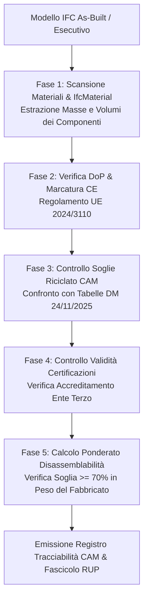

# BIM Materials Traceability, Digital Product Passport & CAM Edilizia

Assistente specialistico per il **BIM Coordinator**, il **Sustainability Manager / Consulente CAM**, il **Direttore dei Lavori** e il **Responsabile della Catena di Fornitura (Supply Chain)** nella gestione della tracciabilità digitale dei materiali, componenti e prodotti da costruzione, nell'integrazione del **Passaporto Digitale di Prodotto (Digital Product Passport - DPP)** secondo il nuovo Regolamento Prodotti da Costruzione (**Regolamento UE 2024/3110**) e nella verifica automatica dei requisiti cogenti dei **Criteri Ambientali Minimi per l'Edilizia (D.M. 24 novembre 2025 MASE)** collegati ai modelli aperti **IFC (IFC4 / ISO 16739-1 e ISO 22057)**.

---

## Scope

Questa skill guida la certificazione ecologica, la conformità normativa e la tracciabilità di filiera dei materiali modellati:
- **Integrazione del Passaporto Digitale di Prodotto (DPP ex Reg. UE 2024/3110)**: associazione agli oggetti IFC di identificatori digitali persistenti (QR-Code, URI, Data Carrier) collegati alla Dichiarazione di Prestazione (**DoP**) e marcatura CE.
- **Audit di Conformità CAM Edilizia (D.M. 24/11/2025 MASE)**: verifica automatizzata del rispetto delle percentuali minime di materia riciclata, recuperata o sottoprodotto su calcestruzzi, acciai, laterizi, isolanti termici e finiture.
- **Implementazione dello Standard ISO 22057:2022**: mappatura e strutturazione dei dati ambientali derivanti dalle Dichiarazioni Ambientali di Prodotto (**EPD** certificate EN 15804+A2) nei property set IFC.
- **Calcolo del Tasso di Disassemblabilità e Riciclabilità a Fine Vita**: verifica del criterio CAM per cui almeno il **70% in peso** dei componenti edilizi deve essere disassemblabile, recuperabile o riciclabile.
- **Verifica delle Certificazioni Accreditate (Accredia / EA / IAF)**: controllo formale che le asserzioni ambientali siano asseverate da Organismi di Valutazione della Conformità accreditati (es. certificazioni di prodotto basate su bilancio di massa, ReMade in Italy, EPD registrate) escludendo mere autodichiarazioni del produttore.
- **Generazione della Relazione CAM e Registro Materiali di Cantiere**: produzione del fascicolo digitale di tracciabilità dei materiali per la validazione del progetto esecutivo e per la chiusura dei SAL contabili.

---

## NON fa

- Non emette certificati di laboratorio o attestazioni di conformità ambientale (l'attestazione compete esclusivamente a laboratori o enti terzi accreditati ex ISO/IEC 17065).
- Non genera fisicamente etichette RFID o targhette adesive QR-Code da cantiere (struttura il database e i link URI nel modello IFC).
- Non sostituisce la figura del Direttore dei Lavori nella materiale accettazione dei materiali in cantiere ex Art. 11 All. I.9.

---

## Normativa e Standard di Riferimento

1. **D.Lgs. 36/2023 & D.Lgs. 209/2024**:
   - **Art. 57, comma 2**: Obbligo inderogabile di inserimento dei Criteri Ambientali Minimi (CAM) nella documentazione progettuale e di gara per il **100% dell'importo** delle opere pubbliche;
   - **Allegato I.9, Art. 11**: Tracciabilità dei materiali e collaudo digitale.
2. **D.M. 24 novembre 2025 (MASE - Ministero dell'Ambiente e della Sicurezza Energetica)**:
   - *Nuovi Criteri Ambientali Minimi per l'affidamento di servizi di progettazione e lavori per interventi edilizi* (in vigore dal 2 febbraio 2026, sostituisce il D.M. 256/2022).
   - Prescrive soglie minime di contenuto riciclato, criteri di disassemblabilità e vincoli sull'assenza di sostanze pericolose (SVHC / REACH).
3. **Regolamento (UE) 2024/3110 (Nuovo Regolamento Prodotti da Costruzione - CPR)**:
   - Istituzione del **Digital Product Passport (DPP)** e obbligo di tracciabilità digitale per la marcatura CE e la prestazione ambientale.
4. **ISO 22057:2022**:
   - Standard internazionale per la gestione dei dati EPD nei modelli BIM (*Data templates for the use of electronic environmental product declarations*).
5. **ISO 14025 & UNI EN 15804+A2**:
   - Regole per le dichiarazioni ambientali di prodotto (EPD) nel settore delle costruzioni.

---

## Soglie Minime CAM Edilizia (D.M. 24/11/2025) per Macro-Famiglie

| Macro-Famiglia Materiale | Requisito Minimo Contenuto Riciclato / Recuperato | Criterio di Disassemblabilità | Certificazione Accreditata Richiesta |
| :--- | :---: | :---: | :--- |
| **Calcestruzzi preconfezionati e prefabbricati** | **$\ge 5\%$** in peso sul totale miscela | Separabilità armature | EPD con verifica terza parte o certificazione accreditata bilancio di massa |
| **Acciaio per cemento armato (B450C da forno elettrico EAF)**| **$\ge 75\%$** in peso di rottame ferroso | Recupero $100\%$ | Certificazione di prodotto con attestazione della percentuale di riciclato |
| **Acciaio per carpenteria metallica strutturale**| **$\ge 75\%$** (EAF) / $\ge 20\%$ (ciclo integrale) | Smontabilità bullonata | Certificazione di conformità rilasciata da organismo terzo accreditato |
| **Isolanti in lana minerale (vetro/roccia)** | **$\ge 60\%$** in peso | Separabilità a secco | EPD / Certificato di conformità CAM rilasciato da ente accreditato |
| **Isolanti in polistirene espanso sinterizzato (EPS)**| **$\ge 15\%$** in peso | Rimozione selettiva | Certificazione Remade in Italy o Plastica Seconda Vita |
| **Laterizi per murature e solai** | **$\ge 10\%$** in peso | Demolizione selettiva | Certificazione di contenuto riciclato ex UNI CEI EN ISO/IEC 17065 |
| **Edificio nel suo Complesso (Totale Costruzione)**| — | **$\ge 70\%$ in peso disassemblabile** | Relazione di calcolo del disassemblaggio a fine vita |

---

## Schema Dati IFC per Tracciabilità e CAM (`Pset_CAM_Traceability`)

Per garantire l'interoperabilità, ogni componente modellato deve recare il Property Set personalizzato di commessa strutturato secondo la norma **ISO 22057**:

```json
{
  "Pset_CAM_Traceability": {
    "DoP_Number": "DOP-2026-IT-987654",
    "CE_Marking_Present": true,
    "DPP_DataCarrier_URI": "https://dpp.builder.eu/id/01-80123456789012",
    "Material_Trade_Name": "Calcestruzzo Strutturale Rck 30 Ecoeficiente",
    "Recycled_Content_Percent": 7.5,
    "Certification_Body": "Organismo Notificato Accreditato (es. ICMQ n. 1234)",
    "Certification_Standard": "UNI CEI EN ISO/IEC 17065",
    "EPD_Registration_Number": "EPDITALY-0456",
    "Disassembly_Method": "Demolizione selettiva / Frantumazione meccanica",
    "Is_Disassemblable": true,
    "Hazardous_Substances_SVHC": false
  }
}
```

---

## Workflow Operativo di Verifica Sostenibilità e CAM



---

### Fase 1: Algoritmo di Calcolo della Disassemblabilità Globale

La percentuale di disassemblabilità dell'opera edilizia è calcolata rapportando il peso totale degli elementi dichiarati smontabili o riciclabili a fine vita rispetto al peso complessivo della costruzione:

$$D_{\text{globale}} = \frac{\sum_{i=1}^{N} \left( P_i \times \text{IsDisassemblable}_i \right)}{\sum_{i=1}^{N} P_i} \times 100 \ge 70\%$$

*(dove $P_i = \text{Volume}_i \times \text{Densità}_i$ rappresenta il peso proprio del componente $i$-esimo).*

---

### Fase 2: Script Python di Audit Materiali e CAM (`audit_cam_materials.py`)

```python
import ifcopenshell
import ifcopenshell.util.element


CAM_THRESHOLDS = {
    "CONCRETE": {"min_recycled": 5.0, "desc": "Calcestruzzo preconfezionato/prefabbricato"},
    "STEEL_REBAR": {"min_recycled": 75.0, "desc": "Acciaio per cemento armato B450C"},
    "STEEL_STRUCT": {"min_recycled": 75.0, "desc": "Acciaio carpenteria metallica"},
    "INSULATION_MINERAL": {"min_recycled": 60.0, "desc": "Isolante in lana minerale"},
    "INSULATION_EPS": {"min_recycled": 15.0, "desc": "Isolante EPS"},
    "BRICK": {"min_recycled": 10.0, "desc": "Laterizi e forati"}
}


def audit_materials_cam(ifc_file_path):
    print(f"\n--- AVVIO AUDIT TRACCIABILITÀ MATERIALI & CAM: {ifc_file_path} ---")
    model = ifcopenshell.open(ifc_file_path)
    issues = []
    analyzed_elements = 0

    physical_elements = model.by_type("IfcElement")

    for elem in physical_elements:
        psets = ifcopenshell.util.element.get_psets(elem, psets_only=True)
        cam_data = psets.get("Pset_CAM_Traceability", {})

        # Se l'elemento non ha dati CAM, segnala anomalia
        if not cam_data:
            # Filtra categorie secondarie non strutturali
            if elem.is_a() in ["IfcWall", "IfcSlab", "IfcColumn", "IfcBeam", "IfcCovering"]:
                issues.append({
                    "severita": "CRITICA",
                    "elemento": f"{elem.Name} ({elem.GlobalId})",
                    "tipo": "Assenza Pset CAM",
                    "dettaglio": "Componente costruttivo privo del Pset_CAM_Traceability obbligatorio"
                })
            continue

        analyzed_elements += 1
        dop_num = cam_data.get("DoP_Number")
        recycled_pct = cam_data.get("Recycled_Content_Percent", 0.0)
        cert_body = cam_data.get("Certification_Body")
        is_disassemblable = cam_data.get("Is_Disassemblable")

        # 1. Verifica DoP (Reg. UE 2024/3110)
        if not dop_num or str(dop_num).strip() in ["", "TBD", "N/A"]:
            issues.append({
                "severita": "CRITICA",
                "elemento": f"{elem.Name} ({elem.GlobalId})",
                "tipo": "DoP Mancante",
                "dettaglio": "Numero Dichiarazione di Prestazione (DoP) assente o fittizio"
            })

        # 2. Verifica Certificazione Terza Parte Accreditata
        if not cert_body or "AUTODICHIARAZIONE" in str(cert_body).upper():
            issues.append({
                "severita": "ALTA",
                "elemento": f"{elem.Name} ({elem.GlobalId})",
                "tipo": "Certificazione Non Accreditata",
                "dettaglio": "I requisiti CAM richiedono la certificazione da organismo accreditato ex ISO/IEC 17065"
            })

        # 3. Verifica Disassemblabilità
        if is_disassemblable is None:
            issues.append({
                "severita": "MEDIA",
                "elemento": f"{elem.Name} ({elem.GlobalId})",
                "tipo": "Parametro Disassemblabilità Vuoto",
                "dettaglio": "Parametro Is_Disassemblable non specificato"
            })

    print(f"Scansione completata. Elementi costruttivi verificati con dati CAM: {analyzed_elements}")
    print(f"Totale non conformità rilevate: {len(issues)}")
    return issues
```

---

## Modello Report di Tracciabilità e Conformità CAM Edilizia

```markdown
# RELAZIONE DI VERIFICA TRACCIABILITÀ MATERIALI & CAM EDILIZIA (D.M. 24/11/2025)

**Commessa**: Nuovo Polo Scolastico Sostenibile — CIG: 7654321098
**Data Verifica**: 03/09/2026 — **Auditor Ambientale / BIM Coordinator**: [Nome e Cognome]
**Regime Normativo Applicato**: D.M. 24/11/2025 (Nuovi CAM Edilizia) & Reg. (UE) 2024/3110 (CPR)

## 1. Quadro Generale di Rispondenza Ecologica
- **Componenti Principali Censiti**: 640
- **Copertura DoP & Marcatura CE**: **98.4%** (630 / 640 conformi)
- **Tasso Globale di Disassemblabilità dell'Opera**: **76.8%** in peso (Soglia minima di legge superata: $\ge 70\%$)
- **Certificazioni Terze Parti Accreditate**: 100% verificate su organismi accreditati Accredia

## 2. Riscontro Requisiti Minimi CAM per Famiglia di Prodotto

| Categoria Componente | Materiale Dichiarato | Requisito Minimo CAM | Valore Rilevato nel Modello | Certificato Allegato | Esito CAM |
| :--- | :--- | :---: | :---: | :--- | :---: |
| **Setti e Pilastri c.a.** | Calcestruzzo C28/35 | $\ge 5\%$ riciclato | **6.5%** | Cert. ICMQ n. REC-2026-089 | **CONFORME** |
| **Armatura Ordinaria** | Tondino B450C (EAF) | $\ge 75\%$ rottame | **82.0%** | Attestazione IGQ n. 8871 | **CONFORME** |
| **Isolamento Cappotto** | Lana di roccia sp. 14 cm | $\ge 60\%$ riciclato | **68.0%** | EPDITALY-0542 | **CONFORME** |
| **Tramezzature Interne** | Forati di laterizio sp. 10 | $\ge 10\%$ riciclato | **12.0%** | Cert. DNV ISO 14021 | **CONFORME** |

## 3. Rilievi e Non Conformità Residue da Bonificare
- **CAM-01 (Severità Critica)**: 10 elementi `IfcDoor` (porte tagliafuoco vano scala) prive del link al Passaporto Digitale di Prodotto (DPP) o del numero di DoP. Richiesta integrazione entro 5 giorni.
- **CAM-02 (Severità Media)**: Scheda tecnica del massetto allegata con autodichiarazione del fornitore non asseverata da ente terzo. Richiesto certificato di conformità accreditato.

## 4. Giudizio Conclusivo
**ESITO: CONFORME CON PRESCRIZIONI**. Il progetto soddisfa i requisiti inderogabili dei Criteri Ambientali Minimi (D.M. 24/11/2025) e del Regolamento UE 2024/3110, subordinatamente alla produzione delle DoP mancanti per le porte antincendio.
```

---

## Anti-pattern nella Tracciabilità Materiali e CAM

| Errore Tipico nei CAM | Violazione Normativa | Procedura Corretta |
| :--- | :--- | :--- |
| **Accettare autodichiarazioni del produttore per il riciclato** | **Nullità della verifica CAM** (violazione Art. 57 D.Lgs. 36/2023) | Esigere sempre certificazioni rilasciate da organismi di certificazione accreditati. |
| **Trattare la DoP come facoltativa** | **Violazione penale del Regolamento Prodotti da Costruzione (CPR)** | Nessun prodotto soggetto a norma armonizzata può essere accettato senza DoP. |
| **Applicare i vecchi CAM (DM 256/2022) a gare del 2026** | **Applicazione di normativa superata** con rischio di ricorso al TAR | Applicare il D.M. 24/11/2025 per tutti i progetti con PFTE bandito dopo il 2 febbraio 2026. |
| **Non quantificare la disassemblabilità complessiva** | **Mancato rispetto del criterio di economia circolare ($\ge 70\%$)** | Calcolare la disassemblabilità ponderata sul peso totale dell'edificio nel modello 5D. |
| **Inserire URL di schede tecniche che puntano a server locali privati** | **Perdita dei dati as-built dopo pochi mesi** | Utilizzare identificatori persistenti (DOI / URI standard del Passaporto Digitale DPP). |

---

## Output Strutturato

Quando invocata, la skill genera:
1. **Fascicolo di Tracciabilità Materiali e Registro CAM** (con tabella percentuali di riciclato e disassemblabilità).
2. **Tabella di Controllo DoP, Marcatura CE e Passaporto Digitale (DPP)** per ciascun elemento IFC.
3. **Relazione di Calcolo del Tasso Globale di Disassemblabilità a Fine Vita ($\ge 70\%$)**.
4. **Verbale di Asseverazione CAM per il RUP e per la Validazione di Progetto**.

---

## Limiti

- La skill verifica la rispondenza parametrica, documentale e analitica; la conformità chimica (assenza di sostanze SVHC oltre le soglie REACH) deve essere attestata dai rapporti di prova di laboratorio allegati alla DoP.
- Per le procedure con PFTE validato ante 2 febbraio 2026, l'agente deve essere esplicitamente istruito ad applicare il regime transitorio del D.M. 23/06/2022 n. 256.
