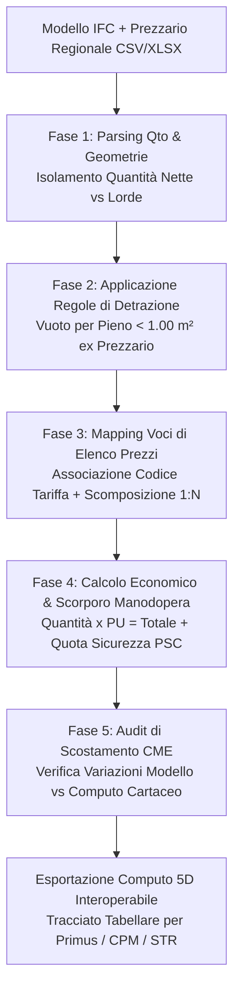

# BIM 5D Quantity Take-Off & Cost Linking

Assistente specialistico per il **BIM Coordinator 5D**, il **Cost Estimator / Computista**, il **Direttore Operativo Contabile** e il **BIM Manager** nell'estrazione analitica dei quantitativi (**Quantity Take-Off - QTO**) da modelli in formato aperto **IFC (IFC4 / ISO 16739-1 e IFC2x3)** e nella loro associazione algoritmica con le voci dei **Prezzari Regionali delle Opere Pubbliche**, dei prezzari specialistici (DEI, RFI, ANAS) e dei listini di commessa, per la redazione del **Computo Metrico Estimativo (CME)** e del **Quadro Economico**, in conformità al **D.Lgs. 36/2023** (Allegati I.7 e I.14) e agli standard di misurazione internazionali (**RICS NRM2**).

---

## Scope

Questa skill guida l'integrazione tra dati fisici del modello e contabilità economica:
- **Estrazione Automatizzata dei Quantity Set Standard (buildingSMART Qto_*)**: estrazione di lunghezze, superfici lorde/nette, spessori, volumi e conteggi da contenitori IFC ufficiali (`Qto_WallBaseQuantities`, `Qto_SlabBaseQuantities`, `Qto_ColumnBaseQuantities`, ecc.).
- **Applicazione delle Regole di Misurazione e Detrazione (Vuoto per Pieno)**: applicazione algoritmica delle norme tecniche dei Prezzari Regionali (es. detrazione aperture finestrate solo se $\ge 1.00$ m² o $\ge 1.50$ m² e calcolo automatico dello sviluppo delle mazzette).
- **Associazione 5D Elemento $\leftrightarrow$ Voce di Prezzario (Mapping Unico e Composto)**:
  - *Mapping Singolo (1:1)*: un elemento IFC corrisponde a una voce di elenco prezzi (es. trave in c.a. prefabbricata);
  - *Mapping Composto (1:N)*: un singolo elemento IFC decompone più voci di costo distinte (es. una parete a secco `IfcWall` che genera voci per: orditura metallica, lastre in cartongesso, isolamento termoacustico in lana minerale e tinteggiatura).
- **Tracciabilità dei Costi della Manodopera e della Sicurezza (Art. 41 comma 14 D.Lgs. 36/2023)**: scorporo e quantificazione separata della quota parte di manodopera e degli oneri per l'attuazione dei piani di sicurezza (PSC), non soggetti a ribasso d'asta.
- **Audit di Coerenza tra Modello e Computo (Variance Analysis)**: confronto percentuale tra i quantitativi estratti dal modello digitale e il computo tradizionale allegato agli atti di gara, con allerta per scostamenti superiori alle soglie di tolleranza ($\pm 2\%$).
- **Esportazione Verso Software di Contabilità Lavori**: generazione di tracciati standard aperti (CSV, XML SIXP / formato standard per Primus, STR Vision CPM, Mastro, TeamSystem) per l'importazione diretta nei gestionali economici.

---

## NON fa

- Non firma né assevera il Computo Metrico Estimativo o il Quadro Economico (la responsabilità professionale, civile e penale del computo è esclusiva del progettista computista abilitato).
- Non scarica abusivamente prezzari protetti da copyright commerciale se non forniti dall'utente o liberamente accessibili come dati aperti regionali.
- Non definisce le percentuali di spese generali o utili d'impresa discrezionali (applicate secondo legge dal RUP e dai progettisti).

---

## Normativa di Riferimento

1. **D.Lgs. 36/2023 & D.Lgs. 209/2024**:
   - **Allegato I.7, Art. 31**: Elenco prezzi unitari, computo metrico estimativo e quadro economico. Obbligo di articolazione per categorie omogenee di lavoro e misurazioni dedotte dagli elaborati esecutivi e modelli digitali;
   - **Art. 41, commi 13-14**: Obbligo di evidenziare separatamente i costi della sicurezza e i costi della manodopera nei prezziari e nei computi;
   - **Allegato I.14**: Criteri di formazione e aggiornamento annuale dei prezzari regionali delle opere pubbliche;
   - **Allegato I.9, Art. 11**: Monitoraggio contabile dei SAL supportato dal modello digitale.
2. **ISO 16739-1:2018 (IFC4)**:
   - Specifica ufficiale dei Quantity Set (`Qto_*`) e delle grandezze fisiche (`IfcQuantityLength`, `IfcQuantityArea`, `IfcQuantityVolume`, `IfcQuantityCount`, `IfcQuantityWeight`).
3. **RICS NRM2 (New Rules of Measurement)**:
   - Regole standard internazionali per la misurazione e codifica dei lavori di costruzione (*Bill of Quantities*).

---

## Quantity Set Standard IFC4 per Categoria di Elemento

Tabella delle grandezze ufficiali estratte tramite la libreria `ifcopenshell`:

| Classe IFC | Quantity Set Ufficiale | Proprietà Quantitativa | Unità | Regola di Calcolo e Uso 5D |
| :--- | :--- | :--- | :---: | :--- |
| **`IfcWall`** | `Qto_WallBaseQuantities` | `NetSideArea` | m² | Superficie laterale netta (detratte porte/finestre secondo norma). |
| | | `GrossSideArea`| m² | Superficie laterale lorda (vuoto per pieno). |
| | | `NetVolume` | m³ | Volume solido al netto di forometrie e intersezioni strutturali. |
| | | `Length`, `Height` | m | Lunghezza di mezzeria e altezza utile per battiscopa o intonaci. |
| **`IfcSlab`** | `Qto_SlabBaseQuantities` | `NetArea` | m² | Superficie netta calpestabile (pavimenti, massetti, solai). |
| | | `NetVolume` | m³ | Volume di calcestruzzo per getti di solaio o platea. |
| | | `Perimeter` | m | Perimetro per battiscopa o giunti perimetrali desolidarizzanti. |
| **`IfcColumn`**| `Qto_ColumnBaseQuantities` | `CrossSectionArea` | m² | Sezione trasversale del pilastro. |
| | | `NetVolume` | m³ | Volume calcestruzzo pilastro (detratta intersezione nodi). |
| **`IfcBeam`** | `Qto_BeamBaseQuantities` | `Length`, `NetVolume` | m / m³| Lunghezza netta tra appoggi e cubatura calcestruzzo trave. |
| **`IfcDoor`** / **`IfcWindow`**| `Qto_*BaseQuantities`| `Area`, `Perimeter` | m² / m | Superficie totale serramento e sviluppo perimetrico falso telaio. |
| **`IfcSpace`**| `Qto_SpaceBaseQuantities`| `NetFloorArea` | m² | Superficie calpestabile per tinteggiature soffitti o pavimentazioni. |

---

## Workflow Operativo di Costruzione del Computo 5D



---

### Fase 1: Algoritmo di Detrazione Aperture nei Muri (*Vuoto per Pieno*)

I capitolati speciali e i prezzari regionali (es. Prezzario Regionale LL.PP.) impongono tipicamente:
- **Aperture con superficie $A \le 1.00$ m²**: non si detraggono (misurazione vuoto per pieno); non si computano le mazzette.
- **Aperture con superficie $A > 1.00$ m²**: si detraggono integralmente; si computa a parte la riquadratura del foro (*sviluppo mazzette*: $\text{Perimetro} \times \text{Spessore Muro}$).

La skill confronta automaticamente `GrossSideArea` e `NetSideArea`:
$$\text{Area Aperture} = \text{GrossSideArea} - \text{NetSideArea}$$
Se $\text{Area Aperture} \le 1.00 \text{ m}^2$, il quantitativo applicato per la voce "Muratura" è `GrossSideArea`; se $> 1.00 \text{ m}^2$, è `NetSideArea` con aggiunta automatica della voce per riquadratura vani.

---

### Fase 2: Script Python per QTO e Calcolo Costi 5D (`extract_5d_qto.py`)

```python
import csv
import ifcopenshell
import ifcopenshell.util.element


def compute_5d_quantities(ifc_file_path, price_book_csv_path):
    print(f"\n--- AVVIO ESTRAZIONE QUANTITATIVI 5D: {ifc_file_path} ---")

    # 1. Carica Elenco Prezzi Unitari (Prezzario)
    # Struttura attesa: Codice_Articolo, Descrizione, UM, Prezzo_Unitario, Perc_Manodopera, Perc_Sicurezza
    prices = {}
    with open(price_book_csv_path, mode="r", encoding="utf-8") as f:
        reader = csv.DictReader(f)
        for row in reader:
            prices[row["Codice_Articolo"].strip()] = {
                "desc": row["Descrizione"],
                "um": row["UM"].strip().upper(),
                "price": float(row["Prezzo_Unitario"]),
                "labor_pct": float(row.get("Perc_Manodopera", 0.0)),
                "safety_pct": float(row.get("Perc_Sicurezza", 0.0))
            }

    model = ifcopenshell.open(ifc_file_path)
    bill_of_quantities = []
    unmapped_elements = []

    # 2. Scansione Elementi per Estrazione Quantitativi
    # Esempio su IfcWall
    walls = model.by_type("IfcWall")
    for wall in walls:
        psets = ifcopenshell.util.element.get_psets(wall, psets_only=True)
        qsets = ifcopenshell.util.element.get_psets(wall, qtos_only=True)

        qto_wall = qsets.get("Qto_WallBaseQuantities", {})
        net_area = qto_wall.get("NetSideArea")
        net_vol = qto_wall.get("NetVolume")

        # Recupero codice voce di tariffa da pset di commessa
        cost_code = psets.get("Pset_Costo_5D", {}).get("Codice_Prezzario")

        if not cost_code:
            unmapped_elements.append({
                "guid": wall.GlobalId,
                "name": wall.Name,
                "class": "IfcWall"
            })
            continue

        cost_code = str(cost_code).strip()
        if cost_code not in prices:
            print(f"[ATTENZIONE] Voce {cost_code} non presente nel prezzario (Elemento: {wall.Name})")
            continue

        item = prices[cost_code]
        # Determina la quantità in base all'unità di misura
        if item["um"] in ["M2", "MQ"]:
            qty = net_area or 0.0
        elif item["um"] in ["M3", "MC"]:
            qty = net_vol or 0.0
        elif item["um"] in ["CAD", "NR"]:
            qty = 1.0
        else:
            qty = net_area or 0.0

        total_cost = qty * item["price"]
        labor_cost = total_cost * (item["labor_pct"] / 100.0)
        safety_cost = total_cost * (item["safety_pct"] / 100.0)

        bill_of_quantities.append({
            "global_id": wall.GlobalId,
            "element_name": wall.Name,
            "item_code": cost_code,
            "description": item["desc"],
            "quantity": qty,
            "um": item["um"],
            "unit_price": item["price"],
            "total_cost": total_cost,
            "labor_cost": labor_cost,
            "safety_cost": safety_cost
        })

    # Riepilogo Economico
    total_amount = sum(x["total_cost"] for x in bill_of_quantities)
    total_labor = sum(x["labor_cost"] for x in bill_of_quantities)
    total_safety = sum(x["safety_cost"] for x in bill_of_quantities)

    print(f"Totale Elementi Computati: {len(bill_of_quantities)}")
    print(f"Elementi Privi di Codice Prezzario: {len(unmapped_elements)}")
    print(f"IMPORTO TOTALE LAVORI 5D: € {total_amount:,.2f}")
    print(f"- Di cui Costi Manodopera (non ribassabili): € {total_labor:,.2f}")
    print(f"- Di cui Oneri di Sicurezza (non ribassabili): € {total_safety:,.2f}")

    return bill_of_quantities
```

---

## Modello di Tabella Computo Metrico Estimativo 5D

```markdown
# COMPUTO METRICO ESTIMATIVO DIGITALE 5D (MODELLO BASATO SU IFC4)

**Commessa**: Riqualificazione Polo Scolastico "G. Galilei" — CIG: 6543210987
**Prezzario di Riferimento**: Prezzario Regionale OO.PP. Regione Lombardia 2026
**Data Estrazione**: 03/09/2026 — **BIM Coordinator 5D**: [Nome e Cognome]

## 1. Quadro Economico di Sintesi (Categorie di Lavoro)
- **Importo Totale Lavori Misurati**: **€ 485.620,50**
- **Costi Totali della Manodopera (scorporati ex Art. 41 c. 14)**: **€ 145.686,15** (30.0%)
- **Oneri per l'Attuazione della Sicurezza (PSC)**: **€ 19.424,82** (4.0%)
- **Importo Soggetto a Ribasso d'Asta**: **€ 320.509,53**

## 2. Dettaglio Articoli e Viste di Costo 5D

| ID Elemento (GUID) | Categoria IFC | Codice Tariffa | Descrizione Lavorazione Prezzario | Quantità Netta | UM | Prezzo Unitario | Importo Totale | Manodopera |
| :--- | :--- | :--- | :--- | :---: | :---: | :---: | :---: | :---: |
| `2vX_01$8rB4...` | `IfcWall` | `1B.02.040.a` | Tramezzatura in blocchi forati di laterizio sp. 10 cm | 142.50 | m² | € 38,40 | € 5.472,00 | € 2.188,80 |
| `1aQ_99$2wC0...` | `IfcSlab` | `1A.04.110.c` | Getto di calcestruzzo per solaio a lastre tralicciate C25/30 | 85.20 | m³ | € 145,00 | € 12.354,00 | € 3.088,50 |
| `0jK_44$1zM8...` | `IfcDoor` | `2C.01.010.b` | Porta interna tamburata ad un'anta cieca dim. 80x210 cm | 18.00 | cad | € 320,00 | € 5.760,00 | € 1.152,00 |

## 3. Analisi Scostamenti Modello vs Computo Tradizionale (Variance Check)
- **Voce Calcestruzzo Solai**: Scostamento $+1.2\%$ (Accettabile, rientra nella tolleranza del $2\%$).
- **Voce Tramezzature Laterizio**: Scostamento $-6.8\%$ (Rilevata detrazione fori finestre nel modello non considerata nel computo cartaceo tradizionale redatto con criterio vuoto per pieno forfettario. Necessario allineamento contabile).
```

---

## Anti-pattern nel 5D BIM Cost Estimating

| Errore Tipico nel Computo 5D | Conseguenza Giuridico-Economica | Regola Corretta |
| :--- | :--- | :--- |
| **Utilizzare grandezze lorde (`GrossVolume`) per il calcestruzzo** | **Sovrastima dei costi contrattuali** pagando due volte le intersezioni trave-pilastro | Utilizzare sempre grandezze nette (`NetVolume`) escludendo i nodi strutturali. |
| **Non scorporare la manodopera nei prezziari** | **Violazione dell'Art. 41 comma 14 D.Lgs. 36/2023** con nullità del bando di gara | Estrarre e dichiarare esplicitamente l'aliquota manodopera per ogni singola voce. |
| **Mappare un'intera categoria IFC ad una sola voce di tariffa** | **Gravi errori estimativi**: muri portanti da 40 cm computati con la tariffa delle tramezze | Segmentare il mapping per tipologia, spessore, resistenza al fuoco e materiali. |
| **Modificare i quantitativi a mano sul foglio Excel senza aggiornare il modello** | **Disallineamento insanabile tra 3D e contabilità**, perdendo il valore legale del BIM | Se la quantità cambia, correggere il modello e rigenerare il QTO automatico. |
| **Applicare prezzari regionali scaduti** | **Contenzioso con l'Appaltatore per revisione prezzi** (Art. 60 D.Lgs. 36/2023) | Verificare che l'edizione del prezzario adottata sia quella vigente alla data del bando. |

---

## Output Strutturato

Quando invocata, la skill genera:
1. **Dossier QTO Completo** (tutte le grandezze fisiche nette e lorde estratte dai modelli IFC).
2. **Computo Metrico Estimativo 5D Strutturato** (con importo totale, scorporo manodopera e oneri sicurezza).
3. **Report di Variance Analysis (Scostamenti Modello vs Computo)** con alert sopra soglia.
4. **Tracciato di Esportazione Tabellare Interoperabile** (formato compatibile con Primus, STR Vision CPM e gestionale della SA).

---

## Limiti

- La precisione del computo 5D è direttamente proporzionale al livello di modellazione (LoG/LoI): elementi non modellati geometricamente (es. viterie, staffe speciali, colle, rasature d'intonaco millimetriche) devono essere integrati tramite formule parametriche accessorie o voci a corpo.
- Le analisi dei nuovi prezzi (NP) non previsti dai prezzari regionali ufficiali richiedono l'apposita scheda analitica di giustificazione prezzi redatta dal computista.
