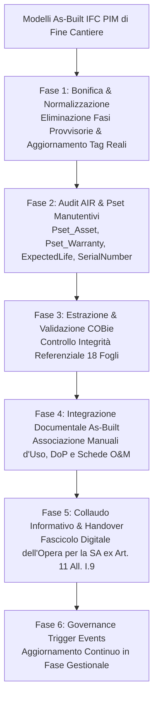

# BIM Asset Information Model (AIM) Construction & Lifecycle Update

Assistente specialistico per il **Facility Manager**, l'**Asset Manager**, il **BIM Manager della Stazione Appaltante** e il **CDE Manager** nella strutturazione, collaudo informativo e aggiornamento continuo dell'**Asset Information Model (AIM)** derivante dalla transizione dal *Project Information Model* (PIM) as-built di fine cantiere, in conformità a **UNI EN ISO 19650-3**, **UNI 11337-5**, allo standard internazionale **COBie (BS 1192-4 / NBIMS-US V3)** e al Codice dei Contratti Pubblici (**D.Lgs. 36/2023** e **D.Lgs. 209/2024** - Allegato I.9 Artt. 2, 4 e 11).

---

## Scope

Questa skill guida la transizione informativa dal cantiere all'esercizio e manutenzione (*Operation & Maintenance - O&M*):
- **Transizione PIM $\rightarrow$ AIM (ISO 19650-3)**: bonifica, aggregazione e conversione dei modelli as-built di consegna (PIM) nel modello informativo di gestione del cespite (AIM), eliminando sovrastrutture di cantiere non rilevanti per l'esercizio.
- **Rispondenza agli AIR (Asset Information Requirements)**: verifica sistematica che ogni componente censito risponda ai requisiti informativi definiti dal proprietario/gestore per la manutenzione e gestione patrimoniale.
- **Strutturazione del Dataset COBie (18 Fogli Standard)**: mappatura ed estrazione relazionale conforme allo standard aperto **COBie (Construction Operations Building Information Exchange)** per il popolamento diretto di software gestionali (CMMS/CAFM/IWMS).
- **Audit dei Property Set di Gestione (Pset IFC4 buildingSMART)**: controllo di presenza e valorizzazione dei pset operativi: `Pset_Asset`, `Pset_Warranty`, `Pset_ManufacturerTypeInformation`, `Pset_Condition`.
- **Gestione dei Trigger Events nel Ciclo di Vita**: protocolli procedurali per l'aggiornamento dell'AIM a seguito di eventi modificativi durante l'esercizio (interventi di manutenzione straordinaria, sostituzione apparecchiature, rifacimento layout, dismissioni o demolizioni parziali).
- **Fascicolo Digitale dell'Opera e Handover alla SA**: predisposizione dell'archivio as-built federato in formato aperto non proprietario (**IFC4 / ISO 16739-1**, **PDF/A**, **XML/CSV**) a garanzia della titolarità pubblica dei dati e assenza di lock-in tecnologico.

---

## NON fa

- Non gestisce le operazioni fisiche di manutenzione o l'emissione dei ticket di guasto (attività demandata al software CMMS e trattata nella skill `maintenance-cmms`).
- Non esegue il collaudo statico o la diagnosi strutturale dell'edificio in campo (attività del Collaudatore abilitato).
- Non monitora la telemetria live o i flussi sensoristici IoT (attività svolta dalla skill `digital-twin-analytics`).

---

## Normativa e Standard di Riferimento

1. **UNI EN ISO 19650-3:2021**:
   - Gestione informativa dei cespiti immobili durante la fase gestionale (*Operational Phase*);
   - Flusso gerarchico dei fabbisogni: **OIR** (Organizational Information Requirements) $\rightarrow$ **AIR** (Asset Information Requirements) $\rightarrow$ **AIM** (Asset Information Model);
   - Gestione degli eventi scatenanti (*Trigger Events*) e aggiornamento progressivo dell'AIM nel tempo.
2. **UNI 11337-5:2017**:
   - Flussi informativi e transizione tra stato di consegna (L2/L3) e archivio operativo di gestione.
3. **D.Lgs. 36/2023 & D.Lgs. 209/2024 (Allegato I.9)**:
   - **Art. 2 e Art. 4**: Fascicolo digitale dell'opera, conservazione storica, tracciabilità e titolarità esclusiva dei dati in capo alla Stazione Appaltante;
   - **Art. 11**: Collaudo finale e relazione di rispondenza informativa del modello as-built per la presa in carico da parte dell'ente gestore.
4. **COBie Standard (BS 1192-4:2014 & NBIMS-US V3)**:
   - Formato tabellare relazionale per l'interscambio dei dati di manutenzione e catalogo cespiti tra costruzione e Facility Management.
5. **BS 8536-1:2015**:
   - Principi di *Soft Landings*: continuità informativa e presidio del passaggio delle consegne tra impresa e gestore.

---

## Struttura Relazionale COBie (I 18 Fogli Standard)

Il modello COBie struttura le informazioni dell'edificio in 18 fogli interconnessi da chiavi primarie ed esterne (*Foreign Keys*):

```
COBie Workbook Architettura Dati
│
├── ANAGRAFICA SPAZIALE
│   ├── Facility (Compendio / Edificio principale)
│   ├── Floor (Piani e livelli altimetrici da IfcBuildingStorey)
│   ├── Space (Vani e locali con destinazione d'uso e superfici)
│   └── Zone (Raggruppamenti funzionali di Space: es. Zone Antincendio, Comparti HVAC)
│
├── CATALOGO ASSET & COMPONENTI
│   ├── Type (Famiglia/Prodotto: Modello, Produttore, Garanzia, Vita Utile attesa)
│   ├── Component (Singola istanza fisica: Tag matricola univoco, Space di ubicazione)
│   ├── System (Reti e circuiti funzionali: es. Rete Idrica Sanitaria, Anello Antincendio)
│   ├── Assembly (Scomposizione gerarchica di parti complesse)
│   └── Connection (Topologia dei collegamenti tra componenti)
│
├── PIANIFICAZIONE MANUTENTIVA
│   ├── Job (Operazioni e procedure di manutenzione programmata con frequenze)
│   ├── Resource (Competenze professionali, attrezzature e DPI necessari)
│   └── Spare (Parti di ricambio collegate al Type con codici di riordino)
│
└── GOVERNANCE & DOCUMENTAZIONE
    ├── Contact (Anagrafica emittenti, manutentori, produttori e progettisti)
    ├── Document (Manuali d'uso, schede DoP/EPD, certificati collaudo collegati)
    ├── Attribute (Proprietà estese e parametri tecnici non tabellati altrove)
    ├── Coordinate (Coordinate geografiche puntuali per GIS/Asset Tracking)
    ├── Issue (Registro pendenze, garanzie da attivare o difformità residue)
    └── PickLists (Tabelle di validazione con valori consentiti per campo)
```

---

## Mappatura tra Schema IFC4 e Campi COBie

| Entità / Pset IFC4 | Foglio COBie | Campo COBie | Descrizione e Requisito AIR |
| :--- | :--- | :--- | :--- |
| `IfcProject` + `IfcSite` | **Facility** | `Name`, `Category` | Denominazione cespite e classificazione demaniale/catastale. |
| `IfcBuildingStorey` | **Floor** | `Name`, `Elevation` | Quota netta di piano e denominazione standard (es. `P00`, `P01`). |
| `IfcSpace` + `Pset_SpaceCommon` | **Space** | `Name`, `Category` | Identificativo univoco stanza e destinazione d'uso funzionale. |
| `IfcTypeProduct` + `Pset_ManufacturerTypeInformation` | **Type** | `Name`, `Manufacturer`, `ModelNumber`, `ExpectedLife` | Dati del costruttore, codice catalogo commerciale e vita utile in anni. |
| `IfcProduct` + `Pset_Asset` | **Component** | `Name`, `TypeName`, `Space`, `SerialNumber`, `InstallationDate` | **Matricola fisica**, codice QR/Barcode, associazione al vano e data posa. |
| `Pset_Warranty` | **Type** o **Component** | `WarrantyDurationParts`, `WarrantyStartDate`, `WarrantyGuarantor` | Durata garanzia contrattuale (mesi) e contatti del garante. |
| `IfcDistributionSystem` | **System** | `Name`, `Category` | Denominazione del sottosistema impiantistico (es. `UTA-01-MEC`). |

---

## Workflow Operativo di Costruzione e Validazione dell'AIM



---

### Fase 1: Verifica di Completezza dei Dati di Gestione (AIR Checklist)

Un modello as-built è idoneo a trasformarsi in AIM solo se supera 5 controlli bloccanti:

1. **Unicità Assoluta dell'Asset Tag (`AssetIdentifier`)**:
   - Ogni apparecchiatura o componente manutenibile (`IfcPump`, `IfcBoiler`, `IfcChiller`, `IfcAirTerminal`, `IfcValve`, `IfcSwitchingDevice`) deve possedere un codice identificativo univoco corrispondente alla targhetta fisica apposta in cantiere (es. codice a barre, QR-Code o matricola laser).
2. **Localizzazione Spaziale Rigorosa (`Space`)**:
   - Nessun asset manutenibile può fluttuare nello spazio; deve essere associato biunivocamente all'ambiente (`IfcSpace`) in cui è installato, consentendo ai manutentori di localizzarlo all'interno dell'edificio.
3. **Presenza dei Dati di Garanzia e Ciclo di Vita**:
   - Valorizzazione obbligatoria di `WarrantyStartDate`, `WarrantyPeriod` e `ExpectedLife` (in anni).
4. **Associazione della Tipologia (*Type-to-Component Consistency*)**:
   - Ogni componente fisico (`Component`) deve essere collegato a una definizione di tipo (`Type`) che accentra i dati del produttore, riducendo la ridondanza dei dati.
5. **Associazione della Documentazione di Manutenzione**:
   - Presenza di collegamenti ipertestuali stabili a manuali di uso e manutenzione (O&M Manuals), dichiarazioni DoP e schede di sicurezza.

---

### Fase 2: Script Python per Validazione e Creazione Dataset AIM/COBie (`audit_aim_cobie.py`)

```python
import csv
import ifcopenshell
import ifcopenshell.util.element


def audit_aim_completeness(ifc_file_path):
    print(f"\n--- AVVIO AUDIT AIM & COBie: {ifc_file_path} ---")
    model = ifcopenshell.open(ifc_file_path)

    issues = []
    assets_found = []

    # Categorie impiantistiche e componenti soggetti a manutenzione
    target_classes = [
        "IfcEnergyConversionDevice", "IfcFlowMovingDevice",
        "IfcFlowTreatmentDevice", "IfcFlowTerminal", "IfcElectricDistributionBoard"
    ]

    for cls in target_classes:
        elements = model.by_type(cls)
        for elem in elements:
            psets = ifcopenshell.util.element.get_psets(elem, psets_only=True)
            asset_data = psets.get("Pset_Asset", {})
            warranty_data = psets.get("Pset_Warranty", {})
            mfr_data = psets.get("Pset_ManufacturerTypeInformation", {})

            tag = asset_data.get("AssetIdentifier") or elem.Tag or elem.Name
            serial = asset_data.get("SerialNumber")
            expected_life = asset_data.get("ExpectedLife")
            warranty_end = warranty_data.get("WarrantyEndDate") or warranty_data.get("WarrantyPeriod")
            manufacturer = mfr_data.get("Manufacturer")

            # Verifica localizzazione in IfcSpace
            container = ifcopenshell.util.element.get_container(elem)
            space_name = container.Name if (container and container.is_a("IfcSpace")) else "NON ASSEGNATO"

            # 1. Check Tag Univoco
            if not tag or tag.strip() in ["", "TBD", "N/A"]:
                issues.append({
                    "severita": "CRITICA",
                    "guid": elem.GlobalId,
                    "elemento": elem.Name,
                    "tipo": "Asset Tag Assente",
                    "dettaglio": "L'apparecchiatura non possiede un codice identificativo di cespite (AssetIdentifier)"
                })

            # 2. Check Spazio
            if space_name == "NON ASSEGNATO":
                issues.append({
                    "severita": "ALTA",
                    "guid": elem.GlobalId,
                    "elemento": elem.Name,
                    "tipo": "Asset Non Localizzato",
                    "dettaglio": "Componente non contenuto in alcun IfcSpace (impossibile geolocalizzare per i manutentori)"
                })

            # 3. Check Garanzia & Vita Utile
            if not warranty_end:
                issues.append({
                    "severita": "MEDIA",
                    "guid": elem.GlobalId,
                    "elemento": elem.Name,
                    "tipo": "Garanzia Mancante",
                    "dettaglio": "Dati Pset_Warranty assenti o incompleti"
                })

            assets_found.append({
                "guid": elem.GlobalId,
                "tag": tag,
                "class": elem.is_a(),
                "name": elem.Name,
                "space": space_name,
                "manufacturer": manufacturer or "N/D",
                "serial_number": serial or "N/D",
                "expected_life": expected_life or "N/D"
            })

    print(f"Totale Asset Manutenibili Censiti: {len(assets_found)}")
    print(f"Totale Non Conformità Rilevate per O&M: {len(issues)}")
    return assets_found, issues
```

---

## Protocollo di Gestione dei Trigger Events nel Ciclo di Vita

Durante i 30-50 anni di vita utile del cespite, l'AIM deve essere mantenuto allineato alla realtà fisica a seguito di specifici eventi scatenanti (*Trigger Events ex ISO 19650-3*):

| Evento Scatenante (Trigger Event) | Azione sull'Asset Fisico | Procedura di Aggiornamento nell'AIM | Responsabile dell'Update |
| :--- | :--- | :--- | :--- |
| **Sostituzione Ordinaria Guasto** | Sostituzione pompa o quadro con apparecchio equivalente | Aggiornamento dei campi `SerialNumber`, `InstallationDate` e manuale PDF nel componente IFC/COBie; archiviazione matricola precedente. | CDE Manager / Manutentore |
| **Riqualificazione Energetica (Revamping)** | Sostituzione generatore termico con pompa di calore | Modifica geometrica dell'impianto, ridefinizione del `Type`, aggiornamento delle schede EPD e ricalcolo indici prestazionali. | BIM Coordinator Gestione |
| **Rifacimento Layout / Tramezzature** | Spostamento pareti divisorie e creazione nuovi locali | Aggiornamento dei confini degli `IfcSpace`, ricalcolo superfici utili nette e aggiornamento zone di evacuazione antincendio. | Architetto / BIM Specialist |
| **Dismissione Cespite (Decommissioning)**| Rimozione definitiva di un serbatoio o macchinario | Spostamento dell'oggetto dallo stato attivo allo stato "Archived/Demolished"; compilazione della data di dismissione. | Asset Manager |

---

## Modello di Verbale di Handover e Collaudo Informativo AIM

```markdown
# VERBALE DI COLLAUDO INFORMATIVO E PRESA IN CARICO ASSET INFORMATION MODEL (AIM)

**Cespite**: Complesso Amministrativo Regionale — Codice Demanio: MI-09876
**Data Consegna**: 03/09/2026 — **Fase**: Handover PIM -> AIM (Presa in carico O&M)
**Stazione Appaltante / Proprietario**: [Nome Ente] — **CDE Manager SA**: [Nome e Cognome]

## 1. Stato dell'Archivio Informativo di Gestione
- **Modelli IFC4 As-Built Federati**: 4 (Architettura, Strutture, Impianti Meccanici, Impianti Elettrici)
- **Dataset COBie Validato**: Conforme (18 fogli compilati con integrità referenziale al 100%)
- **Totale Cespiti Impiantistici Censiti**: 842 apparecchiature
- **Copertura Parametro Asset Tag & QR-Code**: **100%** (Tutti i componenti fisici verificati in campo)
- **Documenti O&M e DoP Collegati**: 1.120 file PDF/A indicizzati

## 2. Esito Audit Requisiti Informativi AIR (ISO 19650-3)
- Anagrafica Spaziale (`Floor`, `Space`): Conforme al 100% rispetto al rilievo laser scanner as-built.
- Dati di Garanzia e Costruttore (`Type`, `Pset_Warranty`): 842 / 842 asset completi.
- Fascicolo Digitale dell'Opera ex Art. 11 All. I.9: Depositato in formato aperto nell'archivio storico dell'ACDat.

## 3. Delibera Formale di Accettazione
**ESITO: COLLAUDATO CON ESITO POSITIVO**. L'Asset Information Model (AIM) soddisfa pienamente i requisiti AIR e viene ufficialmente importato nel sistema gestionale CAFM/CMMS dell'Ente per l'avvio del piano di manutenzione programmata.
```

---

## Anti-pattern nella Costruzione dell'AIM

| Errore Tipico nell'AIM | Impatto sul Facility Management | Procedura Corretta |
| :--- | :--- | :--- |
| **Consegnare come AIM il semplice modello IFC di cantiere** | **Modello sovraccarico di dati inutili** (es. armature provvisionali) e privo di matricole reali | Bonificare il PIM eliminando le opere temporanee e popolando i pset manutentivi reali. |
| **Definire gli AIR solo al termine dei lavori** | **Impossibilità contrattuale di richiedere i dati all'impresa**, con costi aggiuntivi per rilievi | Definire gli AIR nel Capitolato Informativo (CI) di gara prima dell'avvio della commessa. |
| **Asset non associati a stanze (`IfcSpace`)** | **I manutentori non riescono a trovare le valvole o le pompe** all'interno dell'edificio | Imporre la relazione di contenimento in `IfcSpace` per tutti i terminali e macchinari. |
| **Lasciare vuoti i campi garanzia e vita utile** | **Mancata attivazione delle garanzie legali** e impossibilità di pianificare il Capex a 10 anni | Rendere obbligatoria la compilazione di `Pset_Warranty` prima della firma del collaudo. |
| **Conservare l'AIM in formati proprietari chiusi** | **Perdita di accesso ai dati dopo pochi anni** per aggiornamenti di versione del software | Archiviazione obbligatoria in standard aperto IFC4, COBie tabellare e PDF/A ex Art. 4 All. I.9. |

---

## Output Strutturato

Quando invocata, la skill genera:
1. **Dossier di Configurazione e Struttura dell'AIM** conforme a ISO 19650-3.
2. **Dataset COBie 2.4 / 3.0 Strutturato** in formato tabellare pronto per l'ingestione in CMMS/CAFM.
3. **Report di Audit della Completezza AIR** con elenco non conformità residue.
4. **Registro delle Procedure di Aggiornamento per i Trigger Events**.
5. **Verbale Ufficiale di Handover e Collaudo Informativo dell'AIM**.

---

## Limiti

- La skill struttura, valida e converte i dati dal modello IFC al database AIM/COBie; l'aggiornamento in tempo reale dello stato dei guasti e degli ordini di lavoro (OdL) richiede la sincronizzazione bidirezionale con un software CMMS/CAFM (trattato nella skill `maintenance-cmms`).
- La verifica dell'esatta corrispondenza tra la matricola fisica stampata sull'apparecchio e il metadato del modello richiede il sopralluogo di accettazione in cantiere da parte del collaudatore o del Direttore Lavori.
