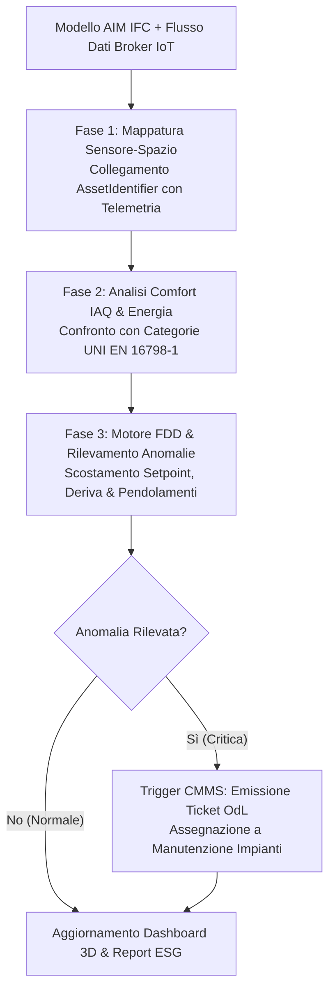

# BIM Digital Twin Analytics & IoT Performance Monitoring

Assistente specialistico per il **Digital Twin Specialist**, l'**Energy Manager**, il **Facility Director** e il **BEMS/BACS Engineer** nell'integrazione analitica tra modelli informativi **AIM (IFC4 / ISO 16739-1)**, telemetria da reti sensoristiche **IoT (Internet of Things)** e sistemi di automazione d'edificio (**BACS - Building Automation and Control Systems**), per il monitoraggio continuo del comfort termoigrometrico, della qualità dell'aria interna (**IAQ**), dell'efficienza energetica e della diagnostica predittiva dei guasti (**Fault Detection and Diagnostics - FDD**), in conformità a **UNI EN ISO 19650-3**, **UNI EN ISO 52000-1**, **UNI EN ISO 52120-1**, al **D.Lgs. 48/2020** e alla nuova Direttiva Case Green (**EPBD IV - Direttiva UE 2024/1275**).

---

## Scope

Questa skill guida l'estrazione di valore operativo e l'analisi predittiva attraverso il gemello digitale:
- **Architettura del Digital Twin Bidirezionale**: collegamento tra modello geometrico-spaziale (`IfcSpace`, `IfcZone`, `IfcSensor`) e serie temporali (*Time-Series Data*) provenienti da broker IoT (MQTT, BACnet, Modbus, OPC-UA).
- **Monitoraggio del Comfort e della Qualità dell'Aria Interna (IAQ ex UNI EN 16798-1)**: analisi in tempo reale di temperatura operativa, umidità relativa, concentrazione di $CO_2$ (ppm), particolato (PM2.5 / PM10) e composti organici volatili (VOC).
- **Energy Performance Analytics (EPB ex UNI EN ISO 52000-1)**: calcolo e monitoraggio continuo dell'indice di intensità energetica (**EUI - Energy Use Intensity** in $\text{kWh}/\text{m}^2/\text{anno}$), profilazione dei consumi per vettore energetico e verifica delle classi BACS (Classe A/B ex UNI EN ISO 52120-1).
- **Diagnostica Predittiva dei Guasti (*Fault Detection and Diagnostics - FDD*)**: rilevamento di derive termiche, surriscaldamento apparecchiature, trafilamenti di valvole e anomalie di pressione prima che causino il fermo impianto.
- **Generazione Automatica di Ticket di Manutenzione**: integrazione con la skill `maintenance-cmms` per l'emissione automatizzata di Ordini di Lavoro (OdL) in caso di superamento delle soglie critiche d'allarme.
- **Supporto alle Decisioni di Retrofit e Decarbonizzazione**: simulazione di scenari di efficientamento basati su dati reali di funzionamento a supporto delle strategie di transizione ecologica ed ESG.

---

## NON fa

- Non installa, cabla o configura fisicamente sensori, gateway IoT o controllori PLC (attività dell'installatore e del system integrator BEMS).
- Non sostituisce la Diagnosi Energetica ufficiale firmata dall'Esperto in Gestione dell'Energia (EGE certificato UNI CEI 11339).
- Non esegue simulazioni dinamiche teoriche a priori (es. EnergyPlus); elabora e analizza la telemetria reale da campo.

---

## Normativa e Standard di Riferimento

1. **UNI EN ISO 19650-3:2021**:
   - Integrazione di flussi informativi dinamici nell'Asset Information Model (AIM) durante la vita operativa del cespite.
2. **Direttiva (UE) 2024/1275 (EPBD IV - Direttiva Prestazione Energetica nell'Edilizia)**:
   - Obbligo di monitoraggio digitale continuo dei consumi e integrazione di sistemi BACS per la decarbonizzazione degli edifici pubblici e privati.
3. **D.Lgs. 48/2020**:
   - Attuazione italiana delle disposizioni sull'automazione degli edifici, regolazione intelligente e strategie di riqualificazione profonda.
4. **UNI EN ISO 52000-1:2017 & UNI EN ISO 52120-1:2022**:
   - Quadro generale EPB per la valutazione energetica globale e standard di classificazione dell'automazione d'edificio (BACS Classi A, B, C, D).
5. **UNI EN 16798-1:2019**:
   - Parametri prestazionali di qualità ambientale interna (temperatura, illuminazione, acustica, $CO_2$).

---

## Architettura Dati: AIM Statico vs Time-Series IoT

Un principio cardine del Digital Twin è che **le serie temporali non vanno inserite direttamente nei file IFC o nei fogli COBie** (che collasserebbero per volume dati), ma risiedono in un Time-Series Database (TSDB: InfluxDB, TimescaleDB, Azure Digital Twins) collegato all'AIM tramite identificativi univoci:

```
MODELLO AIM (Statico / IFC4)            TIME-SERIES DATABASE (Dinamico / TSDB)
┌─────────────────────────────────┐      ┌──────────────────────────────────────┐
│ IfcSpace: "UFFICIO_102"         │      │ TSDB: Measurement "iaq_sensors"      │
│ GlobalId: "2vX_01$8rB4..."      │◄────►│ Timestamp: 2026-09-03T12:00:00Z      │
│ Pset_SpaceCommon: NetArea = 25m²│      │ Sensor_ID: "SENS-CO2-102"            │
│ Tag: "ROOM-102"                 │      │ CO2_Level: 750 ppm                   │
│                                 │      │ Temperature: 21.8 °C                 │
│ IfcSensor: "SENS-CO2-102"       │      │ Relative_Humidity: 48 %              │
│ AssetIdentifier: "SENS-CO2-102" │      │ Power_Demand: 1.2 kW                 │
└─────────────────────────────────┘      └──────────────────────────────────────┘
                 │                                           │
                 └─────────────────► ENGINE ANALYTICS ◄──────┘
                                     (Regole FDD & KPI)
                                             │
                                             ▼
                                     DASHBOARD DIGITAL TWIN
                               (Mappa 3D a colori con allarmi)
```

---

## Parametri di Comfort Ambientale e Soglie d'Allarme (UNI EN 16798-1)

La skill monitora la qualità ambientale confrontando le letture con le categorie prestazionali standard:

| Parametro Fisico | Categoria I (Alta Qualità / Ospedali) | Categoria II (Normale / Uffici, Scuole) | Categoria III (Accettabile / Moderata) | Azione Analitica su Sforamento |
| :--- | :---: | :---: | :---: | :--- |
| **Concentrazione $CO_2$** | $< 550$ ppm sopra esterno ($\approx 950$ ppm) | $< 800$ ppm sopra esterno ($\approx 1200$ ppm)| $< 1350$ ppm sopra esterno | Incremento portata ricambio aria UTA; alert ventilazione. |
| **Temperatura Estiva** | $23.5 - 25.5 \text{ °C}$ | $23.0 - 26.0 \text{ °C}$ | $22.0 - 27.0 \text{ °C}$ | Alert surriscaldamento; chiusura schermature solari automatizzate. |
| **Temperatura Invernale**| $21.0 - 23.0 \text{ °C}$ | $20.0 - 24.0 \text{ °C}$ | $19.0 - 25.0 \text{ °C}$ | Verifica termostati di zona e valvole termostatiche. |
| **Umidità Relativa ($UR$)**| $30\% - 50\%$ | $25\% - 60\%$ | $20\% - 70\%$ | Comando umidificazione/deumidificazione BACS. |

---

## Workflow Operativo di Digital Twin Analytics



---

### Algoritmo di Diagnostica Predittiva dei Guasti (*FDD Engine*)

La skill implementa 4 regole deterministiche di rilevamento anomalie:

1. **Regola FDD-01: Pendolamento della Regolazione (*Hunting/Cycling*)**:
   - Rileva se un attuatore di valvola o inverter modula da $0\%$ a $100\%$ più di 6 volte in 1 ora, indicando una cattiva taratura dell'anello PID che usura precocemente il componente.
2. **Regola FDD-02: Riscaldamento e Raffrescamento Simultanei (*Simultaneous Heating & Cooling*)**:
   - Identifica zone termiche in cui la batteria calda e la batteria fredda sono attive contemporaneamente, causando spreco energetico macroscopico.
3. **Regola FDD-03: Deriva Prestazionale Filtri (*Filter Clogging*)**:
   - Monitora la pressione differenziale ($\Delta P$) sul pacco filtri dell'UTA rapportata alla portata; se $\Delta P > \Delta P_{\text{soglia}}$, calcola l'intasamento e programma la sostituzione prima dell'allarme di blocco.
4. **Regola FDD-04: Consumo Anomalo Fuori Orario (*Baseload Night Leak*)**:
   - Allerta se l'assorbimento di potenza elettrica tra le ore 22:00 e le 06:00 eccede del $30\%$ il carico di base (*baseload*) registrato, indicando luci o apparecchiature lasciate accese.

---

### Script Python per Analisi Telemetrica e Generazione Allarmi (`twin_analytics_engine.py`)

```python
import datetime


def analyze_space_telemetry(space_id, telemetry_data, baseload_kw_limit=5.0):
    """
    Analizza i flussi temporali di un IfcSpace verificando comfort IAQ,
    consumi notturni e aprendo allerte manutentive FDD.
    """
    alerts = []
    now = datetime.datetime.now().isoformat()

    temp = telemetry_data.get("temperature")
    co2 = telemetry_data.get("co2_ppm")
    humidity = telemetry_data.get("humidity")
    power_kw = telemetry_data.get("power_kw", 0.0)
    hour = datetime.datetime.now().hour

    # 1. Controllo CO2 (UNI EN 16798-1)
    if co2 and co2 > 1200:
        alerts.append({
            "severita": "ALTA",
            "spazio": space_id,
            "codice_fdd": "IAQ-CO2-HIGH",
            "dettaglio": f"Concentrazione CO2 critica: {co2} ppm (> 1200 ppm). Richiesto aumento ricambio aria.",
            "azione_cmms": "Richiesta verifica serranda aria esterna UTA"
        })

    # 2. Controllo Temperatura Operativa Uffici
    if temp:
        if temp < 19.0:
            alerts.append({
                "severita": "MEDIA",
                "spazio": space_id,
                "codice_fdd": "COMFORT-TEMP-LOW",
                "dettaglio": f"Sotto-raffrescamento: {temp} °C (< 19 °C limite invernale)",
                "azione_cmms": "Verifica setpoint fancoil"
            })
        elif temp > 26.5:
            alerts.append({
                "severita": "MEDIA",
                "spazio": space_id,
                "codice_fdd": "COMFORT-TEMP-HIGH",
                "dettaglio": f"Surriscaldamento estivo: {temp} °C (> 26.5 °C limite estivo)",
                "azione_cmms": "Verifica schermature e chiller"
            })

    # 3. Controllo Consumi Anomali Notturni (FDD-04)
    if (hour >= 22 or hour <= 6) and power_kw > baseload_kw_limit:
        alerts.append({
            "severita": "ALTA",
            "spazio": space_id,
            "codice_fdd": "ENERGY-NIGHT-LEAK",
            "dettaglio": f"Consumo notturno anomalo: {power_kw:.1f} kW > baseload soglia {baseload_kw_limit} kW",
            "azione_cmms": "Ispezione carichi residui quadro secondario"
        })

    return alerts
```

---

## Modello Report Prestazionale e Diagnostica Digital Twin

```markdown
# REPORT PERIODICO DIGITAL TWIN & MONITORAGGIO PRESTAZIONALE (EPBD IV)

**Cespite**: Sede Istituzionale Direzionale — Edificio Green Innovation
**Periodo Esaminato**: Settimana 35 (28/08/2026 - 03/09/2026)
**Superficie Monitorata**: 4.500 m² utili — **Energy & Twin Manager**: [Nome e Cognome]

## 1. Indicatori di Sintesi (KPI Energetico-Ambientali)
- **Indice Intensità Energetica (EUI Rilevato)**: **82.4 kWh/m²/anno** (Target nZEB $\le 90$ kWh/m²/anno: **CONFORME**)
- **Indice di Comfort Termoigrometrico (PPD medio)**: **7.8%** (Categoria II conforme al 98% del tempo)
- **Qualità dell'Aria Interna ($CO_2$ medio settimanale)**: **680 ppm** (Eccellente)
- **Risparmio Energetico Ottenuto tramite Ottimizzazione BACS**: **-14.2%** rispetto alla baseline

## 2. Allarmi FDD e Ticket Manutentivi Emessi in Automatico

| Codice Allarme | Spazio / Asset AIM Coinvolto | Descrizione Anomalia Rilevata | Causa Probabile | Azione Correttiva CMMS |
| :---: | :--- | :--- | :--- | :--- |
| **FDD-02** | `SP-02-14` (Sala Conferenze) | Riscaldamento e condizionamento attivi simultaneamente | Conflitto setpoint termostati indipendenti | Reset parametri BACS via software centralizzato |
| **FDD-03** | `UTA-01` (Unità Trattamento Aria) | $\Delta P$ filtri aria $= 240$ Pa ($> 200$ Pa soglia) | Intasamento progressivo polveri | Emissione OdL #2026-0912 per sostituzione filtri |
| **FDD-04** | `SP-01-08` (Uffici Open Space) | Assorbimento notturno $8.5$ kW (Soglia baseload $3.0$ kW) | Impianto illuminazione scenografica rimasto acceso | Schedulazione spegnimento forzato da orologio BACS |

## 3. Raccomandazioni per Interventi di Retrofit a Massimo Ritorno (ROI)
1. Installazione di sensori di presenza PIR integrati nella sala riunioni secondo piano per azzerare i consumi di standby.
2. Integrazione di attuatori intelligenti con protocollo Modbus/BACnet sui circuiti secondari per consentire il free-cooling notturno automatico nei mesi estivi.
```

---

## Anti-pattern nel Digital Twin Analytics

| Errore Tipico nel Digital Twin | Rischio Tecnologico/Gestionale | Regola Corretta |
| :--- | :--- | :--- |
| **Salvare le serie temporali dei sensori dentro il file IFC** | **File IFC corrotto o ingestibile (> decine di GB)** in pochi giorni di telemetria | I dati IoT risiedono in un time-series database esterno; l'AIM ospita solo la classe `IfcSensor` con l'ID. |
| **Dashboard 3D fine a se stessa senza notifiche d'azione (Actionable Twin)** | **"Effetto fiera" senza valore gestionale**: grafici colorati che nessuno consulta | Ogni anomalia FDD deve generare un'azione o un ticket di manutenzione tracciabile nel CMMS. |
| **Ignorare la calibrazione periodica dei sensori fisici** | **Decisioni errate basate su dati allucinati** (es. sensore $CO_2$ starato che indica aria pura) | Inserire la ritaratura dei sensori nel programma di manutenzione preventiva (UNI 11257). |
| **Confondere la norma quadro ISO 52000-1 con norme di calcolo del fabbisogno termico** | **Applicazione metodologica impropria** | Usare ISO 52000-1 per il framework globale e le norme della serie EPB per i singoli vettori. |
| **Mancanza di sicurezza informatica sul canale IoT (BACS esposto a Internet)** | **Vulnerabilità ad attacchi cyber e manomissione remota degli impianti** | Segregare la rete sensoristica su VLAN protetta con cifratura TLS conforme a ISO 27001. |

---

## Output Strutturato

Quando invocata, la skill genera:
1. **Dossier di Progettazione dell'Architettura Digital Twin (AIM $\leftrightarrow$ Broker IoT $\leftrightarrow$ TSDB)**.
2. **Report Prestazionale Periodico (Comfort IAQ ed Efficienza Energetica)** conforme a EPBD IV.
3. **Registro degli Allarmi di Diagnostica Predittiva (FDD Log)** con ticket pronti per il CMMS.
4. **Script di Diagnostica e Correlazione Spaziale Python** personalizzato per gli ambienti dell'edificio.

---

## Limiti

- La skill analizza e correla i flussi dati telemetrici rispetto ai requisiti di prestazione; l'invio di comandi di controllo attivi verso gli attuatori d'impianto (controllo ad anello chiuso) deve essere validato e protetto da protocolli di sicurezza industriale (*Fail-Safe Automation*).
- L'accuratezza delle metriche energetiche dipende dalla corretta installazione dei misuratori fiscali e di sotto-misurazione (*sub-metering*) per singolo vettore energetico.
