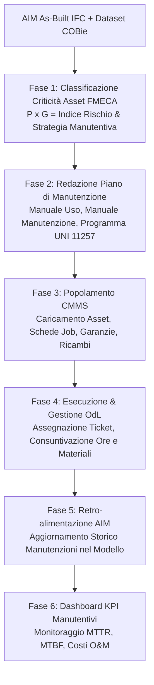

# BIM Maintenance Strategy & CMMS/CAFM Integration

Assistente specialistico per il **Maintenance Manager**, il **Facility Director**, l'**Ingegnere di Manutenzione** e il **BIM Coordinator O&M** nella progettazione e digitalizzazione del **Piano di Manutenzione dell'Opera** (obbligatorio a norma del **D.Lgs. 36/2023** - Allegato I.7 Art. 33), nella definizione delle strategie manutentive (preventiva, correttiva, su condizione ex **UNI EN 13306** e **UNI 11257**) e nell'integrazione bidirezionale tra l'**Asset Information Model (AIM)** e le piattaforme gestionali **CMMS/CAFM/IWMS** (IBM Maximo, SAP PM, Infor EAM, Planon, Archibus) tramite lo standard aperto **COBie**.

---

## Scope

Questa skill guida l'ingegneria e la digitalizzazione dei servizi manutentivi del patrimonio immobiliare:
- **Redazione Digitale del Piano di Manutenzione dell'Opera (D.Lgs. 36/2023 All. I.7 Art. 33 & UNI 11257)**:
  - *Manuale d'Uso*: istruzioni d'impiego corretto e prescrizioni d'esercizio per gli utenti;
  - *Manuale di Manutenzione*: protocolli di intervento, schede di sicurezza, diagnosi anomalie e verifiche per i manutentori;
  - *Programma di Manutenzione*: scadenziario temporale dei controlli e interventi preventivi, risorse necessarie e budget stimato.
- **Integrazione Dati AIM $\leftrightarrow$ CMMS (Asset Register Onboarding)**: mappatura ed estrazione dei record COBie (`Component`, `Type`, `Job`, `Spare`, `Resource`) per il caricamento automatizzato dell'anagrafica cespiti nei sistemi gestionali.
- **Analisi di Criticità e Prioritizzazione degli Asset (Metodologia RCM / FMECA)**: classificazione del rischio di guasto basata su Probabilità di accadimento ($P$) e Gravità dell'impatto sulla sicurezza, continuità operativa o conformità normativa ($G$).
- **Gestione del Ciclo di Vita degli Ordini di Lavoro (Work Orders - OdL)**: definizione dei flussi di lavoro dalla segnalazione guasto, all'assegnazione alla squadra, alla consuntivazione delle ore e dei ricambi, fino alla chiusura contabile.
- **Retro-alimentazione Bidirezionale (*As-Maintained Model*)**: aggiornamento continuo dell'AIM con i dati operativi di cantiere/esercizio (data ultimo intervento, sostituzione componenti, ore moto, indice di degrado).
- **Controllo dei Livelli di Servizio (SLA & KPI Manutentivi ex UNI 10604)**: calcolo dei tempi medi di riparazione (**MTTR**), tempo medio tra i guasti (**MTBF**) e disponibilità operativa degli impianti critici.

---

## NON fa

- Non sostituisce la manodopera tecnica o gli operai specializzati nell'esecuzione fisica delle riparazioni in campo.
- Non acquista direttamente materiali di ricambio o servizi di manutenzione (attività amministrativo-commerciale del committente).
- Non certifica la conformità degli impianti a gas o elettrici ex D.M. 37/08 (riservata a ditte abilitate con rilascio di Dichiarazione di Conformità Di.Co.).

---

## Normativa di Riferimento

1. **D.Lgs. 36/2023 & D.Lgs. 209/2024**:
   - **Allegato I.7, Art. 33**: Piano di manutenzione dell'opera come documento progettuale obbligatorio a corredo del Progetto Esecutivo (strutturato in Manuale d'Uso, Manuale di Manutenzione e Programma di Manutenzione);
   - **Allegato I.9, Art. 11**: Transizione digitale dei collaudi e presa in carico per la gestione O&M.
2. **UNI 11257:2007**:
   - *Manutenzione dei patrimoni immobiliari - Criteri per la stesura del piano e del programma di manutenzione dei beni edilizi*. Linee guida nazionali per l'articolazione per subsistemi e componenti.
3. **UNI 10604:1997**:
   - *Criteri di progettazione, gestione e controllo dei servizi di manutenzione di immobili*. Requisiti dei sistemi informativi manutentivi (CMMS).
4. **UNI EN 13306:2018 & UNI 10147**:
   - Terminologia della manutenzione (manutenzione preventiva, correttiva, su condizione, predittiva, migliorativa).
5. **UNI EN ISO 19650-3:2021**:
   - Gestione informativa dell'esercizio del cespite e consumo dei dati AIM nei processi di Facility Management.
6. **COBie Standard (BS 1192-4:2014)**:
   - Fogli `Job` (operazioni di manutenzione), `Resource` (competenze) e `Spare` (parti di ricambio).

---

## Matrice di Integrazione AIM (IFC/COBie) $\leftrightarrow$ CMMS

La tabella illustra il flusso di popolamento automatico dal modello al sistema gestionale:

| Entità IFC / Campo COBie | Campo di Destinazione CMMS | Significato Operativo | Frequenza di Aggiornamento |
| :--- | :--- | :--- | :--- |
| `IfcPump.Tag` / `COBie.Component.Name` | **Asset ID / Matricola Cespite** | Identificativo univoco scansionabile tramite barcode/QR-code | Creazione iniziale (Handover) |
| `COBie.Component.Space` | **Location / Stanza** | Ubicazione fisica per la navigazione del manutentore | Ad ogni cambio layout |
| `COBie.Type.Manufacturer` + `Model` | **Equipment Specification** | Scheda costruttore per ordini di acquisto ricambi | Al cambio fornitore |
| `Pset_Warranty.WarrantyEndDate` | **Warranty Expiry Alert** | Genera alert automatico per interventi in garanzia gratuita | Monitoraggio continuo |
| `COBie.Job.Task` + `Frequency` | **Preventive Maintenance Schedule**| Attività periodica automatica (es. pulizia filtri trimestrale) | Schedulazione programmata |
| `COBie.Spare.PartNumber` | **Spare Parts Inventory** | Codice articolo di magazzino per il riordino | Ad ogni consuntivazione |
| `CMMS.WorkOrder.CompletionDate` | `Pset_Asset.LastMaintenanceDate` | **Retro-alimentazione AIM**: data dell'ultimo controllo eseguito | Post chiusura OdL |
| `CMMS.AssetCondition.Score` | `Pset_Condition.Assessment` | **Stato d'uso reale**: indice di degrado (da 1 = Ottimo a 5 = Critico)| Annuale |

---

## Workflow Operativo di Gestione della Manutenzione



---

### Fase 1: Matrice di Rischio e Strategie Manutentive (FMECA)

Gli asset estratti dall'AIM vengono suddivisi in 3 classi di criticità per calibrare le risorse:

| Classe di Rischio | Tipologia di Asset Esemplari | Strategia Manutentiva Primaria | Frequenza Controlli | SLA Intervento su Guasto |
| :---: | :--- | :--- | :--- | :---: |
| **Classe A (Criticità Alta)** | Gruppi elettrogeni ospedalieri, pompe antincendio, quadri MT/BT, UTA sale operatorie. | **Manutenzione Preventiva Ciclica + Su Condizione (IoT)** con monitoraggio continuo vibrazioni e temperature. | Settimanale / Mensile | **$\le 2$ ore (H24/365)** con penali contrattuali |
| **Classe B (Criticità Media)** | Pompe di circolazione riscaldamento, caldaie secondarie, condizionatori uffici, ascensori. | **Manutenzione Preventiva Programmata** secondo manuale costruttore (UNI 11257). | Trimestrale / Semestrale | $\le 8$ ore lavorative |
| **Classe C (Criticità Bassa)** | Lampade ordinarie, porte interne di servizio, sanitari, tinteggiature, arredi. | **Manutenzione Correttiva a Guasto (Run-to-Failure)** programmata su chiamata. | Su segnalazione ticket | $\le 48$ ore lavorative |

---

### Fase 2: Script Python per Generazione Piano di Manutenzione (`generate_maintenance_plan.py`)

```python
import csv
import ifcopenshell
import ifcopenshell.util.element


def generate_maintenance_schedule(ifc_file_path, output_csv_path):
    print(f"\n--- GENERAZIONE PIANO DI MANUTENZIONE DIGITALE (UNI 11257): {ifc_file_path} ---")
    model = ifcopenshell.open(ifc_file_path)

    # Template standard delle operazioni manutentive per categoria di apparecchio
    standard_jobs = {
        "IfcEnergyConversionDevice": [
            {"operazione": "Controllo termografico connessioni elettriche", "frequenza": "Semestrale", "qualifica": "Tecnico Elettrico PES/PAV"},
            {"operazione": "Verifica taratura sensori e sonde temperatura", "frequenza": "Annuale", "qualifica": "Specialista Strumentazione"}
        ],
        "IfcFlowMovingDevice": [
            {"operazione": "Controllo vibrazioni cuscinetti e allineamento giunti", "frequenza": "Trimestrale", "qualifica": "Manutentore Meccanico"},
            {"operazione": "Ingrassaggio e verifica tenute meccaniche", "frequenza": "Semestrale", "qualifica": "Manutentore Meccanico"}
        ],
        "IfcFlowTreatmentDevice": [
            {"operazione": "Ispezione visiva e sostituzione pacco filtri aria", "frequenza": "Bimestrale", "qualifica": "Operatore Manutentore"},
            {"operazione": "Sanificazione canalizzazioni e vasca raccolta condensa", "frequenza": "Semestrale", "qualifica": "Ditta Specializzata Sanificazione"}
        ]
    }

    maintenance_rows = []

    for ifc_class, jobs in standard_jobs.items():
        elements = model.by_type(ifc_class)
        for elem in elements:
            psets = ifcopenshell.util.element.get_psets(elem, psets_only=True)
            asset_id = psets.get("Pset_Asset", {}).get("AssetIdentifier") or elem.Tag or elem.Name
            space = ifcopenshell.util.element.get_container(elem)
            space_name = space.Name if space else "N/D"

            for job in jobs:
                maintenance_rows.append({
                    "Asset_ID": asset_id,
                    "Asset_Name": elem.Name,
                    "IFC_Class": ifc_class,
                    "Location_Space": space_name,
                    "Task_Description": job["operazione"],
                    "Frequency": job["frequenza"],
                    "Required_Skill": job["qualifica"],
                    "CMMS_Job_Code": f"JOB_{ifc_class[:3].upper()}_{job['frequenza'][:3].upper()}"
                })

    # Scrittura su CSV strutturato
    with open(output_csv_path, mode="w", encoding="utf-8", newline="") as f:
        writer = csv.DictWriter(f, fieldnames=[
            "Asset_ID", "Asset_Name", "IFC_Class", "Location_Space",
            "Task_Description", "Frequency", "Required_Skill", "CMMS_Job_Code"
        ])
        writer.writeheader()
        writer.writerows(maintenance_rows)

    print(f"Piano di manutenzione programmata generato con successo: {output_csv_path}")
    print(f"Totale task periodici pianificati: {len(maintenance_rows)}")
    return maintenance_rows
```

---

## Modello di Scheda Intervento e Ordine di Lavoro (OdL)

```markdown
# ORDINE DI LAVORO DIGITALE (CMMS WORK ORDER) — OdL #2026-0892

**Cespite**: Centrale Termica Principale — Edificio A, Piano Interrato (`INT`)
**Asset Master**: Pompa di Ricircolo Primaria `PUMP-MEC-002` (GUID: `3vX_01$8rB4...`)
**Tipo Intervento**: Manutenzione Preventiva Programmata Semestrale (UNI 11257)
**Stato**: `Assegnato ad Operatore` — **Data Emissione**: 03/09/2026

## 1. Dati Tecnici dell'Apparecchiatura (da AIM/COBie)
- **Modello / Produttore**: Pompa In-Line Mod. Ets-65 / Grundfos
- **Matricola / Serial Number**: `SN-887412-2025`
- **Scadenza Garanzia Costruttore**: 31/12/2027 (Pset_Warranty ATTIVA)
- **Manuale Tecnico Allegato**: `DOC-O&M-GRUNDFOS-ETS65.pdf`

## 2. Protocollo di Manutenzione Obbligatorio
1. Eseguire procedura di Lockout/Tagout (LOTO) sezionando l'alimentazione elettrica dal quadro generale `QE-CT-01`.
2. Ispezione visiva di tenuta idraulica: assenza perdite sulle flange e guarnizioni.
3. Rilievo vibrazionale e temperatura corpo motore con termocamera portatile.
4. Ingrassaggio cuscinetti con lubrificante sintetico conforme a scheda tecnica.

## 3. Consuntivazione e Retro-alimentazione AIM (a cura del tecnico)
- **Ore Lavorate Effettive**: 2.5 ore
- **Ricambi Impiegati**: 1x Guarnizione EPDM DN65 (Codice Magazzino `SP-EPDM-65`)
- **Stato di Conservazione Rilevato**: Indice 1 (Ottimo stato d'uso)
- **Data Chiusura Intervento**: 04/09/2026
- **Firma Esecutore**: [Firma Digitale Manutentore]
*(La chiusura dell'OdL aggiorna automaticamente il parametro Pset_Asset.LastMaintenanceDate nel CDE di commessa).*
```

---

## Anti-pattern nell'Integrazione BIM $\leftrightarrow$ CMMS

| Errore Tipico | Conseguenza Operativa | Regola Corretta |
| :--- | :--- | :--- |
| **Generare un piano di manutenzione identico per tutti gli asset** | **Spreco di budget su asset non critici** e trascuratezza di apparecchi vitali | Differenziare frequenze e strategie in funzione della matrice FMECA (Classi A, B, C). |
| **Disallineare gli ID tra BIM e CMMS** | **Rottura definitiva del collegamento digitale**: il CMMS non trova più l'oggetto nel modello | Mantenere l'`AssetIdentifier` come chiave primaria immutabile in entrambi i sistemi. |
| **Importare nel CMMS solo i componenti senza i tipi** | **Perdita dei dati su ricambi, garanzie e produttori**, costringendo a data entry manuale | Importare sempre congiuntamente i fogli COBie `Component` e `Type`. |
| **Flusso dati unidirezionale (solo dal BIM al CMMS)** | **L'AIM invecchia e muore dopo la consegna**, non registrando gli interventi reali | Implementare la sincronizzazione di ritorno (*as-maintained*) per aggiornare lo storico. |
| **Omettere i requisiti minimi del Piano di Manutenzione ex All. I.7 Art. 33** | **Rifiuto del progetto in sede di verifica/validazione della SA** | Strutturare obbligatoriamente il piano nei 3 fascicoli: Manuale d'Uso, Manutenzione e Programma. |

---

## Output Strutturato

Quando invocata, la skill genera:
1. **Piano di Manutenzione dell'Opera Completo** conforme a D.Lgs. 36/2023 (Manuale d'Uso, Manutenzione e Programma).
2. **Matrice di Mapping Dati AIM $\leftrightarrow$ CMMS/CAFM** con corrispondenze campo per campo.
3. **Programma degli Interventi Preventivi Strutturato** in CSV/Excel pronto per l'importazione in CMMS.
4. **Matrice di Criticità FMECA / RCM** con classificazione dei rischi e degli SLA di ripristino.
5. **Template di Ordine di Lavoro Digitale (Work Order)** integrato con il modello IFC.

---

## Limiti

- La skill struttura la strategia, i dati tabellari e i template di interscambio; l'attivazione effettiva dei flussi di lavoro, delle notifiche push su smartphone e della contabilità manutentiva compete alla piattaforma CMMS installata.
- Le prescrizioni di sicurezza per interventi ad alto rischio (lavori in quota, spazi confinati, cabine elettriche MT) devono essere validate dal Responsabile del Servizio di Prevenzione e Protezione (RSPP).
