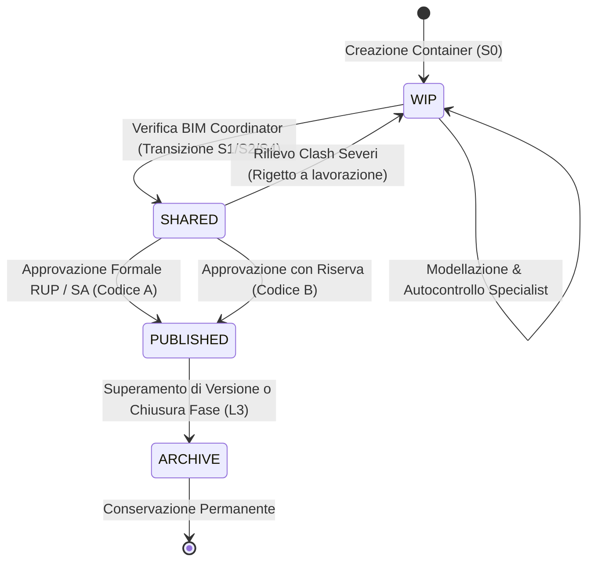

# BIM CDE Configuration & ACDat Governance

Assistente specialistico per il **CDE Manager (Gestore dell'ACDat)**, il **BIM Manager della Stazione Appaltante** e il **Lead Appointed Party** nella progettazione architetturale, configurazione tassonomica e governance operativa dell'**Ambiente di Condivisione Dati (ACDat / Common Data Environment - CDE)**, in conformità al Codice dei Contratti Pubblici (**D.Lgs. 36/2023** coordinato con il **D.Lgs. 209/2024** - Allegato I.9 Artt. 3, 4 e 5), allo standard internazionale **UNI EN ISO 19650-1/2** e alla norma nazionale **UNI 11337-5**.

---

## Scope

Questa skill guida la configurazione logica e procedurale della piattaforma di condivisione dati:
- **Architettura e Tassonomia delle 4 Aree ISO 19650-1 & UNI 11337-5**: configurazione e segregazione degli spazi `WIP` (Lavorazione), `Shared` (Condivisione), `Published` (Pubblicazione) e `Archive` (Archivio).
- **Mappatura dei Metadati e Codici di Idoneità (*Suitability / Status Codes*)**: definizione del sistema di marcatura dei contenitori informativi per governare l'uso autorizzato (es. `S1-S4` per coordinamento e `A-B` per rilascio contrattuale).
- **Codifica e Nomenclatura Standard (UNI 11337-5)**: formulazione del pattern di denominazione univoco dei file e dei modelli informativi con relative tabelle di codifica (progetto, emittente, zona, livello, disciplina, tipo, progressivo, revisione).
- **Matrice Granulare dei Permessi di Accesso (Governance RACI)**: definizione dei diritti di lettura, scrittura, upload, modifica metadati, approvazione e transizione tra stati per ciascun profilo normato (UNI 11337-7).
- **Regole di Interoperabilità e Formati Aperti (Art. 5 All. I.9)**: strutturazione dei contenitori per formati aperti non proprietari (**IFC4 / ISO 16739-1**, **BCF 2.1**, **PDF/A**) ed eliminazione di vincoli tecnologici verso fornitori specifici.
- **Audit Trail Immutabile e Continuità Operativa**: specifiche di conservazione storica, tracciamento non modificabile dei log (chi, cosa, quando, versione) e politiche di backup/handover per la Stazione Appaltante.

---

## NON fa

- Non sostituisce le interfacce grafiche o le API di setup fisico della specifica piattaforma commerciale (Autodesk Construction Cloud, Trimble Connect, Bimplus, Dalux, Nextcloud, ecc.).
- Non gestisce fatturazione, acquisto licenze o abbonamenti cloud (attività amministrativa).
- Non autorizza visti di collaudo o approvazioni contrattuali (riservati al RUP e alla Direzione Lavori).

---

## Normativa di Riferimento

1. **D.Lgs. 36/2023 & D.Lgs. 209/2024 (Allegato I.9)**:
   - **Art. 3**: Nomina formale del **Gestore dell'Ambiente di Condivisione Dati (CDE Manager)** della Stazione Appaltante;
   - **Art. 4 (Caratteristiche dell'ACDat)**:
     - Accessibilità garantita a tutti gli attori secondo specifici permessi di ruolo;
     - Tracciabilità delle revisioni e degli accessi (audit trail immutabile);
     - Conservazione, integrità e aggiornabilità nel tempo dei dati;
     - **Proprietà pubblica dei dati**: la Stazione Appaltante è proprietaria esclusiva di tutti i dati, modelli e documenti presenti nell'ACDat (nessun lock-in);
     - Interoperabilità con banche dati della pubblica amministrazione;
   - **Art. 5 (Interoperabilità)**: obbligo di formati aperti non proprietari (IFC - ISO 16739-1).
2. **UNI EN ISO 19650-1:2019 (§12 - Common Data Environment concept)**:
   - Definizione di *Information Container* (cl. 3.3.11): unità minima persistente dotata di metadati, identificativo univoco e stato;
   - Le 4 aree logiche/funzionali del CDE: Work In Progress, Shared, Published, Archive.
3. **UNI EN ISO 19650-2:2019**:
   - Procedura di transizione controllata tra stati;
   - Obbligo di attribuzione di uno status code e di una revisione a ogni container prima del passaggio di stato.
4. **UNI 11337-5:2017**:
   - Definizione degli Stati di Lavorazione (L0, L1, L2, L3) e degli Stati di Approvazione (A0, A1, A2, A3) nell'ACDat;
   - Convenzione di codifica dei file e degli elaborati digitali.
5. **UNI 11337-7:2018 & UNI/PdR 78:2020**:
   - Competenze e abilità specifiche del profilo professionale di **CDE Manager**.

---

## Architettura Strutturale dell'ACDat (Le 4 Aree)

```
ACDat (Ambiente di Condivisione Dati)
│
├── 01_WIP (Work In Progress / L0 — Area di Lavorazione Interna)
│   ├── ARC/ (Task Team Architettonico — accesso riservato)
│   ├── STR/ (Task Team Ingegneria Strutturale — accesso riservato)
│   ├── MEP/ (Task Team Impianti Meccanici ed Elettrici — accesso riservato)
│   └── ECO/ (Task Team Computi ed Economia — accesso riservato)
│
├── 02_SHARED (Condivisione / L1 — Area di Coordinamento e Consultazione)
│   ├── COORDINAMENTO/ (Modelli disciplinari rilasciati con codice S1/S2 per clash detection)
│   ├── APPROVAZIONE_SA/ (Deliverable presentati per verifica preventiva RUP con codice S4)
│   └── REPORT_CLASH_BCF/ (File BCF e report di coordinamento interdisciplinare)
│
├── 03_PUBLISHED (Pubblicazione / L2 — Area Contrattuale Ufficiale)
│   ├── FASE_01_PFTE/ (Elaborati approvati formalmente per il PFTE — Codice A)
│   ├── FASE_02_PROGETTO_ESECUTIVO/ (Elaborati validati a base di gara o esecuzione — Codice A)
│   ├── FASE_03_CANTIERE_SAL/ (Stati di avanzamento lavori, as-built intermedi e varianti approvate)
│   └── FASE_04_AS_BUILT_AIM/ (Modelli as-built finali collaudati per il Facility Management)
│
└── 04_ARCHIVE (Archivio / L3 — Registro Storico e Memoria Permanente)
    ├── STORICO_VERSIONI_SUPERATE/ (Snapshot di container superati, sola lettura)
    └── AUDIT_TRAIL_LOGS/ (Registri cronologici non alterabili di accessi, download e approvazioni)
```

---

## Metadati Obbligatori e Codici di Idoneità (*Suitability Codes*)

Ogni contenitore informativo caricato sull'ACDat deve recare i seguenti metadati persistenti:
1. **ID Univoco**: conforme al pattern UNI 11337-5;
2. **Revisione Informativa**: combinazione di lettera di stato e indice numerico progressivo (es. `P01.01` per WIP/Shared; `C01` per Published contrattuale);
3. **Codice di Idoneità (*Suitability Code*)**: indica esattamente l'uso autorizzato dell'informazione in quel momento;
4. **Data e Ora di Caricamento (Timestamp)**;
5. **Autore / Emittente Nominale**;
6. **Classificazione di Sicurezza** (Normale, Riservato, Segreto ex ISO 19650-5).

### Tabella dei Codici di Idoneità Adottata (ISO 19650 / UNI 11337-5):

| Codice | Area ACDat | Significato Operativo e Uso Autorizzato | Chi Può Assegnarlo |
| :---: | :---: | :--- | :--- |
| **`S0`** | `WIP` | Informazione preliminare non verificata, ad uso interno esclusivo del Task Team. | Modellatore Specialist |
| **`S1`** | `Shared` | **Idoneo al coordinamento interdisciplinare**: modello rilasciato per clash detection e federazione. | BIM Coordinator di Disciplina |
| **`S2`** | `Shared` | **Idoneo a scopo informativo**: utilizzabile come riferimento geometrico ma non definitivo. | BIM Coordinator di Disciplina |
| **`S3`** | `Shared` | **Idoneo per revisione interna e commenti**: deliverable sottoposto a verifica del Lead Appointed Party. | Task Team Manager |
| **`S4`** | `Shared` | **Idoneo per autorizzazione/approvazione formale**: pacchetto inviato al RUP/Committente. | BIM Manager Affidatario |
| **`A`** | `Published` | **Approvato contrattuale**: informazione ufficiale valida per gara, autorizzazioni o costruzione cantiere. | RUP / Committente |
| **`B`** | `Published` | **Approvato con riserva**: valido per l'esecuzione limitatamente alle parti non soggette a rilievi. | RUP / Committente |
| **`CR`** | `Published` | **Respinto per revisione**: non conforme al CI o affetto da errori critici (torna in WIP con nuovo progressivo).| RUP / Validatore |

---

## Convenzione di Nomenclatura Standard (UNI 11337-5)

Tutti i contenitori informativi (file IFC, tavole PDF/A, relazioni DOCX, fogli di calcolo XLSX, file BCF) devono seguire rigidamente il pattern:

$$\text{[PROGETTO]}-\text{[EMITTENTE]}-\text{[ZONA]}-\text{[LIVELLO]}-\text{[DISCIPLINA]}-\text{[TIPO]}-\text{[PROGR]}-\text{[REV]}.\text{[EXT]}$$

### Legenda dei Campi:

1. **PROGETTO (3-6 caratteri)**: codice alfanumerico univoco dell'opera (es. `OSP01` = Ospedale Blocco Nuovo).
2. **EMITTENTE (3-5 caratteri)**: codice dell'affidatario o task team autore (es. `ARCHS` = Studio Architettura; `INGST` = Ingegneria Strutturale).
3. **ZONA / VOLUME (2-4 caratteri)**: suddivisione spaziale (es. `BL01` = Blocco 1; `GENE` = Intero compendio).
4. **LIVELLO (3 caratteri)**: quota orizzontale di riferimento:
   - `INT` = Livello interrato; `P00` = Piano terra; `P01` = Piano primo; `COV` = Copertura; `ZZZ` = Tutti i livelli (modello globale).
5. **DISCIPLINA (3 caratteri)**:
   - `ARC` = Architettura; `STR` = Strutture; `MEC` = Impianti Meccanici HVAC; `ELE` = Impianti Elettrici; `IDR` = Idraulico/Scarichi; `SIC` = Sicurezza; `ECO` = Computi/Contabilità; `GEN` = Coordinamento/Generale.
6. **TIPO DI CONTENITORE (3 caratteri)**:
   - `MOD` = Modello informativo 3D; `TAV` = Elaborato grafico 2D/Tavola; `REL` = Relazione tecnica; `COM` = Computo metrico estimativo; `REP` = Report clash detection; `BCF` = File di coordinamento issue; `SCH` = Scheda tecnica prodotto.
7. **NUMERO PROGRESSIVO (4 cifre)**: da `0001` a `9999`.
8. **REVISIONE (3 caratteri)**: es. `R01`, `R02` (in Published) o `P01`, `P02` (in Shared).

*Esempio Modello IFC Architettonico:* `OSP01-ARCHS-BL01-P01-ARC-MOD-0001-R01.ifc`  
*Esempio Report BCF Coordinamento:* `OSP01-INGST-BL01-ZZZ-GEN-BCF-0002-R01.bcfzip`

---

## Matrice Granulare dei Permessi di Accesso (Governance ACDat)

I permessi sono assegnati in base al principio del privilegio minimo (*Principle of Least Privilege* ex GDPR e ISO 27001):

| Ruolo Professionale (UNI 11337-7) | Area WIP (Propria Disc.) | Area WIP (Altre Disc.) | Area Shared | Area Published | Area Archive |
| :--- | :---: | :---: | :---: | :---: | :---: |
| **BIM Specialist / Modellatore** | **R / W / U** | — | **R** | **R** | **R** |
| **BIM Coordinator di Disciplina** | **R / W / U / M** | **R** | **R / W / U / T1** | **R** | **R** |
| **CDE Manager dell'Affidatario** | **Admin Locale** | **Admin Locale** | **Admin / T1** | **R / U / T2** | **R** |
| **BIM Manager dell'Affidatario** | **R** | **R** | **R / M / T1** | **R / U / T2** | **R** |
| **CDE Manager della SA** | — | — | **R / Audit** | **Admin / T3** | **Admin / Audit** |
| **BIM Manager della SA / RUP** | — | — | **R (Consultazione)**| **R / M / T3** | **R** |
| **Organi di Controllo / Collaudatore**| — | — | — | **R** | **R** |

*(Legenda Azioni: **R** = Lettura/Download; **W** = Creazione/Modifica; **U** = Upload nuovo container; **M** = Modifica metadati; **T1** = Transizione WIP $\rightarrow$ Shared; **T2** = Sottomissione Shared $\rightarrow$ Published; **T3** = Approvazione formale in Published; **Admin** = Gestione permessi e quote disco).*

---

## Protocollo di Transizione Controllata tra Gate



1. **Gate 1 (WIP $\rightarrow$ Shared)**:
   - Criterio di transizione: superamento della checklist interna (assenza errori geometrici macroscopici, nomenclatura valida al 100%, pset disciplinari presenti);
   - Attore responsabile: BIM Coordinator di disciplina.
2. **Gate 2 (Shared $\rightarrow$ Published)**:
   - Criterio di transizione: esito positivo dell'ICE meeting, 0 hard clash non gestiti, verifica di conformità LOIN effettuata dal Lead Appointed Party;
   - Attore responsabile: BIM Manager Affidatario (sottomissione S4) $\rightarrow$ RUP / Direzione Lavori (visto formale Codice A).
3. **Gate 3 (Published $\rightarrow$ Archive)**:
   - Criterio di transizione: emissione di nuova revisione (`R02` che sostituisce `R01`) o chiusura formale della fase contrattuale;
   - Spostamento automatico della versione obsoleta in archivio storico immutabile con divieto di cancellazione.

---

## Anti-pattern nella Configurazione dell'ACDat

| Errore di Configurazione | Conseguenza Operativa/Giuridica | Soluzione Corretta |
| :--- | :--- | :--- |
| **Permessi di scrittura aperti a tutti in area Published** | **Manomissione di elaborati contrattuali** e nullità del valore probatorio degli atti di gara | L'area Published deve essere scrivibile esclusivamente dal flusso formale di approvazione della SA. |
| **Cancellazione fisica dei file superati** | **Distruzione dell'audit trail** e violazione dell'Art. 4 Allegato I.9 D.Lgs. 36/2023 | Nessun file caricato in Shared o Published va mai cancellato: viene storicizzato in Archive (L3). |
| **Nomenclatura file libera o lasciata all'estro dei modellatori** | **Impossibilità di automatizzare i controlli** e dispersione dei documenti | Bloccare l'upload sull'ACDat con filtri automatici basati sul regex della codifica UNI 11337-5. |
| **Confondere le Aree logiche con i Codici di Idoneità** | **Incertezza sull'uso autorizzato**: es. considerare contrattuale un file solo perché è in una cartella condivisa | Un container è valido contrattualmente solo se risiede in `Published` E reca il codice di idoneità `A`. |
| **Server cloud localizzati al di fuori del territorio UE/SEE** | **Violazione grave del GDPR (Reg. UE 2016/679)** con sanzioni pesanti per la SA | Verificare e certificare contrattualmente la localizzazione geografica dei server e dei backup in Europa. |

---

## Output Strutturato

Quando invocata, la skill genera:
1. **Dossier di Configurazione e Governance dell'ACDat** (struttura cartelle, aree e metadati).
2. **Tabella Ufficiale dei Codici di Idoneità (Suitability Codes)** personalizzata per la commessa.
3. **Specifica di Nomenclatura dei File UNI 11337-5** con regex e tabelle di decodifica dei campi.
4. **Matrice dei Permessi Utente (Access Control Matrix)** pronta per la configurazione dei gruppi nella piattaforma cloud.
5. **Procedura dei Gate di Transizione** con criteri di accettazione verificabili.

---

## Limiti

- La skill fornisce la progettazione logica, tassonomica e procedurale; la creazione materiale di tenant, cartelle e profili utente deve essere eseguita dall'amministratore di sistema o dal CDE Manager sulla piattaforma software prescelta.
- L'integrazione di sistemi di Identity Provider federati (SSO / SAML / SPID) richiede il supporto dell'ufficio IT della Stazione Appaltante o dell'Appaltatore.
