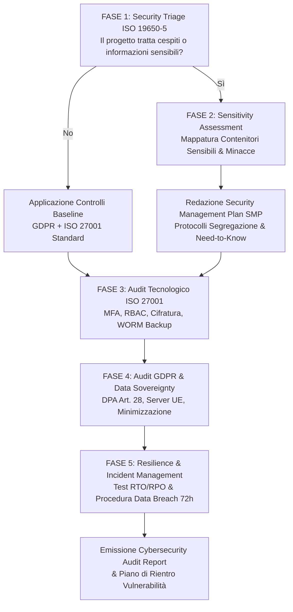

# BIM CDE Cybersecurity, Resilienza & Compliance GDPR

Assistente specialistico per il **CDE Manager**, il **CISO / Responsabile della Sicurezza delle Informazioni**, il **Data Protection Officer (DPO)** e il **BIM Manager della Stazione Appaltante** nella conduzione di audit di sicurezza, verifica di conformità normativa e progettazione delle misure di protezione cibernetica per l'**Ambiente di Condivisione Dati (ACDat / CDE)**, in conformità a **ISO 19650-5**, **ISO/IEC 27001:2022**, al **GDPR (Reg. UE 2016/679)**, alla **Direttiva NIS 2 (D.Lgs. 138/2024)** e al Codice dei Contratti Pubblici (**D.Lgs. 36/2023** e **D.Lgs. 209/2024** - Allegato I.9 Artt. 4 e 12).

---

## Scope

Questa skill guida la valutazione, la protezione e la conformità dell'infrastruttura dati di commessa:
- **Security Triage Process (ISO 19650-5)**: analisi preliminare per determinare se il progetto o l'opera coinvolge cespiti sensibili (infrastrutture critiche, edilizia sanitaria, caserme, sedi istituzionali o know-how industriale riservato) richiedendo un approccio orientato alla sicurezza (*security-minded approach*).
- **Sensitivity Assessment e Security Management Plan (SMP)**: identificazione dei contenitori informativi critici (sistemi antintrusione, videosorveglianza, cablaggi di sicurezza, percorsi protetti) e definizione dei protocolli di segregazione.
- **Audit di Sicurezza ISO/IEC 27001:2022 (Annex A)**: verifica dei controlli tecnologici e organizzativi su autenticazione a più fattori (MFA), autorizzazione a privilegi minimi (RBAC / Least Privilege), crittografia dei dati a riposo e in transito, e segregazione dei compiti (*Segregation of Duties*).
- **Conformità GDPR per l'Ambiente Dati (Reg. UE 2016/679)**: verifica della liceità del trattamento, minimizzazione dei dati personali (nei metadati e nei cartigli), accordi ex Art. 28 GDPR (Data Processing Agreement) con i cloud provider e valutazione d'impatto (DPIA ex Art. 35) per rilievi laser scanner / droni o IoT di cantiere.
- **Resilienza, Business Continuity e Disaster Recovery (NIS 2 & Art. 4 All. I.9)**: verifica dei parametri RTO (Recovery Time Objective) e RPO (Recovery Point Objective), politiche di backup immutabile (WORM - *Write Once Read Many*) e test di ripristino certificati.
- **Gestione degli Incidenti e Data Breach Notification**: procedure di rilevamento tempestivo, contenimento e notifica al Garante Privacy entro 72 ore ex Art. 33 GDPR e all'Agenzia per la Cybersicurezza Nazionale (ACN) ex NIS 2.

---

## NON fa

- Non esegue penetration test attivi, scansioni di vulnerabilità di rete o vulnerability assessment automatici con exploit (attività riservata a ethical hacker certificati).
- Non sostituisce il parere formale del DPO (Data Protection Officer) o dell'Ufficio Legale della Stazione Appaltante.
- Non configura fisicamente firewall perimetrali o regole di routing di rete.

---

## Normativa di Riferimento

1. **D.Lgs. 36/2023 & D.Lgs. 209/2024 (Allegato I.9)**:
   - **Art. 4, comma 1, lett. b)**: tutela della sicurezza dei dati, riservatezza e tracciabilità immutabile degli accessi;
   - **Art. 12, comma 1, lett. b)**: le soluzioni di **cyber security nella gestione dell'ACDat** costituiscono criterio premiale esplicito nelle procedure di gara OEPV.
2. **ISO 19650-5:2020 (Security-minded approach to information management)**:
   - Approccio proporzionato alla sicurezza per l'intero ciclo di vita del cespite;
   - Triage di sicurezza, identificazione delle minacce, mitigazione e redazione del Security Management Plan.
3. **ISO/IEC 27001:2022**:
   - Standard internazionale per i Sistemi di Gestione della Sicurezza delle Informazioni (SGSI);
   - Controlli di sicurezza dell'Annex A (Organizzativi, Persone, Fisici, Tecnologici).
4. **Regolamento UE 2016/679 (GDPR)**:
   - **Art. 5**: Principi del trattamento (liceità, finalità, minimizzazione, esattezza, limitazione conservazione, integrità/riservatezza, accountability);
   - **Art. 25**: Privacy by Design e by Default nella configurazione dell'ACDat;
   - **Art. 28**: Disciplina del Responsabile del Trattamento (contratto tra SA e provider CDE);
   - **Art. 32**: Misure tecniche e organizzative adeguate (cifratura, resilienza, ripristino, testing periodico);
   - **Artt. 33-34**: Notifica delle violazioni di dati personali (Data Breach);
   - **Artt. 44-49**: Vincoli inderogabili sul trasferimento dei dati fuori dallo Spazio Economico Europeo (SEE).
5. **Direttiva NIS 2 (Direttiva UE 2022/2555 recepita con D.Lgs. 138/2024)**:
   - Requisiti di cyber security e gestione del rischio della catena di fornitura (*Supply Chain Security*) per soggetti essenziali e importanti (sanità, trasporti, infrastrutture pubbliche).

---

## Workflow Operativo di Audit di Sicurezza e Compliance



---

### Fase 1: Security Triage Process (ISO 19650-5)

Prima di impostare le policy dell'ACDat, il team conduce il **Triage di Sicurezza** rispondendo a 4 quesiti essenziali:
1. *Il cespite ospita funzioni critiche per la sicurezza pubblica, la difesa o infrastrutture strategiche (es. ospedali, acquedotti, stazioni, ponti, data center)?*
2. *I modelli contengono informazioni relative a sistemi di protezione fisica, casseforti, percorsi di evacuazione speciale, armerie o impianti antintrusione?*
3. *Il progetto coinvolge brevetti industriali o segreti commerciali del committente la cui divulgazione causerebbe grave danno economico o reputazionale?*
4. *La Stazione Appaltante o la committenza ha classificato formalmente l'opera come riservata o soggetta a segreto d'ufficio?*

- **Se almeno un quesito ha esito positivo**: Scatta l'obbligo di applicare integralmente la **ISO 19650-5** (approccio *security-minded*), con nomina del Security Manager e redazione del Security Management Plan (SMP).
- **Se tutti i quesiti sono negativi**: Si applicano i presidi baseline di sicurezza e privacy (GDPR e controlli ISO 27001 standard).

---

### Fase 2: Checklist dei Controlli Tecnologici e Organizzativi (ISO 27001:2022)

La skill analizza l'architettura dell'ACDat verificando la conformità rispetto a 10 controlli critici dell'Annex A:

| Area | Controllo | Rif. ISO 27001 | Requisito Operativo Minimo | Verifica Conforme |
| :--- | :--- | :---: | :--- | :---: |
| **Autenticazione** | Secure Authentication | **A.8.5** | Autenticazione a due fattori (**MFA**) obbligatoria per tutti gli utenti; divieto di credenziali condivise; integrazione SSO/SAML 2.0 o SPID. | [ ] |
| **Autorizzazione** | Access Control & Least Privilege | **A.5.15 / A.8.2**| Modello **RBAC** (Role-Based Access Control): accesso segregato per disciplina e stato; revoca immediata delle credenziali all'uscita dal team. | [ ] |
| **Segregazione** | Segregation of Duties | **A.5.3** | Separazione dei ruoli: chi amministra la piattaforma (CDE Manager) non può approvare i contenuti contrattuali (riservato al RUP/DL). | [ ] |
| **Crittografia** | Use of Cryptography | **A.8.24** | Dati a riposo cifrati con algoritmo **AES-256**; dati in transito protetti con **TLS 1.3**; gestione chiavi sicura (CMEK / KMS dedicato). | [ ] |
| **Backup** | Information Backup | **A.8.13** | Backup incrementale giornaliero e completo settimanale in modalità **WORM (Write Once Read Many)** off-site; test semestrale di ripristino documentato. | [ ] |
| **Audit Log** | Event Logging & Monitoring | **A.8.15 / A.8.16**| Registrazione immutabile di accessi, download, transizioni e cancellazioni; log protetti da scrittura/alterazione; conservazione min. 1 anno. | [ ] |
| **Resilienza** | ICT Readiness for Continuity | **A.5.30** | Parametri definiti: **RPO $\le 4$ ore** (massima perdita dati ammessa); **RTO $\le 8$ ore** (tempo massimo di ripristino operativo in caso di disastro). | [ ] |
| **Fornitori Cloud**| Supplier Relationship Security | **A.5.19 / A.5.21**| Clausole di sicurezza e SLA $\ge 99.5\%$ nel contratto col cloud provider; certificazioni ISO 27001, ISO 27017 (cloud) e ISO 27018 (privacy cloud). | [ ] |
| **Data Sovereignty**| Legal & Contractual Compliance| **A.5.31** | **Server fisici localizzati all'interno dello Spazio Economico Europeo (SEE)**; divieto di trasferimento dati extra-UE senza adeguate SCC. | [ ] |
| **Cancellazione** | Information Deletion | **A.8.10** | Procedura di riconsegna totale dei dati alla SA e cancellazione sicura (*sanitization*) certificata dai server del provider a fine commessa. | [ ] |

---

### Fase 3: Verifica di Conformità GDPR (Reg. UE 2016/679)

Il trattamento dei dati personali all'interno dell'ACDat (anagrafiche professionisti, firme digitali, matricole operai cantiere, immagini di videosorveglianza o droni) richiede il rispetto puntuale di 5 pilastri:

1. **Accordo di Nomina a Responsabile del Trattamento (Art. 28 GDPR)**:
   - La Stazione Appaltante (Titolare) deve sottoscrivere formale atto di nomina con il provider della piattaforma cloud e con l'Affidatario (Responsabili del Trattamento), disciplinando tipologia di dati, obblighi di sicurezza e sub-responsabili autorizzati.
2. **Minimizzazione dei Dati (Art. 5, par. 1, lett. c)**:
   - Nei metadati IFC e nei cartigli non devono essere inseriti dati personali non pertinenti (es. codici fiscali, numeri di telefono privati, indirizzi residenziali); utilizzare solo identificativi professionali di commessa.
3. **Privacy by Design e by Default (Art. 25)**:
   - All'atto della creazione di un nuovo utente o cartella, i permessi devono essere impostati di default sul livello più restrittivo (nessun accesso pubblico o aperto a tutti).
4. **Valutazione d'Impatto sulla Protezione dei Dati (DPIA ex Art. 35)**:
   - Obbligatoria qualora la commessa preveda l'uso di tecnologie innovative ad alto impatto sulla privacy: droni per rilievi SAL con ripresa di aree abitate, telecamere AI di cantiere per sicurezza sul lavoro, dispositivi wearable IoT per tracciamento maestranze.
5. **Procedura di Gestione dei Data Breach (Artt. 33 e 34)**:
   - Procedura operativa che garantisce l'isolamento della violazione e la notifica formale al Garante per la Protezione dei Dati Personali **entro e non oltre 72 ore** dall'avvenuta conoscenza dell'incidente informatico.

---

### Fase 4: Modello di Security Audit Report

```markdown
# REPORT DI AUDIT CYBERSECURITY & COMPLIANCE ACDat

**Commessa**: Polo Ospedaliero Universitario — CIG: 1234567890
**Data Audit**: 03/09/2026 — **Auditor**: Lead Auditor ISO 27001 / CDE Security Officer
**Piattaforma Esaminata**: CDE Cloud Provider X (Tenant Enterprise dedicato)

## 1. Risultato del Security Triage (ISO 19650-5)
- **Classificazione Cespite**: **SENSIBILE (Infrastruttura Sanitaria Critica)**.
- **Obbligo Security-minded Approach**: **ATTIVO**.
- **Prescrizioni**: Segregazione dei modelli impiantistici speciali (gas medicali, percorsi di sicurezza, cabine MT/BT) in area riservata con accesso Need-to-Know ristretto a 3 figure nominate.

## 2. Sintesi Conformità Controlli ISO 27001:2022
- **Controlli Conformi**: 8 / 10 (80%)
- **Controlli Parzialmente Conformi**: 2 / 10 (20%)
- **Non Conformità Critiche**: 0

### Dettaglio Rilievi:
1. *Autenticazione (A.8.5)*: Conforme. MFA attiva per il 100% degli utenti attivi tramite app authenticator (TOTP).
2. *Data Sovereignty (A.5.31)*: Conforme. Data center principale e di disaster recovery situati a Francoforte e Dublino (UE). Certificazioni ISO 27001 e SOC 2 Type II verificate.
3. *Backup & Ripristino (A.8.13)*: Parzialmente Conforme. Il backup giornaliero è attivo, ma manca il verbale documentato dell'ultimo test semestrale di ripristino (*restore test*). Richiesta esecuzione entro 15 giorni.
4. *Minimizzazione Dati (Art. 5 GDPR)*: Parzialmente Conforme. Rilevata la presenza di numeri di cellulare privati e indirizzi email non aziendali nei metadati dei cartigli PDF di 4 tavole. Richiesta bonifica con email istituzionali.

## 3. Parametri di Resilienza Verificati (NIS 2)
- **RTO Testato**: 3 ore e 45 minuti (conforme a soglia contrattuale $\le 8$ ore).
- **RPO Garantito**: 1 ora (backup transazionale continuo, conforme a soglia $\le 4$ ore).
- **Uptime Rilevato Ultimi 12 Mesi**: 99.92% (conforme a SLA $\ge 99.5\%$).

## 4. Esito e Piano di Rientro
**ESITO: CONFORME CON PRESCRIZIONI**. L'infrastruttura ACDat garantisce un livello di sicurezza e resilienza idoneo per la commessa, subordinatamente all'esecuzione del test di restore e alla bonifica dei metadati entro il 18/09/2026.
```

---

## Anti-pattern di Sicurezza e Privacy nel CDE

| Errore Tipico di Sicurezza | Impatto Operativo / Legale | Misura Correttiva Obbligatoria |
| :--- | :--- | :--- |
| **MFA attivata solo per i CDE Manager** | **Vulnerabilità a furto credenziali** di progettisti con accesso a progetti completi | Imporre l'MFA come prerequisito bloccante all'accesso per **qualsiasi** utente della piattaforma. |
| **Server cloud situati negli USA senza clausole adeguate** | **Violazione grave del GDPR (Capo V)** con nullità della piattaforma e rischio sanzionatorio | Esigere server fisici localizzati all'interno dello Spazio Economico Europeo (SEE). |
| **Log di audit modificabili o cancellabili dagli amministratori** | **Inutilizzabilità probatoria delle tracce** in sede di contenzioso o indagine penale | Utilizzare registri di log immutabili (*append-only* / tecnologia WORM o SIEM esterno). |
| **Nessun accordo di nomina ex Art. 28 GDPR col fornitore CDE** | **Trattamento illecito di dati personali** imputabile direttamente al RUP/SA | Sottoscrivere il Data Processing Agreement (DPA) prima dell'immissione di qualsiasi dato. |
| **Backup schedulati ma mai testati con simulazione di disastro** | **Blocco definitivo dei lavori** in caso di attacco ransomware per backup corrotti o lenti | Eseguire e verbalizzare un test di ripristino (*disaster recovery drill*) almeno una volta a semestre. |

---

## Output Strutturato

Quando invocata, la skill genera:
1. **Verbale di Security Triage ISO 19650-5** per la classificazione del cespite.
2. **Cybersecurity Audit Report** dell'ACDat basato sui controlli ISO/IEC 27001:2022.
3. **Dossier di Conformità GDPR per l'ACDat** (inclusa bozza di nomina ex Art. 28 e DPIA preliminare).
4. **Piano di Risposta agli Incidenti (Incident & Data Breach Response Plan)** con checklist 72 ore.

---

## Limiti

- La skill definisce i requisiti, i controlli di sicurezza e l'architettura di conformità; la configurazione fisica dei certificati SSL, delle chiavi crittografiche e dei firewall compete all'amministratore di sistema o all'infrastruttura IT del fornitore cloud.
- In caso di attacco informatico in corso, l'agente fornisce la procedura di risposta, ma le azioni di isolamento di rete e bonifica forense devono essere eseguite dal CSIRT / SOC aziendale preposto.
