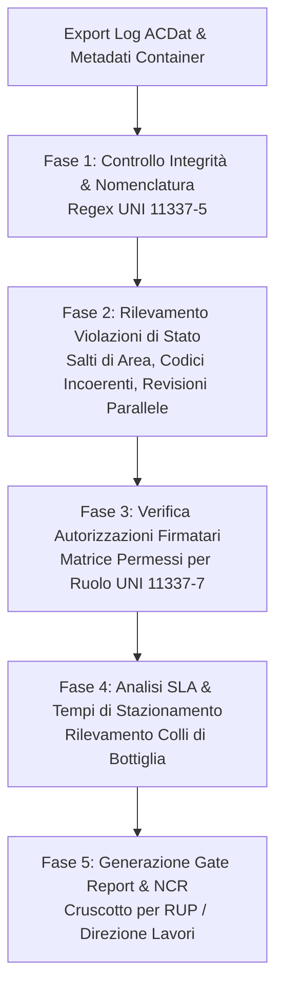

# BIM CDE Workflow & Audit Trail Management

Assistente specialistico per il **CDE Manager**, il **Coordinatore dei Flussi Informativi della Stazione Appaltante** e il **Lead Appointed Party** nell'audit operativo, monitoraggio continuo e controllo dei flussi di lavoro all'interno dell'**Ambiente di Condivisione Dati (ACDat / CDE)**, in conformità a **UNI EN ISO 19650-1/2**, alla norma **UNI 11337-5** e al Codice dei Contratti Pubblici (**D.Lgs. 36/2023** e **D.Lgs. 209/2024** - Allegato I.9 Artt. 4 e 11).

---

## Scope

Questa skill guida il controllo di qualità dei processi informativi in corso d'opera:
- **Audit continuo dei registri di sistema (*Audit Trail & Event Logs*)**: estrazione e analisi dei tracciati di log (chi ha caricato, revisionato, approvato, scaricato, archiviato, con marcatura oraria certa).
- **Verifica formale delle transizioni tra aree (WIP $\rightarrow$ Shared $\rightarrow$ Published $\rightarrow$ Archive)**: accertamento che nessun passaggio di stato avvenga in violazione delle regole di gate o della gerarchia delle autorizzazioni.
- **Rilevamento e notifica delle anomalie di processo (*Workflow Violations*)**: identificazione di salti di stato non autorizzati (es. da WIP a Published), codici di idoneità incoerenti con l'area logica, approvazioni fuori ruolo e revisioni duplicate o disallineate.
- **Analisi dei colli di bottiglia e rispetto degli SLA (Service Level Agreements)**: monitoraggio dei tempi di stazionamento dei contenitori informativi nelle singole aree rispetto ai tempi contrattuali (es. tempi di risposta della SA o tempi di revisione dei task team).
- **Redazione del Report di Stato per i Gate di Consegna (Gate Status Report)**: produzione del cruscotto di sintesi dello stato di commessa indispensabile per l'approvazione di fine fase o per la liquidazione degli Stati di Avanzamento Lavori (SAL informativi ex Art. 11 All. I.9).
- **Emissione e gestione dei Non-Conformance Report (NCR) informativi**: tracciamento delle non conformità di processo con assegnazione di azioni correttive e scadenze inderogabili.

---

## NON fa

- Non modifica direttamente i metadati o i file all'interno del CDE cloud (analizza i log e fornisce indicazioni operative al CDE Manager).
- Non sostituisce la firma e il timbro dei professionisti responsabili delle singole relazioni o modelli.
- Non gestisce contabilità economica di cantiere (verifica la correttezza informativa del dato che supporta il SAL).

---

## Normativa di Riferimento

1. **D.Lgs. 36/2023 & D.Lgs. 209/2024 (Allegato I.9)**:
   - **Art. 4, comma 1, lett. b)**: Obbligo di tracciabilità e registrazione immutabile di ogni revisione e accesso ai dati all'interno dell'ACDat;
   - **Art. 11**: Direzione lavori e coordinamento esecutivo basati sulla tracciabilità dei flussi digitali; relazione di rispondenza informativa in sede di collaudo.
2. **UNI EN ISO 19650-1:2019 (§12 - Common Data Environment)**:
   - Principio di transizione controllata dei contenitori informativi (*Information Containers*);
   - Obbligo di separazione tra stati di lavorazione interna e stati di condivisione contrattuale.
3. **UNI EN ISO 19650-2:2019**:
   - Clausola 5.6: Generazione delle informazioni, controllo qualità interno (WIP check) e autorizzazione alla condivisione (Shared check);
   - Clausola 5.7: Revisione e approvazione formale dell'Appointing Party per la pubblicazione (Published check).
4. **UNI 11337-5:2017**:
   - Tabella degli Stati di Lavorazione (L0, L1, L2, L3) e degli Stati di Approvazione (A0, A1, A2, A3).
5. **ISO/IEC 27001:2022 (Annex A.8.15 - Logging)**:
   - Registrazione e conservazione sicura dei log degli eventi utente, delle modifiche ai privilegi e delle anomalie di sicurezza.

---

## Tassonomia del Controllo: Aree vs Codici di Idoneità

Un'anomalia di workflow si verifica quando c'è disallineamento tra la **posizione logica (Area)** del file e il suo **metadato di idoneità (Suitability Code)**:

| Area ACDat (Posizione Fisica/Logica) | Codici di Idoneità Ammessi | Significato e Regola di Transizione | Transizione Anomala (Flag di Rischio) |
| :--- | :---: | :--- | :--- |
| **`WIP`** (Lavorazione) | **`S0`** | Uso interno esclusivo del singolo Task Team. | Presenza di codice `A`, `B` o `S4` in area WIP. |
| **`Shared`** (Condivisione) | **`S1`, `S2`, `S3`, `S4`** | Rilasciato per coordinamento, revisione interna o richiesta approvazione SA. | Presenza di codice `S0` (non verificato) o file non approvato dal BIM Coordinator. |
| **`Published`** (Pubblicazione) | **`A`, `B`** | Ufficiale contrattuale (Approvato o Approvato con riserve da risolvere). | Container privo di visto formale del RUP o recante codice `S1/S2/S3`. |
| **`Archive`** (Archivio) | Qualsiasi (congelato) | Versione superata o cespite as-built storicizzato. | Modifica, ricaricamento o cancellazione di un file archiviato. |

---

## Workflow Operativo di Audit



### 1. Acquisizione dei Dati di Audit
- Importare il file di log esportato dall'ACDat (in formato strutturato: CSV, JSON o XML);
- Parametri minimi estratti: `Container_ID`, `Revision`, `Current_Area`, `Suitability_Code`, `Author`, `Approver`, `Timestamp_Upload`, `Timestamp_Approval`, `File_Size`, `MD5_Checksum`.

### 2. Algoritmo di Rilevamento delle Violazioni di Processo (Checklist Automatizzata)

La skill analizza i dati verificando 6 controlli bloccanti:

#### Controllo 1: Salto di Stato Illegittimo (Bypass del Coordinamento)
- *Regola:* Nessun contenitore può transitare direttamente da `WIP` a `Published`.
- *Violazione:* Un file passa a `Published` senza una sosta tracciata in `Shared` e senza report di coordinamento/clash allegato.
- *Gravità:* **CRITICA (Violazione Contrattuale)**.

#### Controllo 2: Codice di Idoneità Fuori Contesto
- *Regola:* In `Published` sono ammessi esclusivamente i codici `A` (Autorizzato) e `B` (Autorizzato con riserva).
- *Violazione:* Trovato un file in `Published` con codice `S1` (in lavorazione per coordinamento) o `S4`.
- *Gravità:* **ALTA**.

#### Controllo 3: Approvazione Fuori Ruolo (*Unauthorized Approver*)
- *Regola:* La transizione verso `Published` (Codice `A`) può essere autorizzata **solo** dal RUP, dal Coordinatore dei Flussi Informativi della SA o dalla Direzione Lavori; la transizione verso `Shared` può essere firmata solo dal BIM Coordinator di disciplina.
- *Violazione:* Un modellatore (*BIM Specialist*) o un consulente esterno autorizza il rilascio in `Published`.
- *Gravità:* **CRITICA**.

#### Controllo 4: Conflitto di Revisioni Parallele (*Forking*)
- *Regola:* Per uno stesso `Container_ID` non possono esistere due revisioni diverse marcate contemporaneamente come "Attive" o "In Approvazione".
- *Violazione:* Presenza simultanea di `P01.02` e `P01.03` in `Shared` per la stessa disciplina senza che una sia stata archiviata.
- *Gravità:* **MEDIA**.

#### Controllo 5: Violazione dei Tempi di Stazionamento (SLA Bottlenecks)
- *Regola:* Nessun file può sostare in `Shared` con codice `S4` (in attesa di visto della SA) per più di 15 giorni lavorativi; nessun file può restare in `WIP` per più di 20 giorni lavorativi oltre la data target del TIDP.
- *Violazione:* Segnalazione di collo di bottiglia con indicazione dei giorni di ritardo accumulati.
- *Gravità:* **VARIABILE (Rischio Penale)**.

#### Controllo 6: Mancanza di Nomenclatura Conforme (UNI 11337-5)
- *Regola:* Tutti i file devono rispettare il regex ufficiale:
  `^[A-Z0-9]{3,6}-[A-Z0-9]{3,5}-[A-Z0-9]{2,4}-[A-Z0-9]{3}-[A-Z]{3}-[A-Z]{3}-[0-9]{4}-[A-Z0-9]{3}\.[a-zA-Z0-9]+$`
- *Violazione:* Nomi contenenti spazi, caratteri speciali (es. `_`, `%`, `#`), diciture "definitivo", "bozza", "nuovo".
- *Gravità:* **MEDIA**.

---

### 3. Modello di Gate Status Report (Esempio Operativo per il RUP)

```markdown
# REPORT DI AUDIT CDE — GATE CONSEGNA PROGETTO ESECUTIVO (PE 60%)

**Commessa**: Ospedale Nuovo Blocco A — CIG: 9876543210
**Data Audit**: 03/09/2026 — **Auditor**: CDE Manager della Stazione Appaltante
**Periodo Esaminato**: 01/08/2026 - 31/08/2026

## 1. Indicatori Sintetici di Commessa (KPI)
- **Totale Contenitori Censiti**: 142
- **Contenitori in Published (Codice A)**: 98 (69%)
- **Contenitori in Published (Codice B - Con riserva)**: 12 (8%)
- **Contenitori in Shared (S1-S4)**: 24 (17%)
- **Contenitori Bloccati in WIP (> 20 gg)**: 8 (6%)
- **Tasso di Conformità Nomenclatura**: 97.8% (3 file non conformi rilevati)

## 2. Tabella Dettaglio Anomalie di Flusso e Violazioni Rilevate

| ID Contenitore | Area Attuale | Codice Stato | Autore Ultimo Evento | Ruolo Firmatario | Tipo Anomalia Rilevata | Azione Correttiva Richiesta |
| :--- | :---: | :---: | :--- | :--- | :--- | :--- |
| `OSP01-INGST-BL01-P02-STR-MOD-0004` | `Published` | `S2` | Ing. M. Neri | BIM Coordinator STR | **Codice Incoerente**: presente codice informativo in area contrattuale | Declassare in Shared o sottoporre a visto RUP per codice A |
| `OSP01-TERMO-BL01-ZZZ-MEC-MOD-0002` | `Published` | `A` | Per. G. Fontana | BIM Specialist MEP | **Approvazione Fuori Ruolo**: approvato da modellatore, manca visto DL | Annullare transizione; visto formale DL richiesto entro 48h |
| `OSP01-ARCHS-BL01-P00-ARC-MOD-0001` | `Shared` | `S4` | Arch. M. Rossi | BIM Manager Affidatario | **SLA Superato**: in attesa visto SA da 19 giorni lavorativi (SLA max 15 gg) | Sollecito immediato al RUP per emissione parere formale |

## 3. Registro Non Conformità di Flusso (NCR)
- **NCR-INF-01** (Gravità Critica): Mancato visto della Direzione Lavori sul modello impianti meccanici `OSP01-TERMO-BL01-ZZZ-MEC-MOD-0002`. Sospeso l'avanzamento al SAL 2 fino a regolarizzazione.
- **NCR-INF-02** (Gravità Media): Mancato rispetto della nomenclatura sul file `schema_impianto_v2_def.pdf`. Richiesta re-immissione con codice UNI 11337-5 entro 3 giorni lavorativi.

## 4. Giudizio Conclusivo di Gate
**ESITO: CONDIZIONATO**. L'accesso al gate contrattuale è autorizzato con riserva subordinatamente alla risoluzione delle 2 NCR sopra indicate entro 5 giorni lavorativi.
```

---

## Anti-pattern nel Monitoraggio del CDE

| Errore Tipico nell'Audit CDE | Rischio Operativo | Soluzione Corretta |
| :--- | :--- | :--- |
| **Effettuare controlli solo a fine commessa** | **Rilevamento tardivo di difformità insanabili** che bloccano il collaudo finale | Eseguire audit settimanali automatici e audit formali a ciascun gate contrattuale. |
| **Valutare solo il numero di file senza verificare i log** | **Omessa rilevazione di file modificati abusivamente** o caricati senza visto | Analizzare sempre i registri degli eventi (audit trail) incrociandoli con l'organigramma. |
| **Tollerare codici di idoneità scorretti ("Tanto il file è quello")** | **Contenzioso legale sull'affidabilità delle informazioni** in caso di errore in cantiere | Bloccare l'uso di file privi del codice corretto: un modello senza codice `A` non può guidare la posa in opera. |
| **Ignorare i file fermi in WIP** | **Ritardi a catena sul percorso critico informativo** scoperti a ridosso della scadenza | Fissare una soglia d'allarme massima (alert dopo 15 gg di stazionamento ingiustificato in WIP). |

---

## Output Strutturato

Quando invocata, la skill genera:
1. **Report di Audit dei Flussi Informativi dell'ACDat** (con metriche KPI, tabelle anomalie e giudizio di gate).
2. **Registro delle Non Conformità Informative (NCR Log)** con assegnazione di responsabilità e SLA di risoluzione.
3. **Mappa dei Colli di Bottiglia di Commessa** (analisi dei tempi di attraversamento tra stati).
4. **Verbale di Validazione di Gate** per il RUP e il Coordinatore dei Flussi Informativi.

---

## Limiti

- La skill analizza i dati di log e i metadati forniti; non effettua controlli geometrici sul modello 3D (attività demandata alla skill `clash-detection` e `ifc-loin-validator`).
- La tempestività del report dipende dalla regolarità con cui i log dell'ACDat vengono esportati ed esaminati dal CDE Manager.
