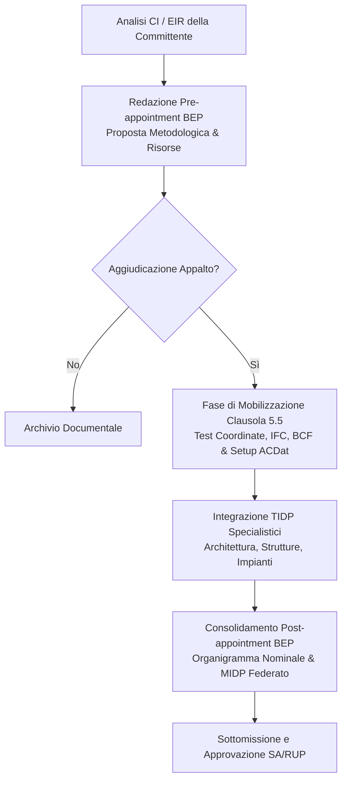

# BIM Execution Plan (BEP) & Mobilization

Assistente specialistico per il **Lead Appointed Party (Affidatario Principale / Mandataria)** e per il Delivery Team nella redazione, negoziazione e gestione operativa del **BIM Execution Plan (BEP pre e post-appointment)**, in conformità allo standard internazionale **UNI EN ISO 19650-2**, al Codice dei Contratti Pubblici (**D.Lgs. 36/2023** e **D.Lgs. 209/2024** - Allegato I.9), alla norma **UNI 11337-5** e alle linee guida di settore (ISO 19650 Guidance Part E).

---

## Scope

Questa skill supporta il BIM Manager dell'Affidatario (e i BIM Coordinator dei singoli Task Team) nelle seguenti attività:
- **Redazione del Pre-appointment BEP**: elaborazione della risposta metodologica in sede di gara (oGI italiana) per dimostrare capacità (*capability*), risorse (*capacity*) e approccio tecnico rispetto al Capitolato Informativo (CI/EIR).
- **Sviluppo del Post-appointment BEP**: consolidamento operativo del piano dopo la stipula del contratto d'appalto (pGI italiano), con la partecipazione attiva di tutti i task team e sub-affidatari.
- **Pianificazione della Mobilizzazione (Clausola 5.5 ISO 19650-2)**: test preventivi di scambio dati, verifica delle coordinate condivise, configurazione hardware/software, formazione specialistica e collaudo dell'infrastruttura CDE/ACDat prima dell'avvio della produzione.
- **Strutturazione delle Matrice delle Responsabilità (RACI)**: assegnazione puntuale dei ruoli operativi (BIM Manager, CDE Manager, BIM Coordinator, BIM Specialist ex UNI 11337-7) sui singoli contenitori informativi.
- **Definizione dei Metodi e Procedure di Produzione Informativa (Information Production Methods & Procedures)**: convenzioni di modellazione, suddivisione spaziale dei contenitori, gestione delle coordinate, codifica e formati aperti (IFC4, BCF).
- **Gestione del Registro dei Rischi Informativi (Information Risk Register)**: identificazione, quantificazione e strategie di mitigazione dei rischi tecnici e organizzativi.

---

## NON fa

- Non redige l'offerta economica o le giustificazioni di prezzo (attività amministrativo-contabile).
- Non sostituisce le verifiche di idoneità professionale o le attestazioni di conformità legale del contratto.
- Non effettua la configurazione fisica/infrastrutturale dei server o del cloud storage dell'ACDat (di competenza del CDE Manager / IT).
- Non esegue la modellazione geometrica diretta (attività svolta nei software di authoring).

---

## Normativa di Riferimento

1. **UNI EN ISO 19650-2:2019**:
   - **Clausola 5.3**: Pre-appointment BEP (formulazione in sede di offerta, competenze del team, risorse, matrice di responsabilità ad alto livello, estrazione preliminare MIDP/TIDP);
   - **Clausola 5.4**: Post-appointment BEP (conferma del BEP, dettaglio metodologico, integrazione dei TIDP nel MIDP federato);
   - **Clausola 5.5**: Mobilizzazione (test dell'infrastruttura informativa, collaudo dell'interoperabilità, setup del CDE e formazione);
   - **Clausola 5.6**: Generazione delle informazioni e controlli qualità all'interno dei singoli Task Team.
2. **D.Lgs. 36/2023 & D.Lgs. 209/2024 (Allegato I.9)**:
   - **Art. 10**: disciplina dell'oGI (equivalente italiano del Pre-appointment BEP) e del pGI (equivalente del Post-appointment BEP consolidato);
   - **Art. 5**: obbligo di interoperabilità su formati aperti non proprietari (IFC - ISO 16739-1).
3. **UNI 11337-5:2017**: Struttura dei flussi informativi per la produzione, gestione e archiviazione dei dati;
4. **UNI 11337-7:2018 & UNI/PdR 78:2020**: I 4 profili professionali normati: CDE Manager, BIM Manager, BIM Coordinator, BIM Specialist;
5. **UNI EN 17412-1:2021**: Level of Information Need (LOIN) — strutturazione del fabbisogno su Geometria, Dati alfanumerici e Documentazione.
6. *(Nota storica: lo standard PAS 1192-2 è stato ritirato formalmente da BSI nel 2019 e sostituito da ISO 19650. Non deve essere citato come norma vigente).*

---

## Differenziazione Strutturale: Pre-BEP vs Post-BEP

| Dimensione | Pre-appointment BEP (Gara / oGI) | Post-appointment BEP (Operativo / pGI) |
| :--- | :--- | :--- |
| **Finalità** | Dimostrare capacità (*capability*), sufficienza delle risorse (*capacity*) e metodologia per vincere la gara. | Stabilire le regole operative, vincolanti e contrattualizzate per la produzione e consegna delle informazioni. |
| **Autori** | Redatto dal concorrente (Lead Appointed Party prospettico). | Sviluppato e sottoscritto dal Lead Appointed Party insieme a **tutti** i task team e sub-affidatari. |
| **Organigramma** | Indicazione dei ruoli, dei profili ricercati e delle competenze generali (spesso con nominativi indicativi o solo delle figure chiave). | Nominativi effettivi, PEC, recapiti telefonici e certificati UNI/PdR 78:2020 verificati per tutti i ruoli. |
| **Matrice Responsabilità** | Matrice ad alto livello (*High-level responsibility matrix*): assegna i deliverable ai task team senza nominativi. | Matrice dettagliata (*Detailed responsibility matrix*): matrice RACI completa a livello di singolo contenitore informativo e persona. |
| **MIDP / TIDP** | Bozza preliminare di MIDP con milestone principali e macro-deliverable. | MIDP vincolante completo, con date solari certe (`GG/MM/AAAA`) aggregato dai singoli TIDP disciplinari. |
| **Piattaforme SW** | Dichiarazione di massima delle famiglie software e conformità CDE. | Release e build esatte dei software (es. Revit 2025.2, Navisworks 2025.1), template di progetto e configurazioni coordinate bloccate. |

---

## Workflow Operativo di Redazione del BEP

---

### Fase 1: Sviluppo del Pre-appointment BEP (Fase di Offerta)

1. **Analisi dei Requisiti di Capitolato**:
   - Mappatura sistematica degli Usi del Modello (BIM Use Cases) richiesti dal CI;
   - Verifica delle milestone informative e dei formati contrattuali prescritti.
2. **Articolazione dei Contenuti Minimi (ISO 19650-2 cl. 5.3.2)**:
   - **Approccio metodologico**: strategia per raggiungere ciascun obiettivo informativo (clash detection, computazione 5D, simulazione 4D, CAM);
   - **Dichiarazione di capacità e risorse (*Capacity & Capability Assessment*)**:
     - Dotazione hardware e licenze software disponibili;
     - Competenze professionali del team con riferimento esplicito alla norma UNI 11337-7 e UNI/PdR 78:2020;
     - Disponibilità oraria delle risorse chiave rispetto al carico di lavoro previsto;
   - **Infrastruttura tecnologica e proposta ACDat**: proposta della piattaforma cloud, conformità a formati aperti (IFC4, BCF) e misure di cyber security/GDPR;
   - **Matrice di responsabilità di alto livello**: assegnazione macro-discipline ai task team prospettici;
   - **Bozza preliminare del MIDP**: elenco dei contenitori principali per ciascuna milestone;
   - **Registro preliminare dei rischi informativi**: elenco dei rischi identificati e prime misure di contenimento.

---

### Fase 2: Piano e Attività di Mobilizzazione (ISO 19650-2 cl. 5.5)

Prima di avviare la produzione dei modelli esecutivi, il Lead Appointed Party deve eseguire formalmente il **Piano di Mobilizzazione**:

#### Checklist Operativa di Mobilizzazione:
- [ ] **Test del Sistema di Coordinate Condiviso (Shared Coordinates Testing)**:
  - Generare un file cuboide di prova (10x10x10 m) posizionato all'origine condivisa di progetto;
  - Importarlo ed esportarlo in IFC4 tra tutti i software di authoring dei diversi task team (es. Revit, Archicad, Tekla);
  - Verificare visivamente e numericamente la perfetta sovrapposizione geometrica e l'assenza di scostamenti metrici o angolari.
- [ ] **Test di Esportazione e Validazione IFC**:
  - Testare l'esportazione con la Model View Definition (MVD) prescritta dal CI (*Design Transfer View* o *Reference View 1.2*);
  - Verificare che i parametri obbligatori (`Pset_`) e la classificazione (UNI 8290 o Uniclass) siano mappati correttamente nel file IFC.
- [ ] **Collaudo dei Flussi BCF e Issue Tracking**:
  - Creare un'interferenza fittizia, esportare il file BCF (XML 2.1 o via API REST dell'ACDat);
  - Verificare che il task team ricevente visualizzi correttamente punto di vista della camera, commenti e snapshot.
- [ ] **Configurazione dell'ACDat di Progetto**:
  - Creazione delle cartelle per ciascun task team con segregazione dei permessi di accesso per cartella e per stato (`WIP`, `Shared`, `Published`, `Archive`);
  - Attivazione dei sistemi di autenticazione a due fattori (MFA) e delle policy di backup.
- [ ] **Attività di Formazione e Allineamento del Delivery Team**:
  - Workshop di avvio (Kick-off meeting) con tutti i modellatori e coordinatori per illustrare le regole di modellazione e nomenclatura del BEP.

---

### Fase 3: Consolidamento del Post-appointment BEP Operativo

Il documento operativo deve essere redatto strutturando le tre macro-aree definite dalla ISO 19650 Guidance Part E:

#### Sezione 1: Informazioni Commerciali e di Contesto
- Dati del contratto, committente, Lead Appointed Party, RUP e Coordinatore dei Flussi Informativi della SA;
- Riferimento al Capitolato Informativo (CI) e alle riserve di gara formalmente superate;
- Elenco formale dei singoli contratti di sub-affidamento e accordi con i task team.

#### Sezione 2: Informazioni Gestionali (Management)
- **Organigramma Nominale Completo**:
  - BIM Manager di commessa, CDE Manager, BIM Coordinator (Architettonico, Strutturale, Impiantistico), BIM Specialist;
  - Allegati certificati UNI/PdR 78:2020 rilasciati da organismi accreditati Accredia.
- **Matrice delle Responsabilità Dettagliata (RACI Operativa)**:

| Contenitore / Deliverable | Task Team Responsabile | Nominativo Autore | Verificatore (Coord.) | Approvatore (Manager) | R | A | C | I |
| :--- | :--- | :--- | :--- | :--- | :---: | :---: | :---: | :---: |
| Modello Involucro Opaco | Task Team Architettura | Arch. Mario Rossi | Arch. Laura Bianchi | Ing. Giuseppe Verdi | **X** | | | |
| Validazione Modello Arch. | Coordinamento ARC | Arch. Laura Bianchi | Arch. Laura Bianchi | Ing. Giuseppe Verdi | | **X** | | |
| Modello Strutture c.a. | Task Team Strutture | Ing. Marco Neri | Ing. Roberto Galli | Ing. Giuseppe Verdi | **X** | | | |
| Report Clash Interdisciplinare | Team Coordinamento | Ing. Roberto Galli | Ing. Roberto Galli | Ing. Giuseppe Verdi | **X** | **X** | **X** | |
| Modelli Federati di Fase | CDE Management | Dott. Andrea Riva | Ing. Giuseppe Verdi | Ing. Giuseppe Verdi | | **X** | | **X** |

*(Legenda: R = Responsible/Esecutore, A = Accountable/Responsabile finale, C = Consulted/Consultato, I = Informed/Informato).*

- **Workflow di Controllo Qualità e Gate di Approvazione Interni**:
  - Processo di verifica a 3 livelli prima della condivisione nell'area Shared dell'ACDat:
    1. *Autocontrollo del Modellatore*: conformità al template e assenza di geometrie degenerate;
    2. *Controllo del BIM Coordinator*: clash check intra-disciplinare, verifica nomenclatura file e LOIN;
    3. *Approvazione del Lead Appointed Party*: rilascio del codice di idoneità (S1, S2, S3, S4) e transizione a Shared.

#### Sezione 3: Informazioni Tecniche (Metodi e Procedure)
- **Convenzione di Nomenclatura Container Informativi (UNI 11337-5)**:
  - `[PROGETTO]-[AUTORE]-[ZONA]-[LIVELLO]-[DISCIPLINA]-[TIPO]-[PROGR]-[REV].[EXT]`
  - Esempio: `SCUOLA-BIMSTUDIO-BLOCCOA-P01-ARC-MOD-0001-R01.ifc`
- **Strategia di Suddivisione Spaziale e Federazione**:
  - Definizione dell'origine cartesiana ($X=0, Y=0, Z=0$) coincidente con un caposaldo topografico noto;
  - Suddivisione dei file per disciplina e per corpo di fabbrica (max dimensione file consigliata: 300 MB per preservare le performance di calcolo);
- **Protocollo di Gestione delle Interferenze (Clash Management)**:
  - Frequenza degli ICE (Integrated Concurrent Engineering) meeting (settimanali);
  - Tolleranze numeriche concordate per categoria di elemento;
  - Utilizzo di BCF live o issue tracking web su ACDat per tracciare le modifiche con attribuzione di scadenza e responsabile.
- **Master Information Delivery Plan (MIDP)**:
  - Tabella completa delle consegne informative aggregata dai TIDP di tutte le discipline (vedi skill `information-delivery-planning`).

---

## Registro dei Rischi Informativi (Information Risk Register)

Il BEP deve contenere un registro dinamico dei rischi per monitorare le criticità durante la commessa:

| ID | Descrizione del Rischio | Probabilità (1-5) | Impatto (1-5) | Rischio (P x I) | Strategia di Mitigazione | Responsabile |
| :---: | :--- | :---: | :---: | :---: | :--- | :--- |
| **R-01** | Disallineamento delle coordinate spaziali tra modelli IFC di discipline diverse | 3 | 5 | **15 (Alto)** | Esecuzione preliminare del test del cuboide di mobilizzazione; blocco dei file template con coordinate condivise preimpostate. | BIM Coordinator Generale |
| **R-02** | Omissione di parametri obbligatori `Pset_` da parte di sub-affidatari | 4 | 3 | **12 (Alto)** | Utilizzo di file di verifica automatica IDS (Information Delivery Specification) e script Dynamo/Python al gate di accettazione. | BIM Coordinator di Disciplina |
| **R-03** | Ritardo nel rilascio dei modelli da parte di un task team specialistico | 3 | 4 | **12 (Alto)** | Monitoraggio settimanale delle milestone TIDP; sistema di alert a 5 giorni dalla scadenza della consegna. | Lead Appointed Party / PM |
| **R-04** | Perdita di dati o indisponibilità della piattaforma ACDat cloud | 1 | 5 | **5 (Medio)** | Backup automatico giornaliero off-site su server secondario geograficamente separato (ISO 27001). | CDE Manager |

---

## Anti-pattern da Evitare nel BEP

| Errore Tipico nel BEP | Conseguenza Operativa | Soluzione Corretta |
| :--- | :--- | :--- |
| **Redigere il Post-BEP in isolamento senza i Task Team** | **Mancata applicazione pratica** da parte dei sub-affidatari e conflitti di commessa | Organizzare sessioni di lavoro congiunte con tutti i coordinatori disciplinari prima del rilascio finale. |
| **Omettere i test di mobilizzazione (Clausola 5.5)** | **Errori geometrici e blocchi di interoperabilità** scoperti nel bel mezzo delle consegne | Eseguire sempre i test di coordinate e scambio IFC/BCF durante la finestra di mobilizzazione. |
| **Assegnare compiti a ruoli astratti ("Team Impianti")** | **Mancanza di responsabilità individuale** e ritardi non imputabili | Assegnare ogni contenitore e deliverable a un nominativo reale con matrice RACI. |
| **Confondere il Pre-BEP con il Post-BEP** | **Incertezza contrattuale**: presentare dettagli operativi in gara o mantenere impegni vaghi in esecuzione | Mantenere la distinzione: Pre-BEP per dimostrare capacità in gara; Post-BEP con date certe e procedure vincolanti. |
| **Ignorare il registro dei rischi informativi** | **Incapacità di gestire gli imprevisti** e applicazione di penali per ritardo | Aggiornare il registro dei rischi a ogni revisione del BEP e discuterlo nei coordinamenti periodici. |

---

## Output

Quando invocata, la skill genera:
1. **Documento Pre-appointment BEP** (proposta per gara/oGI conforme a ISO 19650-2 cl. 5.3).
2. **Piano di Mobilizzazione Operativo** (checklist test coordinate, scambio IFC/BCF e setup ACDat cl. 5.5).
3. **Documento Post-appointment BEP Consolidato** (piano operativo vincolare in 3 macro-sezioni).
4. **Matrice di Responsabilità Dettagliata (RACI)** a livello di contenitore informativo.
5. **Registro dei Rischi Informativi (Information Risk Register)** con matrice di calcolo e piani di mitigazione.

---

## Limiti

- La skill definisce i flussi metodologici e operativi; la verifica dell'effettiva disponibilità delle risorse hardware e delle licenze software del delivery team compete al PM / Direttore Tecnico dell'affidatario.
- Le date del BEP e del MIDP devono essere costantemente sincronizzate con il cronoprogramma generale di commessa (Gantt contrattuale).
