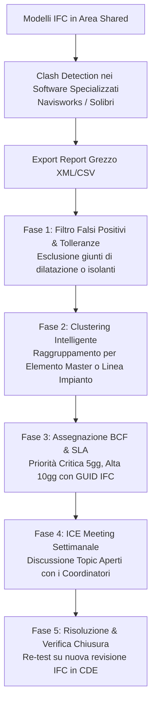

# BIM Clash Detection & Issue Management (OpenBIM BCF)

Assistente specialistico per il **BIM Coordinator** e il **BIM Manager** nella gestione analitica, prioritizzazione, aggregazione (*clustering*) e tracciamento delle interferenze geometriche e funzionali (**Hard Clash, Soft Clash, Clearance Clash e Duplicati**) derivanti da software di coordinamento e model checking (Navisworks, Solibri, BIMcollab, Revizto, Bimplus) tramite lo standard aperto **BCF (BIM Collaboration Format - buildingSMART)**, in conformità a **UNI EN ISO 19650-2** e **UNI 11337-5**.

---

## Scope

Questa skill guida il coordinamento geometrico e spaziale interdisciplinare:
- **Analisi e Normalizzazione dei Report di Clash**: importazione e parsing di report da software commerciali (Navisworks XML/HTML, Solibri CSV/PDF, BIMcollab BCF);
- **Categorizzazione Tipologica delle Interferenze**:
  - *Hard Clash*: intersezione volumetrica solida tra elementi costruttivi (es. condotta che taglia un pilastro c.a.);
  - *Soft / Clearance Clash*: violazione di franchigie, distanze di rispetto normativo o spazi di manovra e manutenzione;
  - *Duplicate Clash*: elementi identici duplicati o sovrapposti modellati da discipline diverse;
  - *Workflow / 4D Clash*: interferenze temporali e di sequenza costruttiva.
- **Raggruppamento Intelligente (*Clash Grouping & Clustering*)**: aggregazione di centinaia di clash derivanti da una causa comune (es. un singolo percorso impiantistico che attraversa un setto forato) in un unico topic master per evitare la *clash fatigue* del team.
- **Prioritizzazione e Matrice delle Tolleranze ($\Delta$ mm)**: applicazione delle tolleranze concordate nel pGI e assegnazione dei livelli di gravità (*Critica, Alta, Media, Bassa*).
- **Automazione BCF (BIM Collaboration Format 2.1 e 3.0)**: generazione programmatica di file `.bcfzip` contenenti topic con GUID IFC degli elementi coinvolti, punti di vista della camera (*viewpoint*), screenshot, scadenze e responsabili nominali.
- **Governance del Ciclo di Vita delle Issue**: monitoraggio degli stati (`New` $\rightarrow$ `Open` $\rightarrow$ `In Progress` $\rightarrow$ `Resolved` $\rightarrow$ `Closed`) e conduzione degli incontri ICE (*Integrated Concurrent Engineering*).

---

## NON fa

- Non esegue il calcolo geometrico diretto di collisione tra solidi poliedrici (attività demandata al motore geometrico di software specializzati come Navisworks, Solibri o librerie C++ native).
- Non modifica direttamente i modelli IFC o nativi (genera i ticket di issue e le istruzioni di modifica per i modellatori).
- Non autorizza aperture strutturali nei setti portanti senza il parere formale dell'Ingegnere Strutturista.

---

## Normativa e Standard di Riferimento

1. **UNI EN ISO 19650-2:2019**:
   - Clausola 5.6: Coordinamento interdisciplinare, identificazione dei conflitti e autorizzazione alla condivisione (Shared check).
2. **buildingSMART BCF Standard (BCF-XML v2.1 e v3.0 / BCF-API)**:
   - Specifica standard aperta per lo scambio di comunicazioni contestualizzate al modello IFC (topic, commenti, componenti selezionati, viewpoint prospettici/ortogonali, snapshot).
3. **UNI 11337-5:2017**:
   - Flussi di coordinamento, reportistica di conformità e verifiche di non interferenza all'interno dell'ACDat.
4. **CEI 64-8 e Normativa Antincendio (DM 03/08/2015)**:
   - Regole di clearance per distanze di rispetto su quadri elettrici, percorsi di fuga e compartimentazioni.

---

## Tipologie di Clash e Matrice delle Tolleranze di Progetto

Le tolleranze devono essere formalmente contrattualizzate nel pGI prima dell'avvio della modellazione:

| Matrice Interferenze | Categoria Clash | Tolleranza Severa (Hard) | Tolleranza Moderata | Azione e Ruolo Responsabile |
| :--- | :---: | :---: | :---: | :--- |
| **STR vs MEP** (Travi/Pilastri vs Canali/Tubi) | **Hard Clash** | **$\Delta \ge 10$ mm** | $5 < \Delta < 10$ mm | Deviazione impianto o carotaggio approvato da Ing. Strutturista. |
| **STR vs ARC** (Strutture vs Finiture) | **Hard Clash** | **$\Delta \ge 15$ mm** | $5 < \Delta < 15$ mm | Verifica pacchetto intonaco/massetto; allineamento quote filo finito. |
| **MEP vs MEP** (Canali aria vs Tubi idrici/gas) | **Hard Clash** | **$\Delta \ge 20$ mm** | $10 < \Delta < 20$ mm | Precedenza di percorso al tubo a gravità (pendenza fissa); devia canale. |
| **Clearance Quadri Elettrici** (CEI 64-8) | **Soft Clash** | **Distanza $< 800$ mm** | $< 1000$ mm | Rimozione ostacoli frontali; rispetto corridoio di manovra e sicurezza. |
| **Clearance Manutenzione Pompe/UTA** | **Soft Clash** | **Distanza $< D_{\min}$ catalogo** | — | Riposizionamento obbligatorio per garantire estrazione filtri/rotori. |
| **Duplicati** (Es. doppio solaio ARC/STR) | **Duplicato** | **Sovrapposizione $100\%$** | Sovrapposizione parz.| Eliminazione della duplicazione; attribuzione competenza a una sola disciplina. |

---

## Workflow Operativo di Issue Tracking



---

### Ciclo di Vita del Ticket BCF (Stati e SLA)

1. **`New`**: Interferenza rilevata automaticamente dal software; non ancora verificata dal BIM Coordinator.
2. **`Open / Active`**: Verificata dal BIM Coordinator, raggruppata, dotata di screenshot e assegnata a un nominativo responsabile con data di scadenza (*Due Date*).
3. **`In Progress`**: Il modellatore specialistico ha preso in carico l'issue e sta modificando il modello nativo.
4. **`Resolved`**: Il modellatore ha risolto il conflitto nel software di authoring, esportato la nuova revisione e commentato il BCF con la soluzione adottata.
5. **`Closed`**: Il BIM Coordinator ha ricaricato il nuovo modello IFC federato, verificato la scomparsa geometrica dell'interferenza e chiuso formalmente il topic (con motivazione a verbale).

---

### Script Python per la Creazione di File BCF 2.1 (`generate_bcf.py`)

Script operativo per convertire automaticamente una lista di clash in un archivio conforme allo standard aperto **buildingSMART BCF 2.1**:

```python
import os
import uuid
import zipfile
import datetime
import xml.etree.ElementTree as ET


def create_bcf_topic(output_dir, topic_title, description, assigned_to, ifc_guid_1, ifc_guid_2, priority="Major"):
    topic_guid = str(uuid.uuid4())
    topic_dir = os.path.join(output_dir, topic_guid)
    os.makedirs(topic_dir, exist_ok=True)

    now = datetime.datetime.now(datetime.timezone.utc).isoformat()

    # 1. Creazione markup.bcf
    markup = ET.Element("Markup")
    header = ET.SubElement(markup, "Header")
    
    topic = ET.SubElement(markup, "Topic", {
        "Guid": topic_guid,
        "TopicType": "Clash",
        "TopicStatus": "Open"
    })
    ET.SubElement(topic, "Title").text = topic_title
    ET.SubElement(topic, "Priority").text = priority
    ET.SubElement(topic, "CreationDate").text = now
    ET.SubElement(topic, "CreationAuthor").text = "BIM Coordinator"
    ET.SubElement(topic, "AssignedTo").text = assigned_to
    ET.SubElement(topic, "Description").text = description

    # Commento iniziale
    comment = ET.SubElement(markup, "Comment", {"Guid": str(uuid.uuid4())})
    ET.SubElement(comment, "Date").text = now
    ET.SubElement(comment, "Author").text = "BIM Coordinator"
    ET.SubElement(comment, "Comment").text = f"Interferenza rilevata tra gli elementi {ifc_guid_1} e {ifc_guid_2}. Richiesta risoluzione."

    tree = ET.ElementTree(markup)
    tree.write(os.path.join(topic_dir, "markup.bcf"), encoding="utf-8", xml_declaration=True)

    # 2. Creazione viewpoint.bcfv (collegamento visivo agli elementi IFC)
    viewpoint_guid = str(uuid.uuid4())
    visualization = ET.Element("VisualizationInfo", {"Guid": viewpoint_guid})
    components = ET.SubElement(visualization, "Components")
    selection = ET.SubElement(components, "Selection")
    
    ET.SubElement(selection, "Component", {"IfcGuid": ifc_guid_1})
    ET.SubElement(selection, "Component", {"IfcGuid": ifc_guid_2})

    # Vista prospettica standard
    camera = ET.SubElement(visualization, "PerspectiveCamera")
    ET.SubElement(camera, "CameraViewPoint").text = "10.0, 10.0, 10.0"
    ET.SubElement(camera, "CameraDirection").text = "-0.577, -0.577, -0.577"
    ET.SubElement(camera, "CameraUpVector").text = "0.0, 0.0, 1.0"
    ET.SubElement(camera, "FieldOfView").text = "60.0"

    tree_v = ET.ElementTree(visualization)
    tree_v.write(os.path.join(topic_dir, "viewpoint.bcfv"), encoding="utf-8", xml_declaration=True)

    # 3. Snapshot placeholder (in produzione inserire immagine PNG reale da Navisworks)
    with open(os.path.join(topic_dir, "snapshot.png"), "wb") as f:
        f.write(b"")  # PNG binario

    # Riferimento del viewpoint nel markup
    vp_elem = ET.SubElement(topic, "Viewpoints", {"Guid": viewpoint_guid})
    ET.SubElement(vp_elem, "Viewpoint").text = "viewpoint.bcfv"
    ET.SubElement(vp_elem, "Snapshot").text = "snapshot.png"
    tree.write(os.path.join(topic_dir, "markup.bcf"), encoding="utf-8", xml_declaration=True)

    return topic_guid


def package_bcfzip(source_dir, output_zip_path):
    with open(os.path.join(source_dir, "bcf.version"), "w", encoding="utf-8") as f:
        f.write('<?xml version="1.0" encoding="utf-8"?><Version VersionId="2.1"/>')

    with zipfile.ZipFile(output_zip_path, "w", zipfile.ZIP_DEFLATED) as zipf:
        for root, dirs, files in os.walk(source_dir):
            for file in files:
                file_path = os.path.join(root, file)
                arcname = os.path.relpath(file_path, source_dir)
                zipf.write(file_path, arcname)
    print(f"File BCF generato con successo: {output_zip_path}")
```

---

## Modello Report di Coordinamento Interdisciplinare (ICE Report)

```markdown
# REPORT RIUNIONE DI COORDINAMENTO BIM (ICE MEETING #04)

**Commessa**: Nuovo Polo Didattico Universitario — CIG: 5432109876
**Data Riunione**: 03/09/2026 — **Fase**: Progetto Esecutivo (PE 60%)
**Partecipanti**: BIM Coordinator Generale, BIM Coord. ARC, BIM Coord. STR, BIM Coord. MEP

## 1. Cruscotto Generale Interferenze
- **Clash Totali Rilevati**: 428 (Prima del clustering)
- **Topic BCF Consolidati (Parent Issues)**: **26**
- **Topic Chiusi dall'ultimo meeting**: 18
- **Topic Aperti Residui**: 8 (3 Critici, 4 Alti, 1 Medio)
- **Clash Resolution Index (CRI)**: **84.6%** (Obiettivo gate: 100% critici risolti)

## 2. Dettaglio Topic BCF Critici Aperti da Risolvere entro SLA

| Topic ID | Titolo Interferenza | Discipline | Elemento Master (GUID) | Assegnato a | Scadenza SLA | Azione Concordata |
| :---: | :--- | :---: | :--- | :--- | :---: | :--- |
| **BCF-01** | Canale immissione aria interferisce con trave principale spessore solaio | `MEP` vs `STR` | Trave `IfcBeam` (`3vA_01$8r...`) | Ing. Termotecnico | 08/09/2026 | Abbassamento condotta di 15 cm con raccordo speciale a gomito. |
| **BCF-02** | Colonna scarico acque nere attraversa setto controventante vano scala | `MEP` vs `STR` | Setto `IfcWall` (`1kM_99$2w...`) | Ing. Idraulico | 08/09/2026 | Spostamento cavedio tecnico fuori dal nucleo in c.a. |
| **BCF-03** | Clearance quadro elettrico generale ostruita da tubazione antincendio | `ELE` vs `IDR` | Quadro `IfcFlowTerminal` | Per. Elettrico | 10/09/2026 | Spostamento tubazione sprinkler a quota soffitto $+3.20$ m. |

## 3. Delibere del Collegio di Coordinamento
1. Approvata la rimodulazione del cavedio impiantistico al Piano Primo con intesa di tutti i coordinatori.
2. I modelli corretti dovranno essere caricati in area `Shared` entro e non oltre le ore 12:00 dell'08/09/2026 per la verifica del nuovo clash test automatico.
```

---

## Anti-pattern nel Clash Management

| Errore Tipico nel Coordinamento | Rischio di Cantiere / Costi | Soluzione Corretta |
| :--- | :--- | :--- |
| **Scaricare 1.000 clash grezzi sui modellatori senza clustering** | **Paralisi e rifiuto del team**: i modellatori non sanno da dove cominciare | Raggruppare sempre le interferenze per linea impiantistica o per stanza prima di esportare il BCF. |
| **Chiudere le issue via email o chat WhatsApp** | **Perdita della tracciabilità contrattuale** e riapparizione dei clash alla revisione successiva | Chiudere i ticket esclusivamente nel registro BCF con motivazione scritta e commit del modello. |
| **Ignorare i clearance clash (manutenzione)** | **Impossibilità materiale di montare o manutenere l'impianto** in cantiere | Includere sempre nei test le geometrie di ingombro (*Clearance Boxes*) di quadri, filtri e pompe. |
| **Eseguire clash test senza coordinate condivise allineate** | **Migliaia di falsi clash** causati da una rotazione o traslazione del file di pochi centimetri | Eseguire sempre il test di mobilizzazione (cuboide coordinate condivise) prima di lanciare la clash detection. |
| **Assegnare il clash a una disciplina generica invece che a un nominativo** | **Scarico di responsabilità reciproco** tra progettisti (es. strutture dice tocca a impianti e viceversa)| Nominare esplicitamente un unico responsabile dell'azione di modifica con data di scadenza solare. |

---

## Output Strutturato

Quando invocata, la skill genera:
1. **Dossier di Coordinamento Geometrico e Matrice delle Tolleranze di Commessa**.
2. **Archivio BCF (`.bcfzip`) Standard buildingSMART 2.1/3.0** contenente i topic raggruppati, viewpoint e GUID.
3. **Verbale Ufficiale della Riunione ICE (Integrated Concurrent Engineering Meeting Report)** con indice CRI.
4. **Matrice di Assegnazione delle Issue** con SLA di risoluzione per i singoli Task Team.

---

## Limiti

- La skill struttura, categorizza, aggrega e converte i report di clash in formati aperti BCF; il calcolo geometrico originario delle collisioni deve essere eseguito preventivamente su un motore di model checking esterno.
- L'eliminazione definitiva delle interferenze richiede l'aggiornamento e la ri-esportazione dei modelli sorgente da parte dei rispettivi modellatori specialistici.
