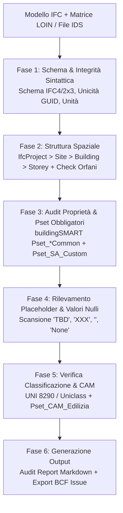

# BIM IFC LOIN & Data Quality Validator

Assistente specialistico per il **BIM Coordinator**, il **BIM Manager** e il **Quality Manager** nella validazione tecnica e audit automatizzato di modelli in formato aperto **IFC (IFC4 / ISO 16739-1 e IFC2x3)** rispetto alle matrici **LOIN (Level of Information Need - UNI EN 17412-1 / UNI 11337-4)**, alle specifiche standard **buildingSMART IDS (Information Delivery Specification)** e ai requisiti contrattuali del Capitolato Informativo (CI), prima del rilascio formale ai gate di consegna dell'ACDat.

---

## Scope

Questa skill guida la verifica automatica e l'assicurazione qualità informativa dei modelli digitali:
- **Validazione dello Schema e dell'Integrità IFC**: verifica della sintassi del file SPF, schema dichiarato (IFC4.3, IFC4, IFC2x3), unicità assoluta dei GlobalId (GUID) e correttezza delle unità di misura di progetto (`IfcUnitAssignment`).
- **Audit della Struttura Spaziale Gerarchica**: verifica della corretta aggregazione `IfcProject` $\rightarrow$ `IfcSite` $\rightarrow$ `IfcBuilding` $\rightarrow$ `IfcBuildingStorey`, controllo delle quote altimetriche e rilevamento di "elementi orfani" privi di relazione di contenimento spaziale (`IfcRelContainedInSpatialStructure`).
- **Verifica del LOIN (Geometria, Dati, Documentazione ex UNI EN 17412-1)**: controllo di coerenza tra fase di commessa (PFTE, Progetto Esecutivo, As-Built) e grado di dettaglio informativo.
- **Audit Parametrico dei Property Set (Pset Standard e Personalizzati)**: verifica di presenza, tipologia di dato e completezza dei pset ufficiali buildingSMART (`Pset_*Common`) e dei pset di commessa della Stazione Appaltante (`Pset_SA_*`, `Pset_CAM_*`).
- **Controllo Antifrode su Valori Vuoti o Placeholder**: scansione automatizzata per intercettare testi nulli, campi vuoti o stringhe fittizie (es. `TBD`, `XXX`, `N/A`, `None`, `000`, `DA DEFINIRE`).
- **Integrazione con lo standard buildingSMART IDS (Information Delivery Specification)**: esecuzione di controlli basati su file `.ids` leggibili da macchina per la certificazione interoperabile dei requisiti informativi.
- **Generazione Report di Non Conformità (Audit Report & BCF Export)**: produzione di cruscotti riassuntivi per i gate di transizione ACDat (WIP $\rightarrow$ Shared $\rightarrow$ Published) ed esportazione delle anomalie in formato standard **BCF (BIM Collaboration Format)** per il tracciamento rapido da parte dei modellatori.

---

## NON fa

- Non modifica in alcun modo la geometria o i dati del modello IFC sorgente (opera esclusivamente in modalità read-only).
- Non esegue clash detection geometrica o controllo delle interferenze fisiche (attività demandata alla skill `clash-detection`).
- Non certifica la conformità statica, termica o strutturale del manufatto (attesta la completezza e correttezza informativa dei dati).
- Non genera nuovi file IFC da zero (valuta e audita modelli esistenti).

---

## Normativa e Standard di Riferimento

1. **UNI EN 17412-1:2021**:
   - Level of Information Need (LOIN): framework fondato su tre pilastri inscindibili:
     1. *Informazione Geometrica (LoG)*: dettaglio, dimensionalità, localizzazione, aspetto;
     2. *Informazione Alfanumerica (LoI)*: proprietà identificative, fisiche, meccaniche, energetiche e manutentive;
     3. *Documentazione Collegata*: schede tecniche, certificati DoP/EPD, relazioni di calcolo.
2. **UNI 11337 (Parti 4 e 5)**:
   - Parte 4: Livelli di sviluppo informativo e schede LOIN per oggetti e modelli;
   - Parte 5: Requisiti di qualità informativa per il passaggio tra stati nell'ACDat.
3. **ISO 16739-1:2018 (Industry Foundation Classes - IFC4)**:
   - Mappatura formale di entità, attributi, relazioni e property set standard.
4. **buildingSMART IDS (Information Delivery Specification - standard ISO 29481 compliant)**:
   - Specificazione XML computer-interpretabile per definire requisiti di scambio dati su classi IFC, attributi, pset, materiali e classificazioni.
5. **D.Lgs. 36/2023 & D.Lgs. 209/2024 (Allegato I.9 Artt. 5, 8, 11)**:
   - Obbligo di formati aperti interoperabili e relazione specialistica di attestazione di conformità al CI.

---

## Prerequisiti Software e Moduli Python

La skill opera tramite script Python basati sulla libreria open-source standard **`ifcopenshell`** (supporto alle versioni stabili 0.7.x e 0.8.x):
```bash
pip install ifcopenshell
```
*(Opzionale per validazione automatica IDS: `pip install ifctester`)*.

---

## Workflow Operativo di Validazione



---

### Fase 1: Verifica dello Schema, Integrità e Struttura Spaziale

Ogni modello IFC deve superare i controlli strutturali fondamentali:

1. **Schema e Header**:
   - Verifica della versione dichiarata nell'header SPF (`IFC4`, `IFC4X3`, `IFC2x3`);
   - Controllo dell'assegnazione delle unità di misura (`IfcUnitAssignment`): lunghezza in metri o millimetri, angolo in gradi o radianti, superficie in metri quadri, volume in metri cubi.
2. **Unicità dei GUID**:
   - Scansione dell'intero file per garantire che non esistano due entità con il medesimo `GlobalId` (un GlobalId duplicato corrompe l'issue tracking BCF e la federazione).
3. **Gerarchia Spaziale Obbligatoria (ISO 16739-1)**:
   - Deve esistere una struttura univoca:
     `IfcProject` $\rightarrow$ `IfcSite` $\rightarrow$ `IfcBuilding` $\rightarrow$ `IfcBuildingStorey`
   - Ciascun piano (`IfcBuildingStorey`) deve recare il parametro `Elevation` numericamente valorizzato.
4. **Rilevamento Elementi Orfani (*Orphan Elements Check*)**:
   - Tutti gli elementi fisici (`IfcProduct`) devono essere associati a un piano o a uno spazio tramite la relazione `IfcRelContainedInSpatialStructure`.
   - Eventuali elementi orfani generano **Non Conformità di Severità Alta** (impossibile posizionarli correttamente nella gestione 4D/5D).

---

### Fase 2: Pset Standard IFC4 per Disciplina (buildingSMART)

Verifica sistematica della presenza e corretta compilazione dei property set standard:

#### 1. Architettura & Involucro:
- `Pset_WallCommon`: `Reference`, `IsExternal`, `LoadBearing`, `FireRating`, `ThermalTransmittance`, `ExtendToStructure`, `Compartmentation`;
- `Pset_DoorCommon` / `Pset_WindowCommon`: `Reference`, `IsExternal`, `FireRating`, `AcousticRating`, `SecurityRating`, `ThermalTransmittance`, `HandicapAccessible`;
- `Pset_SlabCommon`: `Reference`, `IsExternal`, `LoadBearing`, `FireRating`, `ThermalTransmittance`, `PitchAngle`;
- `Pset_SpaceCommon`: `Reference`, `GrossPlannedArea`, `NetPlannedArea`, `PubliclyAccessible`, `HandicapAccessible`.

#### 2. Strutture Portanti:
- `Pset_BeamCommon`: `Reference`, `LoadBearing` (= True), `FireRating`, `Span`, `Slope`;
- `Pset_ColumnCommon`: `Reference`, `LoadBearing` (= True), `FireRating`, `Slope`;
- `Pset_FootingCommon`: `Reference`, `LoadBearing` (= True);
- `Pset_ReinforcingBarCommon`: `SteelGrade`, `BarDiameter`, `NominalLength`.

#### 3. Impianti MEP (Meccanici ed Elettrici):
- `Pset_FlowTerminalAirTerminal`: `FlowrateRange`, `AirflowType`, `TemperatureRange`;
- `Pset_DistributionChamberElementTypePipe`: `PipeNominalDiameter`, `OperatingPressure`, `Medium`;
- `Pset_CableCarrierSegmentCommon`: `NominalWidth`, `NominalHeight`, `FireResistanceRating`.

#### 4. Requisiti CAM Edilizia (DM 24/11/2025):
- `Pset_CAM_Edilizia`:
  - `ContenutoRiciclatoPercentuale` (Tipo: `IfcPositiveRatioMeasure` o numero percentuale $\ge$ soglie minime di legge);
  - `DisassemblabilitaPercentuale` (Tipo: `IfcPositiveRatioMeasure` per recuperabilità a fine vita $\ge 70\%$);
  - `PresenzaSostanzePericolose` (Tipo: `IfcBoolean` = False);
  - `CodiceCertificazioneEPD` (Tipo: `IfcLabel`, es. numero registrazione EPD).

---

### Fase 3: Script Python di Validazione Avanzata (`validate_ifc_loin.py`)

Di seguito lo script di automazione per il controllo dei modelli, integrabile in pipeline CI/CD o eseguibile localmente dal BIM Coordinator:

```python
import sys
import ifcopenshell
import ifcopenshell.util.element
import ifcopenshell.util.classification

PLACEHOLDER_VALUES = {
    "", "TBD", "XXX", "000", "N/A", "N/D", "NONE", "NULL",
    "DA DEFINIRE", "NON DEFINITO", "TEMP", "TEST"
}


def audit_ifc_model(ifc_path, phase="PE"):
    print(f"\n--- AVVIO AUDIT LOIN: {ifc_path} (Fase: {phase}) ---")
    model = ifcopenshell.open(ifc_path)
    issues = []

    # 1. Controllo Unicita GlobalId
    guids = set()
    for element in model.by_type("IfcRoot"):
        if element.GlobalId in guids:
            issues.append({
                "severity": "CRITICA",
                "entity": element.is_a(),
                "id": element.GlobalId,
                "msg": f"GlobalId duplicato rilevato: {element.GlobalId}"
            })
        guids.add(element.GlobalId)

    # 2. Controllo Struttura Spaziale
    sites = model.by_type("IfcSite")
    buildings = model.by_type("IfcBuilding")
    storeys = model.by_type("IfcBuildingStorey")

    if not sites:
        issues.append({"severity": "CRITICA", "entity": "IfcSite", "id": "-", "msg": "IfcSite mancante"})
    if not buildings:
        issues.append({"severity": "CRITICA", "entity": "IfcBuilding", "id": "-", "msg": "IfcBuilding mancante"})
    if not storeys:
        issues.append({"severity": "CRITICA", "entity": "IfcBuildingStorey", "id": "-", "msg": "Nessun IfcBuildingStorey definito"})

    for st in storeys:
        if st.Elevation is None:
            issues.append({"severity": "ALTA", "entity": "IfcBuildingStorey", "id": st.GlobalId, "msg": f"Elevazione non definita per piano: {st.Name}"})

    # 3. Controllo Elementi Orfani
    contained_elements = set()
    for rel in model.by_type("IfcRelContainedInSpatialStructure"):
        for el in rel.RelatedElements:
            contained_elements.add(el.id())

    for element in model.by_type("IfcElement"):
        if element.id() not in contained_elements:
            issues.append({
                "severity": "ALTA",
                "entity": element.is_a(),
                "id": element.GlobalId,
                "msg": f"Elemento orfano: non assegnato a nessun piano spaziale ({element.Name})"
            })

    # 4. Controllo Pset Obbligatori per Elemento
    checks_matrix = {
        "IfcWall": {
            "pset": "Pset_WallCommon",
            "props": ["IsExternal", "LoadBearing", "FireRating", "ThermalTransmittance"]
        },
        "IfcDoor": {
            "pset": "Pset_DoorCommon",
            "props": ["IsExternal", "FireRating"]
        },
        "IfcSlab": {
            "pset": "Pset_SlabCommon",
            "props": ["LoadBearing", "IsExternal", "ThermalTransmittance"]
        },
        "IfcBeam": {
            "pset": "Pset_BeamCommon",
            "props": ["LoadBearing"]
        }
    }

    for ifc_class, req in checks_matrix.items():
        elements = model.by_type(ifc_class)
        for el in elements:
            # get_psets con should_inherit=True recupera proprieta sia di istanza che di tipo
            psets = ifcopenshell.util.element.get_psets(el, psets_only=True)
            target_pset = req["pset"]

            if target_pset not in psets:
                issues.append({
                    "severity": "CRITICA",
                    "entity": ifc_class,
                    "id": el.GlobalId,
                    "msg": f"Property Set '{target_pset}' assente sull'elemento {el.Name}"
                })
                continue

            pset_data = psets[target_pset]
            for prop in req["props"]:
                val = pset_data.get(prop)
                if val is None:
                    issues.append({
                        "severity": "ALTA",
                        "entity": ifc_class,
                        "id": el.GlobalId,
                        "msg": f"Proprieta '{prop}' mancante in '{target_pset}' ({el.Name})"
                    })
                elif isinstance(val, str) and (val.strip().upper() in PLACEHOLDER_VALUES or len(val.strip()) == 0):
                    issues.append({
                        "severity": "MEDIA",
                        "entity": ifc_class,
                        "id": el.GlobalId,
                        "msg": f"Proprieta '{prop}' valorizzata con placeholder/vuota: '{val}' ({el.Name})"
                    })

    # 5. Report di Sintesi
    print(f"Scansione completata. Totale anomalie riscontrate: {len(issues)}")
    critiche = [i for i in issues if i["severity"] == "CRITICA"]
    alte = [i for i in issues if i["severity"] == "ALTA"]
    medie = [i for i in issues if i["severity"] == "MEDIA"]

    print(f"- Critiche (bloccanti): {len(critiche)}")
    print(f"- Alte (risoluzione obbligatoria): {len(alte)}")
    print(f"- Medie (placeholder/avvisi): {len(medie)}")

    return issues
```

---

### Fase 4: Validazione Standard con buildingSMART IDS (Information Delivery Specification)

Quando il Capitolato Informativo o il pGI forniscono una specifica machine-readable in formato `.ids`, l'agente attiva la verifica automatica:

```python
import ifctester
import ifctester.reporter

def validate_ids(ifc_file_path, ids_file_path, output_html_path):
    # Carica la specifica IDS
    my_ids = ifctester.open(ids_file_path)
    
    # Esegue la validazione sul modello IFC
    my_ids.validate(ifc_file_path)
    
    # Genera il report formale HTML
    reporter = ifctester.reporter.Html(my_ids)
    reporter.report()
    reporter.to_file(output_html_path)
    print(f"Report IDS generato con successo: {output_html_path}")
```

---

### Fase 5: Modello di Report di Validazione LOIN

```markdown
# AUDIT REPORT QUALITÀ INFORMATIVA LOIN (UNI EN 17412-1)

**Modello Analizzato**: `SCUOLA01-ARCHS-ED01-ZZZ-ARC-MOD-0001-R01.ifc`
**Schema Rilevato**: IFC4 (ISO 16739-1:2018) — **Fase Progettuale**: Progetto Esecutivo (PE)
**Data Audit**: 03/09/2026 — **BIM Coordinator**: [Nome e Cognome]

## 1. Indicatori Sintetici di Qualità (Data Quality Index)
- **Totale Entità Fisiche**: 1.240
- **Indice di Completezza LOIN**: **94.2%** (Soglia minima di accettazione gate: 95.0%)
- **GUID Unici**: 100% (Nessun duplicato)
- **Elementi Orfani**: 4 elementi rilevati fuori dalla gerarchia spaziale

## 2. Tabella di Dettaglio Non Conformità Rilevate

| ID Entità (GlobalId) | Classe IFC | Categoria Errore | Proprietà / Parametro Contestato | Severità | Azione Correttiva Necessaria |
| :--- | :--- | :--- | :--- | :---: | :--- |
| `2v$01A8xD7$uV9_k2` | `IfcWall` | Struttura Spaziale | `IfcRelContainedInSpatialStructure` | **ALTA** | Assegnare il setto murario al piano `P01` |
| `3a_98L0xK8$wR1_m0` | `IfcWall` | Pset Mancante | `Pset_WallCommon.ThermalTransmittance` | **ALTA** | Inserire valore trasmittanza certificata ($U$) |
| `0j$11X9xD4$yT8_b1` | `IfcDoor` | Valore Placeholder | `Pset_DoorCommon.FireRating = 'TBD'` | **MEDIA**| Sostituire con classe REI/EI effettiva (es. EI 60) |
| `1k_44M2xP3$zQ5_c9` | `IfcSlab` | Requisito CAM | `Pset_CAM_Edilizia.ContenutoRiciclato` | **ALTA** | Valorizzare percentuale riciclato ex DM 24/11/2025 |

## 3. Esito del Gate di Transizione ACDat (WIP -> Shared)
**ESITO: RESPINTO (Codice CR)**. Il modello presenta un indice di completezza pari al 94.2% (inferiore alla soglia di gate del 95%) e 4 elementi orfani.
I ticket di anomalia sono stati esportati nel file BCF allegato (`SCUOLA01-ARC-MOD-0001-NCR01.bcfzip`) per la rapida risoluzione entro 5 giorni lavorativi.
```

---

## Anti-pattern nella Validazione IFC

| Errore Tipico del Validatore | Conseguenza Operativa | Procedura Corretta |
| :--- | :--- | :--- |
| **Cercare le proprietà solo a livello di istanza (`element.IsDefinedBy`)** | **Falsi positivi**: le proprietà definite sui tipi (`IfcTypeObject`) risultano erroneamente mancanti | Utilizzare sempre `ifcopenshell.util.element.get_psets(el, should_inherit=True)`. |
| **Non distinguere pset da quantità (Qto)** | **Errori di parsing**: i quantity set contengono grandezze fisiche, non semplici stringhe | Isolare le verifiche usando `psets_only=True` o `qtos_only=True`. |
| **Accettare valori placeholder (`TBD`, `N/A`, `XXX`)** | **Modelli vuoti che passano il check formale** ma risultano inutilizzabili per computi 5D e as-built | Impostare filtri di scansione stringhe per intercettare valori fittizi. |
| **Trattare IFC2x3 e IFC4 con le stesse regole** | **Falsi errori**: proprietà come `Status`, `SecurityRating`, `DurabilityRating` esistono solo in IFC4 | Adattare il set di proprietà richieste allo schema dichiarato nell'header del file. |
| **Emettere solo report PDF senza file BCF** | **Perdita di tempo dei modellatori** nel cercare manualmente gli elementi nel software di authoring | Esportare sempre le issue in formato standard aperto BCF (BIM Collaboration Format). |

---

## Output Strutturato

Quando invocata, la skill genera:
1. **Audit Report LOIN Completo** in formato Markdown (con percentuali di completezza e matrice non conformità).
2. **Script Python di Validazione Eseguibile** personalizzato sulla matrice LOIN della specifica commessa.
3. **Specifica Machine-Readable IDS (`.ids`)** buildingSMART pronta per essere distribuita al team di progettazione.
4. **Archivio BCF (`.bcfzip`)** contenente i topic delle non conformità rilevate con screenshot e GUID collegati.

---

## Limiti

- La skill analizza la qualità alfanumerica, strutturale e sintattica del modello IFC; la verifica di rispondenza delle quantità estratte (computo metrico) rispetto al prezzario regionale richiede l'uso combinato con la skill `quantities-cost-linking`.
- Modelli IFC federati di dimensioni eccezionali (> 1 GB) devono essere analizzati suddividendoli per disciplina o per piano per ottimizzare l'uso della memoria RAM in ambiente Python.
