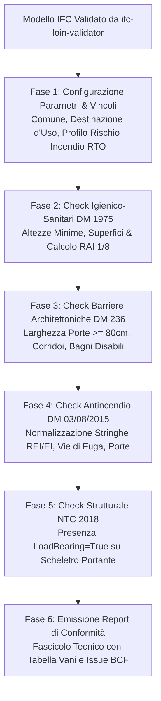

# BIM Normative Code Checking (Automated Compliance)

Assistente specialistico per il **BIM Coordinator**, il **Progettista Abilitato** e il **Validatore di Progetto** nel controllo parametrico, geometrico e prestazionale automatizzato di modelli in formato aperto **IFC (IFC4 / ISO 16739-1 e IFC2x3)** rispetto alle principali norme tecniche e regolamentari italiane: **NTC 2018**, **Codice di Prevenzione Incendi (D.M. 03/08/2015)**, **Requisiti Igienico-Sanitari (D.M. 05/07/1975)** e **Superamento Barriere Architettoniche (D.M. 236/1989)**.

---

## Scope

Questa skill guida la verifica automatizzata di rispondenza alle norme cogenti attraverso l'estrazione e il controllo dei parametri del modello:
- **Verifica Requisiti Igienico-Sanitari (D.M. 05/07/1975 e Regolamenti Edilizi Comunali)**:
  - Controllo delle altezze minime interne utili ($H \ge 2.70$ m per locali abitabili/uffici; $H \ge 2.40$ m per corridoi, bagni e disimpegni);
  - Calcolo e verifica automatica del **Rapporto Aeroilluminante (RAI $\ge 1/8$)** tra superficie delle aperture finestrate e superficie netta di calpestio del vano (`IfcSpace`);
  - Controllo delle superfici minime per destinazione d'uso (stanze singole $\ge 9$ m², matrimoniali $\ge 14$ m², soggiorni $\ge 14$ m²).
- **Audit Barriere Architettoniche e Accessibilità (D.M. 236/1989 & D.P.R. 503/1996)**:
  - Verifica della luce netta di passaggio delle porte (`OverallWidth` $\ge 0.75$ m per porte interne; $\ge 0.80$ m per ingressi principali ed edifici aperti al pubblico);
  - Controllo larghezza minima dei corridoi ($\ge 1.00$ m residenziali; $\ge 1.20$ m in edifici pubblici o aperti al pubblico);
  - Controllo degli spazi di manovra per sedia a rotelle (cerchio di rotazione $\varnothing \ge 1.50$ m nei servizi igienici accessibili);
  - Verifica pendenza massima delle rampe pedonali ($\le 8\%$ con pianerottoli intermedi $\ge 1.50 \times 1.50$ m ogni 10 m).
- **Controlli Antincendio (D.M. 03/08/2015 - Codice di Prevenzione Incendi RTO)**:
  - *Capitolo S.2 (Resistenza al fuoco)*: normalizzazione e verifica delle classi di resistenza al fuoco (R, REI, EI 30/60/90/120) su muri portanti (`Pset_WallCommon`), solai (`Pset_SlabCommon`) e porte tagliafuoco (`Pset_DoorCommon`);
  - *Capitolo S.3 (Compartimentazione)*: verifica della continuità delle pareti di compartimentazione fino all'intradosso del solaio (`ExtendToStructure = True` e `Compartmentation = True`);
  - *Capitolo S.4 (Esodo)*: controllo porte sulle vie di fuga (`FireExit = True`), larghezza dei passaggi in moduli da 60 cm e senso di apertura nel verso dell'esodo.
- **Verifiche Strutturali Preliminari (NTC 2018 - D.M. 17/01/2018)**:
  - Assegnazione rigorosa del parametro `LoadBearing = True` a tutti gli elementi strutturali portanti (`IfcWall`, `IfcColumn`, `IfcBeam`, `IfcSlab`);
  - Controllo di presenza della classe di resistenza dei materiali (es. $C25/30$, $B450C$) nei pset strutturali.
- **Generazione del Fascicolo di Conformità Normativa**: report strutturato con esito (Conforme, Non Conforme, Da Verificare) ancorato a capitoli e paragrafi normativi ufficiali.

---

## NON fa

- Non sostituisce il calcolo strutturale, la relazione di calcolo FEM o i tabulati di dimensionamento sismico (di competenza esclusiva dell'Ingegnere Strutturista iscritto all'Albo).
- Non redige il progetto antincendio completo da sottoporre all'approvazione dei Vigili del Fuoco (attività riservata a professionista antincendio abilitato ex L. 818/84).
- Non costituisce asseverazione o perizia giurata di agibilità/abitabilità (la responsabilità e la firma restano in capo al tecnico abilitato).

---

## Normativa di Riferimento

1. **D.M. 05/07/1975 (Modificazioni alle istruzioni ministeriali 20/06/1896 in materia di altezza minima e requisiti igienico-sanitari)**:
   - Art. 1: Altezza minima interna utile;
   - Art. 2: Superfici minime per gli alloggi;
   - Art. 5: Superficie finestrata apribile non inferiore a $1/8$ della superficie del pavimento.
2. **D.M. 14/06/1989, n. 236 (Prescrizioni tecniche per l'accessibilità, visitabilità e adattabilità degli edifici)**:
   - Art. 4.1.1 (Porte); Art. 4.1.2 (Corridoi e passaggi); Art. 4.1.6 (Servizi igienici); Art. 4.1.11 (Rampe).
3. **D.M. 03/08/2015 (Approvazione di norme tecniche di prevenzione incendi - RTO)**:
   - Capitoli: **G.1** (Terminologia), **S.1** (Reazione al fuoco), **S.2** (Resistenza al fuoco), **S.3** (Compartimentazione), **S.4** (Esodo).
4. **D.M. 17/01/2018 (Norme Tecniche per le Costruzioni - NTC 2018)** e Circolare Esplicativa 21/01/2019, n. 7 C.S.LL.PP.:
   - Cap. 4 (Costruzioni civili e industriali), Cap. 7 (Progettazione per azioni sismiche).
5. **D.Lgs. 36/2023 & D.Lgs. 209/2024 (Allegato I.9, Art. 11)**:
   - Metodi digitali per il controllo di conformità del progetto esecutivo e collaudo.

---

## Parametri e Mappatura IFC

| Requisito Normativo | Entità IFC Coinvolte | Proprietà / Parametri da Interrogare | Soglia di Legge Standard |
| :--- | :--- | :--- | :---: |
| **Altezza Utile Locali** | `IfcSpace` | `Qto_SpaceBaseQuantities.Height` o `Pset_SpaceCommon` | $\ge 2.70$ m (abitabili) / $\ge 2.40$ m (servizi) |
| **Superficie Netta Vani**| `IfcSpace` | `Qto_SpaceBaseQuantities.NetFloorArea` | $\ge 9.00$ m² (singola) / $\ge 14.00$ m² (matrim.) |
| **Rapporto Aeroill. (RAI)**| `IfcSpace` + `IfcWindow` | $\sum \text{Area Finestre} / \text{NetFloorArea}$ | $\ge 1/8$ (12.5% della superficie calpestabile) |
| **Luce Netta Porte** | `IfcDoor` | `OverallWidth` | $\ge 0.75$ m (interne) / $\ge 0.80$ m (accessibili/pubbliche)|
| **Luce Corridoi** | `IfcSpace` (Corridoio) | `Qto_SpaceBaseQuantities.Width` o `GrossFloorArea` | $\ge 1.00$ m (residenziale) / $\ge 1.20$ m (pubblico) |
| **Resistenza al Fuoco** | `IfcWall`, `IfcSlab`, `IfcDoor`| `Pset_*Common.FireRating` | EI/REI 30, 60, 90, 120 (secondo RTO) |
| **Compartimentazione** | `IfcWall` | `Pset_WallCommon.Compartmentation` & `ExtendToStructure`| `True` (continuità fino all'intradosso solaio) |
| **Porte Vie di Fuga** | `IfcDoor` | `Pset_DoorCommon.FireExit` | `True` con verso apertura concorde all'esodo |
| **Elementi Portanti** | `IfcWall`, `IfcColumn`, `IfcBeam`| `Pset_*Common.LoadBearing` | `True` per strutture sismico-resistenti NTC |

---

## Workflow Operativo di Code Checking



---

### Script Python di Code Checking Automatizzato (`normative_checker.py`)

```python
import re
import ifcopenshell
import ifcopenshell.util.element


def normalize_fire_rating(rating_str):
    """
    Normalizza stringhe come 'REI 120', 'ei-60', '120 min', 'REI120'
    estraendo la classe prestazionale e il tempo in minuti.
    """
    if not rating_str or not isinstance(rating_str, str):
        return None
    cleaned = rating_str.strip().upper().replace("-", " ")
    match = re.search(r"(R|REI|EI)\s*(\d+)", cleaned)
    if match:
        return {"tipo": match.group(1), "minuti": int(match.group(2))}
    match_num = re.search(r"(\d+)", cleaned)
    if match_num:
        return {"tipo": "EI", "minuti": int(match_num.group(1))}
    return None


def audit_normative_compliance(ifc_file_path):
    model = ifcopenshell.open(ifc_file_path)
    issues = []

    print(f"\n--- AVVIO CODE CHECKING NORMATIVO: {ifc_file_path} ---")

    # 1. VERIFICA PORTE (DM 236/1989 - Accessibilita)
    doors = model.by_type("IfcDoor")
    for door in doors:
        width = door.OverallWidth
        if width is not None:
            # Converti in metri se in mm
            width_m = width / 1000.0 if width > 10 else width
            if width_m < 0.75:
                issues.append({
                    "norma": "D.M. 236/1989 Art. 4.1.1",
                    "severita": "ALTA",
                    "elemento": f"Porta {door.Name} ({door.GlobalId})",
                    "rilievo": f"Larghezza netta {width_m:.2f} m < 0.75 m (limite minimo accessibilita)"
                })

    # 2. VERIFICA ALTEZZE E VANI (DM 05/07/1975 - Requisiti Igienico-Sanitari)
    spaces = model.by_type("IfcSpace")
    for space in spaces:
        psets = ifcopenshell.util.element.get_psets(space, qtos_only=True)
        qto = psets.get("Qto_SpaceBaseQuantities", {})
        height = qto.get("Height")
        net_area = qto.get("NetFloorArea")

        # Verifica altezza minima locali principali
        is_service = any(k in (space.Name or "").upper() for k in ["BAGNO", "WC", "DIS", "CORR", "RIP"])
        min_h = 2.40 if is_service else 2.70

        if height is not None:
            h_m = height / 1000.0 if height > 10 else height
            if h_m < min_h:
                issues.append({
                    "norma": "D.M. 05/07/1975 Art. 1",
                    "severita": "CRITICA",
                    "elemento": f"Vano {space.Name} ({space.GlobalId})",
                    "rilievo": f"Altezza utile netta {h_m:.2f} m < {min_h:.2f} m minima richiesta"
                })

    # 3. VERIFICA RESISTENZA AL FUOCO (DM 03/08/2015 - Codice Prevenzione Incendi)
    walls = model.by_type("IfcWall")
    for wall in walls:
        psets = ifcopenshell.util.element.get_psets(wall, psets_only=True)
        pset_common = psets.get("Pset_WallCommon", {})
        is_compartment = pset_common.get("Compartmentation", False)
        fire_rating = pset_common.get("FireRating")
        extend_to_structure = pset_common.get("ExtendToStructure", False)

        if is_compartment:
            if not fire_rating:
                issues.append({
                    "norma": "D.M. 03/08/2015 Cap. S.2",
                    "severita": "CRITICA",
                    "elemento": f"Muro di Compartimentazione {wall.Name} ({wall.GlobalId})",
                    "rilievo": "Parete tagliafuoco priva del parametro FireRating (REI/EI)"
                })
            else:
                norm_fr = normalize_fire_rating(str(fire_rating))
                if not norm_fr or norm_fr["minuti"] < 60:
                    issues.append({
                        "norma": "D.M. 03/08/2015 Cap. S.2",
                        "severita": "ALTA",
                        "elemento": f"Muro di Compartimentazione {wall.Name} ({wall.GlobalId})",
                        "rilievo": f"FireRating dichiarato '{fire_rating}' insufficiente per compartimento primario (< 60 min)"
                    })
            if not extend_to_structure:
                issues.append({
                    "norma": "D.M. 03/08/2015 Cap. S.3",
                    "severita": "ALTA",
                    "elemento": f"Muro {wall.Name} ({wall.GlobalId})",
                    "rilievo": "Parete di compartimentazione non prolungata alla struttura portante (ExtendToStructure = False)"
                })

    # 4. VERIFICA STRUTTURALE (NTC 2018)
    beams = model.by_type("IfcBeam")
    for beam in beams:
        psets = ifcopenshell.util.element.get_psets(beam, psets_only=True)
        lb = psets.get("Pset_BeamCommon", {}).get("LoadBearing")
        if lb is not True:
            issues.append({
                "norma": "NTC 2018 Cap. 4",
                "severita": "MEDIA",
                "elemento": f"Trave {beam.Name} ({beam.GlobalId})",
                "rilievo": "Parametro LoadBearing non impostato a True su elemento strutturale"
            })

    print(f"Scansione completata. Totale rilievi di conformità normativa: {len(issues)}")
    return issues
```

---

## Modello Report di Conformità Normativa

```markdown
# FASCICOLO DI VERIFICA DI CONFORMITÀ NORMATIVA SUL MODELLO BIM

**Modello Analizzato**: `SCUOLA01-ARCHS-BL01-ZZZ-ARC-MOD-0001-R01.ifc`
**Fase Progettuale**: Progetto Esecutivo (PE)
**Data Audit**: 03/09/2026 — **Verificatore**: BIM Coordinator / Esperto Normativo

## 1. Quadro di Sintesi dei Controlli Normativi
- **D.M. 05/07/1975 (Igiene & Abitabilità)**: **96.8% Conforme** (1 altezza locale non conforme)
- **D.M. 236/1989 (Accessibilità & Disabilità)**: **100% Conforme** (Tutte le porte interne $\ge 0.80$ m)
- **D.M. 03/08/2015 (Prevenzione Incendi RTO)**: **88.2% Conforme** (2 pareti tagliafuoco senza prolungamento solaio)
- **NTC 2018 (Parametri Strutturali Portanti)**: **100% Conforme** (`LoadBearing = True` verificato su tutte le travi)

## 2. Dettaglio delle Difformità Rilevate

| Ambito Normativo | Articolo/Capitolo | Elemento Coinvolto (GUID) | Parametro Contestato | Valore Rilevato | Valore Limite Cogente |
| :--- | :--- | :--- | :--- | :---: | :---: |
| **Igiene Edilizia** | Art. 1 D.M. 05/07/1975 | Locale Segreteria (`3vK_01$8r...`) | `Height` | **2.55 m** | $\ge 2.70$ m (Locale di lavoro abitabile) |
| **Antincendio** | Cap. S.3 D.M. 03/08/2015 | Parete Vano Scala (`1aM_99$2w...`)| `ExtendToStructure` | **False** | `True` (Continuità compartimento a soffitto) |
| **Antincendio** | Cap. S.2 D.M. 03/08/2015 | Porta Corridoio (`0xP_44$1z...`) | `FireRating` | **'30 min'** | $\ge \text{EI } 60$ (Classe richiesta dal piano) |

## 3. Prescrizioni per il Progettista Responsabile
1. Modificare la quota del controsoffitto nel locale Segreteria per garantire un'altezza netta utile di almeno $2.70$ m.
2. Impostare a `True` il parametro `ExtendToStructure` su tutte le pareti tagliafuoco che delimitano la scala protetta a prova di fumo.
3. Aggiornare la scheda tecnica della porta tagliafuoco del corridoio elevando la classe di resistenza a EI 60.
```

---

## Anti-pattern nel Normative Code Checking

| Errore Tipico nel Code Checking | Rischio Tecnico-Giuridico | Correzione Obbligatoria |
| :--- | :--- | :--- |
| **Inventare soglie o articoli di legge non verificati** | **Falsa attestazione di conformità** o contestazioni infondate ai progettisti | Citare rigorosamente solo capitoli e articoli vigenti (DM 1975, DM 1989, NTC 2018, DM 2015). |
| **Dichiarare "conforme" basandosi su campi vuoti** | **Mancato rilascio dell'agibilità** per difformità sanitarie o antincendio occulte | Se il pset è assente o il parametro è nullo, l'esito deve essere classificato come **"NON VERIFICABILE (CRITICO)"**. |
| **Ignorare la destinazione d'uso del vano** | **Falsi allarmi**: pretendere $2.70$ m di altezza in un bagno o in un ripostiglio | Filtrare le soglie in base alla classificazione del vano (locali principali $2.70$ m; accessori $2.40$ m). |
| **Confrontare stringhe antincendio senza normalizzarle** | **Falsi errori**: considerare non conforme una porta con dicitura `"REI120"` perché il check cerca `"REI 120"` | Implementare sempre un parser con regex per estrarre la classe e il valore numerico in minuti. |
| **Sostituirsi al professionista antincendio o strutturista** | **Esercizio abusivo di competenze riservate** per legge ad albi professionali | Il report dell'agente è uno strumento di controllo ausiliario: la validazione finale spetta al professionista abilitato. |

---

## Output Strutturato

Quando invocata, la skill genera:
1. **Fascicolo di Verifica di Conformità Normativa** (con cruscotto per igiene, antincendio, barriere e NTC).
2. **Tabella Parametrica delle Difformità Rilevate** con richiamo espresso agli articoli di legge violati.
3. **Script Python Personalizzato per il Code Checking** del modello di commessa.
4. **Esportazione delle Issue Normative in Formato BCF** per i progettisti responsabili.

---

## Limiti

- La verifica dei percorsi di esodo complessi e del calcolo dell'affollamento antincendio su layout articolati richiede l'uso combinato con software specialistici di simulazione d'esodo (evacuation modeling).
- Le prescrizioni dei regolamenti edilizi locali variano per singolo comune italiano e devono essere fornite dal coordinatore o desunte dal Capitolato Informativo.
